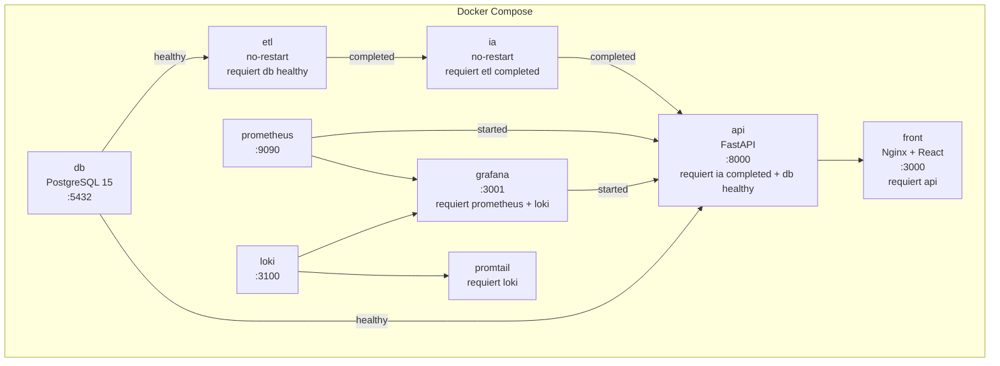
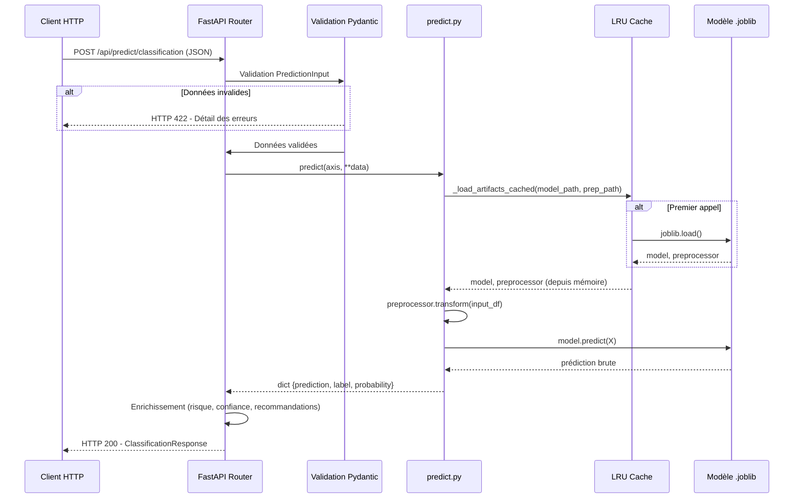
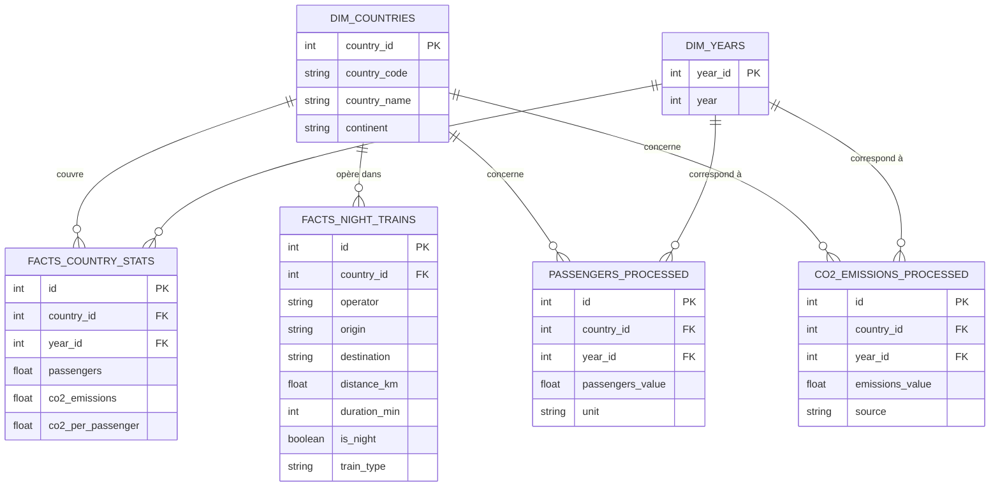
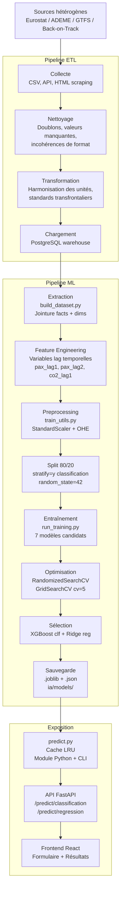

# Rapport Technique — Projet ObRail Europe
## Développement d'un modèle prédictif d'intelligence artificielle pour l'analyse ferroviaire européenne
### MSPR — Bloc E6.2 / E6.4 — RNCP36581

---

**Document rédigé à destination du jury de certification**
**Programme : Développeur en Intelligence Artificielle et Data Science**
**Certification : RNCP36581**

---

## Table des matières

1. [Présentation du projet](#1-présentation-du-projet)
2. [Analyse du cahier des charges](#2-analyse-du-cahier-des-charges)
3. [Architecture générale](#3-architecture-générale)
4. [Structure du projet](#4-structure-du-projet)
5. [Stack technique](#5-stack-technique)
6. [Base de données](#6-base-de-données)
7. [Pipeline de données](#7-pipeline-de-données)
8. [Préparation des données](#8-préparation-des-données)
9. [Machine Learning — Classification](#9-machine-learning--classification)
10. [Machine Learning — Régression](#10-machine-learning--régression)
11. [API REST](#11-api-rest)
12. [Frontend](#12-frontend)
13. [Docker et déploiement](#13-docker-et-déploiement)
14. [Monitoring](#14-monitoring)
15. [Sécurité](#15-sécurité)
16. [Benchmark des services IA](#16-benchmark-des-services-ia)
17. [Veille technologique](#17-veille-technologique)
18. [Résolution d'incidents — Data Leakage](#18-résolution-dincidents--data-leakage)
19. [Résultats et performances](#19-résultats-et-performances)
20. [Perspectives d'amélioration](#20-perspectives-damélioration)
21. [Conclusion](#21-conclusion)
22. [Matrice de conformité au cahier des charges](#22-matrice-de-conformité-au-cahier-des-charges)
23. [Matrice de compétences RNCP36581](#23-matrice-de-compétences-rncp36581)

---

## 1. Présentation du projet

### 1.1 Contexte organisationnel

ObRail Europe est un observatoire indépendant créé en 2018, spécialisé dans l'analyse des flux ferroviaires européens et la promotion du transport bas-carbone. Sa mission s'articule autour de quatre axes : la collecte et l'analyse des données relatives aux dessertes ferroviaires européennes, l'évaluation de l'impact environnemental des modes de transport longue distance, la production d'études comparatives destinées aux décideurs politiques et aux opérateurs ferroviaires, et l'accompagnement de la transition écologique.

L'organisation travaille en partenariat avec les institutions européennes (Commission européenne, Parlement européen), des organisations non gouvernementales telles que Transport & Environnement ou Back-on-Track, et les principaux opérateurs ferroviaires du continent (SNCF, ÖBB Nightjet, DB, Trenitalia). Ces partenariats s'inscrivent dans les grandes stratégies européennes que sont le Green Deal (neutralité carbone à l'horizon 2050) et le programme TEN-T (Trans-European Transport Network).

### 1.2 Problématique

ObRail Europe fait face à plusieurs défis structurels dans son activité d'analyse :

Les informations relatives aux dessertes ferroviaires européennes sont publiées par de nombreux acteurs distincts (opérateurs nationaux, plateformes open data, organismes statistiques), chacun utilisant ses propres formats et conventions. Il n'existe pas de référentiel commun permettant la comparaison homogène des données entre pays. Les jeux de données collectés présentent des problèmes de complétude, de doublons et d'incohérences. Enfin, l'organisation doit livrer une première version exploitable aux institutions européennes dans des délais contraints.

Sur le plan analytique, ObRail ne dispose pas d'outils permettant d'anticiper les tendances de fréquentation ni d'identifier automatiquement les pays dont le réseau ferroviaire est en fragilisation. Les décisions d'investissement et d'orientation politique s'appuient sur des analyses rétrospectives, sans capacité prédictive.

### 1.3 Objectifs du projet

Ce projet vise à développer une solution complète intégrant un entrepôt de données harmonisé et deux modèles d'intelligence artificielle capables de répondre aux enjeux opérationnels d'ObRail :

- Anticiper la demande en mobilité ferroviaire en prédisant le volume de passagers à horizon un an.
- Détecter les pays dont le réseau ferroviaire est en déclin, pour orienter les interventions stratégiques.
- Exposer ces prédictions via une API REST intégrée dans une application web, consommable par les équipes internes, les institutions partenaires et les opérateurs ferroviaires.

### 1.4 Utilisateurs cibles

| Profil | Besoins |
|--------|---------|
| Équipe Data Science interne ObRail | Entraînement, optimisation continue, monitoring des modèles |
| Institutions et décideurs européens | Exploitation des prédictions pour orienter les choix stratégiques (TEN-T, Green Deal) |
| ONG environnementales | Appui à la communication sur les enjeux de mobilité durable |
| Opérateurs ferroviaires (SNCF, DB, ÖBB) | Planification des capacités, identification des lignes à risque |

### 1.5 Périmètre

Le projet couvre :
- La construction d'un entrepôt de données (processus ETL) sur la base des sources Eurostat, ADEME et Back-on-Track.
- Le développement de deux modèles ML : un classifieur (déclin ferroviaire) et un modèle de régression (prévision de fréquentation).
- Une API REST FastAPI exposant les prédictions.
- Un frontend React permettant l'accès aux prédictions via une interface web.
- Une infrastructure Docker assurant la reproductibilité du déploiement.
- Un système de monitoring basé sur Prometheus, Grafana et Loki.

---

## 2. Analyse du cahier des charges

### 2.1 Exigences fonctionnelles

Le cahier des charges ObRail identifie neuf besoins fonctionnels, chacun associé à des livrables précis.

**Besoin 1 — Analyse exploratoire et préparation des données**

Le cahier des charges demande d'identifier les valeurs aberrantes, les données manquantes et les incohérences, d'effectuer les transformations nécessaires (encodage, normalisation, feature engineering), et de construire les ensembles train/validation/test.

Réalisation : ce besoin est satisfait par les scripts `build_dataset.py` et `train_utils.py`, qui implémentent respectivement le feature engineering temporel (variables lag) et le pipeline de preprocessing (StandardScaler, OneHotEncoder). Le notebook `01_eda.ipynb` documente l'analyse exploratoire.

**Besoin 2 — Mise en place de l'environnement d'apprentissage**

Configuration de l'environnement de développement et documentation des dépendances.

Réalisation : le fichier `ia/src/requirements.txt` liste toutes les dépendances. L'environnement est conteneurisé via Docker, garantissant sa reproductibilité sur tout environnement standard.

**Besoin 3 — Développement de plusieurs modèles candidats**

Test de plusieurs algorithmes (régression régularisée, Random Forest, boosting, MLP) avec justification des choix.

Réalisation : sept modèles ont été entraînés — quatre pour la classification (Logistic Regression, Random Forest, XGBoost, MLP) et trois pour la régression (Ridge, Random Forest, XGBoost). Les tableaux comparatifs sont produits dans `ia/reports/`.

**Besoin 4 — Entraînement, optimisation et validation**

Recherche d'hyperparamètres, validation croisée, sélection du modèle final avec documentation des performances.

Réalisation : le script `optimize_xgboost_ridge.py` implémente `RandomizedSearchCV` (30 itérations, 5 folds) pour XGBoost et `GridSearchCV` pour Ridge. Les résultats avant/après optimisation sont documentés dans `docs/rapport_evaluation.md`.

**Besoin 5 — API d'exposition**

Prototype d'API REST exposant une route `/predict`, intégration dans l'application, identification des métriques de monitoring.

Réalisation : l'API FastAPI expose quatre routes (`/`, `/health`, `/predict/classification`, `/predict/regression`). Elle est intégrée dans l'architecture Docker et documentée automatiquement via Swagger. Les métriques de monitoring sont identifiées et exposées via Prometheus.

**Besoin 6 — Benchmark des services d'IA existants**

Comparaison d'au moins trois services cloud (AWS SageMaker, Azure ML, Google Vertex AI, HuggingFace AutoTrain) avec tableau comparatif et recommandations.

Réalisation : le document `docs/benchmark_cloud.md` compare quatre services selon six critères. La conclusion justifie le choix d'une solution interne pour des raisons de volumétrie, de coûts et de conformité RGPD.

**Besoin 7 — Sauvegarde, documentation et reproductibilité**

Sauvegarde des modèles au format joblib, script `predict.py`, documentation de la procédure de réentraînement.

Réalisation : les modèles sont sauvegardés dans `ia/models/` et les preprocesseurs dans `data/ml/`. Le script `predict.py` est opérationnel. La procédure de réentraînement est documentée dans `docs/retraining.md`.

**Besoin 8 — Veille, justification et communication projet**

Veille technique sur les algorithmes et services IA, synthèse des risques et limites.

Réalisation : la section veille couvre trois axes (algorithmique, réglementaire, sécurité) avec des sources datées de 2026. La communication projet est assurée par la documentation structurée et les rapports de phases.

**Besoin 9 — Rapport technique et support de soutenance**

Rapport clair exploitant données, architecture, méthodologie, résultats, limites et plan d'amélioration.

Réalisation : le présent document constitue ce rapport.

### 2.2 Contraintes techniques

| Contrainte | Réponse du projet |
|------------|------------------|
| Modèle reproductible et documenté | `random_state=42` sur tous les modèles, pipelines joblib, documentation de chaque phase |
| Bonnes pratiques de préparation des données | StandardScaler + OHE, fit uniquement sur le train, stratify sur la classification |
| Workflow standard (exploration → sélection) | 17 phases documentées de la construction du dataset à l'API |
| Format compatible API (joblib) | Modèles sauvegardés en `.joblib`, rechargés par l'API via cache LRU |
| Pipeline de prédiction reproductible | Script `predict.py` opérationnel en CLI et comme module Python |

### 2.3 Contraintes réglementaires

Le projet respecte les principes éthiques et RGPD :

- **Transparence** : les modèles sont documentés, les décisions sont explicables via SHAP et l'importance des variables.
- **Minimisation** : seules les variables nécessaires sont conservées (6 numériques + pays). Les données de `facts_night_trains` ont été écartées car non pertinentes pour le sujet retenu.
- **Sécurité** : les données sont stockées localement, non versionnées sur Git. Aucune donnée personnelle n'est traitée (données agrégées par pays).
- **Conformité AI Act** : les modèles appartiennent à la catégorie à risque limité. Ils ne relèvent d'aucune pratique interdite par l'article 5.

---

## 3. Architecture générale

### 3.1 Vue d'ensemble

L'application ObRail repose sur une architecture en couches, entièrement conteneurisée. Chaque couche a un périmètre de responsabilité distinct et communique avec les couches adjacentes via des interfaces définies.

```mermaid
graph TB
    subgraph Sources["Sources de données"]
        E1[Eurostat CSV]
        E2[ADEME]
        E3[Back-on-Track]
        E4[GTFS / Open Data]
    end

    subgraph ETL["ETL Container"]
        T1[run_full_etl.py]
        T2[Nettoyage / Harmonisation]
        T3[Chargement warehouse]
    end

    subgraph DB["PostgreSQL Container"]
        D1[(facts_country_stats)]
        D2[(facts_night_trains)]
        D3[(dim_countries)]
        D4[(dim_years)]
    end

    subgraph IA["IA Container"]
        M1[build_dataset.py]
        M2[run_training.py]
        M3[optimize_xgboost_ridge.py]
        M4[Modèles .joblib]
    end

    subgraph API["API Container - FastAPI"]
        A1[/predict/classification]
        A2[/predict/regression]
        A3[/health]
        A4[predict.py - cache LRU]
    end

    subgraph FRONT["Frontend Container - React"]
        F1[Interface utilisateur]
        F2[Formulaire de prédiction]
        F3[Affichage des résultats]
    end

    subgraph MONITORING["Monitoring Stack"]
        P1[Prometheus :9090]
        P2[Grafana :3001]
        P3[Loki + Promtail]
    end

    Sources --> ETL
    ETL --> DB
    DB --> IA
    IA --> M4
    M4 --> API
    API --> FRONT
    API --> MONITORING
```

### 3.2 Architecture logicielle

```mermaid
graph LR
    subgraph ML["Couche Machine Learning"]
        P[predict.py]
        CLF[xgboost_optimized_clf.joblib]
        REG[ridge_reg.joblib]
        PCLF[preprocessor_classification.joblib]
        PREG[preprocessor_regression.joblib]
    end

    subgraph ROUTER["Couche API - FastAPI"]
        R1[router predict.py]
        R2[PredictionInput - Pydantic]
        R3[ClassificationResponse]
        R4[RegressionResponse]
        R5[/api/predict/classification]
        R6[/api/predict/regression]
    end

    subgraph SEC["Sécurité & Validation"]
        V1[Validation Pydantic - 422]
        V2[HTTPException - 500 / 503]
        V3[Logging structuré]
        V4[Vérification pays connus]
    end

    R2 --> V1
    R5 --> R2
    R6 --> R2
    R2 --> P
    P --> CLF
    P --> REG
    P --> PCLF
    P --> PREG
    R5 --> R3
    R6 --> R4
    R1 --> V2
    R1 --> V3
    R1 --> V4
```

### 3.3 Architecture Docker



### 3.4 Flux de prédiction



---

## 4. Structure du projet

### 4.1 Arborescence complète

```
obrail-europe/
│
├── docker-compose.yml          # Orchestration des 8 conteneurs
├── .env                        # Variables d'environnement (non versionné)
├── requirements.txt            # Dépendances Python globales
│
├── etl/                        # Pipeline ETL
│   ├── Dockerfile.etl
│   ├── run_full_etl.py         # Point d'entrée ETL
│   └── ...                     # Scripts de collecte et transformation
│
├── ia/                         # Intelligence artificielle
│   ├── Dockerfile
│   ├── src/
│   │   └── ml/
│   │       ├── config.py       # Chemins et constantes
│   │       ├── build_dataset.py      # Construction datasets ML
│   │       ├── run_pipeline.py       # Orchestration (STEP 0)
│   │       ├── run_training.py       # Entraînement tous modèles
│   │       ├── evaluate_model.py     # Évaluation comparative
│   │       ├── predict.py            # Script de prédiction (CLI + module)
│   │       ├── api.py                # API FastAPI standalone
│   │       ├── models/
│   │       │   ├── train_utils.py          # Preprocessing, split, utils
│   │       │   ├── train_logistic.py       # Logistic Regression
│   │       │   ├── train_random_forest.py  # Random Forest
│   │       │   ├── train_xgboost.py        # XGBoost
│   │       │   ├── train_mlp.py            # MLP
│   │       │   ├── train_ridge.py          # Ridge Regression
│   │       │   └── optimize_xgboost_ridge.py  # Optimisation hyperparamètres
│   │       └── notebooks/
│   │           ├── 01_eda.ipynb            # Analyse exploratoire
│   │           ├── 02_evaluation.ipynb     # Évaluation comparative
│   │           └── 03_explicabilite.ipynb  # SHAP + feature importance
│   ├── models/                 # Artefacts ML sauvegardés (.joblib, .json)
│   └── reports/                # Rapports comparatifs (.csv)
│
├── data/
│   ├── warehouse/              # Données ETL harmonisées
│   │   ├── facts_country_stats.csv
│   │   ├── facts_night_trains.csv
│   │   ├── dim_countries.csv
│   │   └── dim_years.csv
│   └── ml/                     # Datasets ML et preprocesseurs
│       ├── regression_dataset.csv
│       ├── classification_dataset.csv
│       ├── preprocessor_regression.joblib
│       └── preprocessor_classification.joblib
│
├── platform/
│   ├── server/                 # API FastAPI principale
│   │   ├── Dockerfile
│   │   └── app/
│   │       ├── main.py
│   │       └── routers/
│   │           └── predict.py  # Router enrichi (version audit)
│   └── front/                  # Frontend React
│       ├── Dockerfile
│       └── app/
│           └── ...             # Composants React
│
├── sql/                        # Scripts d'initialisation PostgreSQL
├── monitoring/
│   ├── prometheus/
│   │   └── prometheus.yml
│   ├── grafana/
│   │   ├── dashboards/
│   │   └── provisioning/
│   ├── loki/
│   │   └── local-config.yaml
│   └── promtail/
│       └── config.yml
├── logs/                       # Logs applicatifs
├── docs/                       # Documentation technique
│   ├── rapport_evaluation.md
│   ├── incident_data_leakage.md
│   ├── variables.md
│   ├── benchmark_cloud.md
│   ├── retraining.md
│   └── veille.md
└── tests/                      # Tests unitaires
    └── test_predict.py
```

### 4.2 Rôle des répertoires principaux

**`ia/`** : contient l'intégralité de la chaîne Machine Learning, du chargement des données à l'exposition via l'API standalone. Ce répertoire est monté dans le conteneur API pour permettre l'accès aux modèles et au module `predict`.

**`etl/`** : pipeline de collecte, nettoyage et chargement des données dans PostgreSQL. S'exécute une seule fois au démarrage de la chaîne Docker (restart: no).

**`platform/server/`** : API FastAPI principale intégrée à l'application, avec le router enrichi `predict.py` apportant les réponses métier détaillées (niveau de risque, recommandations, drivers).

**`monitoring/`** : configuration de la stack de supervision (Prometheus, Grafana, Loki, Promtail). Les dashboards Grafana sont provisionnés automatiquement au démarrage.

**`data/`** : point de montage partagé entre les conteneurs ETL, IA et API. Les datasets CSV et les artefacts joblib y sont écrits par l'ETL et le service IA, puis lus par l'API.

---

## 5. Stack technique

### 5.1 Tableau des technologies

| Technologie | Version | Rôle | Justification du choix |
|-------------|---------|------|------------------------|
| Python | 3.11 | Langage principal | Standard de facto en data science. Riche écosystème ML, large communauté, support natif de toutes les bibliothèques utilisées. |
| FastAPI | Récente | API REST | Framework Python haute performance basé sur les standards OpenAPI. Génère automatiquement la documentation Swagger. Validation des entrées via Pydantic intégrée. Alternative à Flask retenue pour ses performances asynchrones et sa documentation automatique. |
| Pydantic | V2 | Validation des données | Permet de définir des schémas de données typés en Python et de valider automatiquement les entrées JSON. Réduit le code de validation manuel et standardise les messages d'erreur. |
| React | 18 | Frontend | Bibliothèque JavaScript pour la construction d'interfaces utilisateur réactives. Alternative aux frameworks complets (Angular, Vue) retenue pour sa flexibilité et son écosystème. |
| Docker | Récente | Conteneurisation | Garantit la reproductibilité de l'environnement sur tout système. Isole les dépendances de chaque service. Facilite le déploiement. |
| Docker Compose | V2 | Orchestration | Définit et gère l'ensemble des services en un seul fichier de configuration. Gère les dépendances, les réseaux et les volumes entre conteneurs. |
| PostgreSQL | 15 | Base de données | SGBD relationnel open source mature, adapté au stockage du warehouse ferroviaire. Supporte les types de données complexes et les requêtes analytiques. |
| SQLAlchemy | Récente | ORM | Abstraction de la base de données permettant d'écrire des requêtes en Python plutôt qu'en SQL brut. Facilite la maintenance et la portabilité. |
| XGBoost | 2.x | Modèle de classification | Algorithme de gradient boosting reconnu comme référence sur les données tabulaires. Supporte le déséquilibre des classes via `scale_pos_weight`. Fournit une importance des variables native. |
| Scikit-learn | 1.3+ | Preprocessing, Ridge, pipelines | Bibliothèque de référence pour le Machine Learning en Python. Fournit StandardScaler, OneHotEncoder, ColumnTransformer, RandomizedSearchCV et les métriques d'évaluation. |
| Pandas | 1.5+ | Manipulation des données | Standard pour la manipulation de données tabulaires en Python. Utilisé du chargement des CSV à la construction des DataFrames d'entrée des modèles. |
| NumPy | 1.24+ | Calcul numérique | Bibliothèque de référence pour les calculs matriciels en Python. Sous-jacent à Pandas et Scikit-learn. |
| Joblib | 1.2+ | Sérialisation des modèles | Bibliothèque recommandée par Scikit-learn pour la sérialisation des objets Python volumineux (modèles, preprocesseurs). Plus efficace que pickle pour les tableaux NumPy. |
| SHAP | Récente | Explicabilité | Standard de l'industrie pour l'interprétation des modèles ML. Permet de quantifier la contribution de chaque variable à chaque prédiction. |
| Prometheus | Récente | Collecte de métriques | Système de monitoring open source. Collecte les métriques exposées par l'API et les stocke sous forme de séries temporelles. |
| Grafana | Récente | Visualisation du monitoring | Tableau de bord interactif connecté à Prometheus et Loki. Permet la visualisation des métriques techniques et la création d'alertes. |
| Loki + Promtail | Récente | Agrégation de logs | Solution de centralisation des logs applicatifs. Promtail collecte les fichiers de logs et les envoie à Loki, visualisable dans Grafana. |
| Uvicorn | Récente | Serveur ASGI | Serveur web asynchrone pour les applications FastAPI. Supporte le rechargement automatique en développement. |
| Git / GitHub | — | Versionnement | Gestion du code source avec historique complet. Le dépôt est disponible sur https://github.com/Oggye/MSPR_1_B3. |

### 5.2 Justification de l'approche locale vs cloud

La comparaison des services cloud (détaillée en section 16) a conduit à retenir une solution interne pour plusieurs raisons structurelles :

Azure ML et Google Vertex AI imposent un seuil minimum de 1 000 lignes pour la classification tabulaire, alors que le dataset ObRail compte 546 observations. Ces services sont donc techniquement inutilisables pour ce projet. AWS SageMaker fonctionne à partir de 500 lignes mais en limite basse de ses recommandations. HuggingFace AutoTrain ne pose pas de seuil mais son explicabilité est insuffisante pour les exigences de documentation du cahier des charges.

La solution locale avec Scikit-learn et XGBoost offre une reproductibilité totale (graines aléatoires, pipelines), une conformité RGPD garantie (aucun envoi de données vers un cloud externe), un coût nul, et une flexibilité maximale pour l'expérimentation.

---

## 6. Base de données

### 6.1 Schéma relationnel



### 6.2 Description des tables principales

**`dim_countries`** : table de dimension contenant le référentiel des pays européens. Utilisée comme clé de jointure dans toutes les tables de faits. Contient 48 entrées.

**`dim_years`** : table de dimension contenant les années couvertes (2010–2024). Permet une jointure propre sans redondance de la valeur entière dans chaque table de faits.

**`facts_country_stats`** : table de faits principale pour le Machine Learning. Contient 630 enregistrements (42 pays × 15 ans). Agrège la fréquentation ferroviaire et les indicateurs carbone par pays et par année.

**`facts_night_trains`** : table de faits contenant 15 538 trajets ferroviaires avec leurs caractéristiques (distance, durée, opérateur, type de train). Utilisée pour l'analyse des dessertes mais écartée comme source ML principale (voir section 18).

### 6.3 Volumétrie

| Table | Lignes | Usage ML |
|-------|--------|----------|
| `facts_country_stats` | 630 | Source principale (dataset ML) |
| `facts_night_trains` | 15 538 | Analyse descriptive uniquement |
| `passengers_processed` | 1 605 | Enrichissement contextuel |
| `co2_emissions_processed` | 106 032 | Enrichissement contextuel |
| `dim_countries` | 48 | Jointure |
| `dim_years` | 16 | Jointure |

### 6.4 Initialisation de la base

La base PostgreSQL est initialisée via les scripts SQL déposés dans le répertoire `sql/`, exécutés automatiquement par l'image PostgreSQL au premier démarrage via le mécanisme `docker-entrypoint-initdb.d`. Un healthcheck vérifie la disponibilité de la base avant le démarrage de l'ETL :

```yaml
healthcheck:
  test: ["CMD-SHELL", "pg_isready -U ${DB_USER} -d ${DB_NAME}"]
  interval: 5s
  timeout: 5s
  retries: 10
```
## 7. Pipeline de données

### 7.1 Vue d'ensemble



### 7.2 Chaîne de démarrage Docker

Le docker-compose.yml implémente une chaîne de dépendances stricte garantissant que chaque service dispose de ses prérequis avant de démarrer :

```
db (healthy) → etl (completed) → ia (completed) → api (started) → front
                                                  ↑
                                          prometheus + grafana (started)
```

Cette architecture garantit que l'API ne démarre jamais sans modèles disponibles, et que les modèles ne sont jamais entraînés avant que les données soient chargées dans le warehouse.

---

## 8. Préparation des données

### 8.1 Source des données ML

Le dataset ML est construit à partir de la jointure de trois tables du warehouse :

```python
df = (facts_country_stats
      .merge(dim_countries, on='country_id', how='left')
      .merge(dim_years,     on='year_id',    how='left'))
df = df.sort_values(['country_id', 'year']).reset_index(drop=True)
```

Le tri chronologique est critique : il garantit que les opérations de décalage temporel (shift) produisent des valeurs dans l'ordre correct.

### 8.2 Feature engineering — Variables lag

Les variables temporelles constituent le cœur du feature engineering. Elles sont calculées par groupe de pays, ce qui évite qu'un décalage "déborde" d'un pays à l'autre :

```python
df['passengers_lag1'] = df.groupby('country_id')['passengers'].shift(1)
df['passengers_lag2'] = df.groupby('country_id')['passengers'].shift(2)
df['co2_lag1']        = df.groupby('country_id')['co2_emissions'].shift(1)
```

Ces variables ont une signification métier directe : la fréquentation d'une année est naturellement corrélée à celle des années précédentes. Elles permettent au modèle d'apprendre la dynamique d'évolution sans accéder à la valeur cible de l'année N.

### 8.3 Construction de la variable cible classification

```python
df['en_declin'] = (df['passengers'] < df['passengers_lag2']).astype(int)
```

Un pays est classé "en déclin" si sa fréquentation de l'année N est inférieure à celle de l'année N-2. Ce seuil a été choisi pour détecter une tendance baissière sur deux ans plutôt qu'une simple fluctuation annuelle. La construction ne dépend d'aucune feature d'entraînement, garantissant l'absence de data leakage (voir section 18).

### 8.4 Tableau des variables

| Variable | Type | Source | Rôle |
|----------|------|--------|------|
| `year` | int | `dim_years` | Feature temporelle — tendance structurelle |
| `co2_emissions` | float | `facts_country_stats` | Émissions CO₂ totales (année N) |
| `co2_per_passenger` | float | `facts_country_stats` | Efficacité carbone (année N) |
| `co2_lag1` | float | Calculé | Efficacité carbone (année N-1) |
| `passengers_lag1` | float | Calculé | Fréquentation (année N-1) — signal principal |
| `passengers_lag2` | float | Calculé | Fréquentation (année N-2) — contexte historique |
| `country_name` | str | `dim_countries` | Contexte national (encodé OHE) |
| `passengers` | float | `facts_country_stats` | Cible régression |
| `en_declin` | int (0/1) | Calculé | Cible classification |

### 8.5 Pipeline de preprocessing

```python
ColumnTransformer(
    transformers=[
        ("num", StandardScaler(), NUMERIC_FEATURES),
        ("cat", OneHotEncoder(handle_unknown="ignore", sparse_output=False),
                CATEGORICAL_FEATURES),
    ],
    remainder="drop"
)
```

**StandardScaler** : centre et réduit les variables numériques (moyenne = 0, écart-type = 1). Indispensable pour Ridge Regression et Logistic Regression, dont les algorithmes sont sensibles à l'échelle des features. Améliore également la convergence du MLP.

**OneHotEncoder** : transforme la variable catégorielle `country_name` en 41 colonnes binaires (une par pays). L'option `handle_unknown="ignore"` protège l'API contre des pays inconnus en production, qui reçoivent des colonnes à zéro plutôt qu'une erreur.

Le preprocesseur est ajusté sur le train uniquement (`fit_transform`), puis appliqué au test (`transform`). Cette pratique évite toute fuite d'information du jeu de test vers le jeu d'entraînement.

### 8.6 Stratégie de split

| Paramètre | Classification | Régression | Justification |
|-----------|---------------|------------|---------------|
| `test_size` | 0.20 | 0.20 | 80/20 — standard pour 546 observations |
| `random_state` | 42 | 42 | Reproductibilité garantie |
| `stratify` | `y` | Non | Préserve le ratio 61,9/38,1 % dans les deux ensembles |

Résultat du split : 436 observations en entraînement, 110 en test, 47 features après OHE.

### 8.7 Valeurs manquantes et traitement

Les 84 observations des années 2010 et 2011 ne disposent pas de valeurs de lag suffisantes et sont supprimées :

```python
df_clean = df.dropna(subset=['passengers_lag1', 'passengers_lag2']).copy()
```

Il s'agit de la seule source de valeurs manquantes dans le dataset final. Aucune imputation n'est nécessaire car la suppression est structurelle (premières années sans historique suffisant).

### 8.8 Distribution de la cible classification

| Classe | Effectif | Proportion |
|--------|----------|------------|
| 0 — En croissance | 338 | 61,9 % |
| 1 — En déclin | 208 | 38,1 % |

Le léger déséquilibre (61,9/38,1 %) est traité via `class_weight="balanced"` pour les modèles Scikit-learn et `scale_pos_weight` pour XGBoost. Ce déséquilibre justifie le choix du F1-Score comme métrique principale plutôt que l'accuracy.

---

## 9. Machine Learning — Classification

### 9.1 Problème métier

L'objectif est de détecter automatiquement les pays européens dont le réseau ferroviaire est en déclin de fréquentation. Cette information permet à ObRail d'orienter les alertes vers les institutions européennes, de prioriser les interventions des opérateurs ferroviaires et d'alimenter les politiques publiques TEN-T.

### 9.2 Modèles candidats testés

**Logistic Regression** — baseline linéaire interprétable

La régression logistique est le point de départ naturel pour tout problème de classification binaire. Interprétable via ses coefficients, elle permet d'établir une baseline et de mesurer le bénéfice apporté par des modèles plus complexes.

```python
LogisticRegression(max_iter=1000, random_state=42, class_weight="balanced")
```

**Random Forest** — méthode ensembliste robuste

Combinaison de plusieurs arbres de décision dont les prédictions sont agrégées. Robuste aux valeurs aberrantes et à l'hétérogénéité des données (grande disparité entre pays). Fournit une importance des features native.

```python
RandomForestClassifier(n_estimators=100, random_state=42, class_weight="balanced")
```

**XGBoost** — gradient boosting

Construction séquentielle d'arbres, chaque arbre corrigeant les erreurs du précédent. Référence sur les données tabulaires. Le paramètre `scale_pos_weight` compense le déséquilibre de classes.

```python
xgb.XGBClassifier(n_estimators=100, learning_rate=0.1, max_depth=4,
                   scale_pos_weight=n_neg/n_pos, random_state=42)
```

**MLP** — réseau de neurones multicouches

Architecture à deux couches cachées (64, 32 neurones) avec `early_stopping` pour prévenir le surapprentissage. Permet la comparaison entre approche deep learning et boosting.

```python
MLPClassifier(hidden_layer_sizes=(64, 32), activation="relu",
              early_stopping=True, validation_fraction=0.15, random_state=42)
```

### 9.3 Optimisation XGBoost

La recherche d'hyperparamètres est réalisée via `RandomizedSearchCV` avec 30 itérations et 5 folds de validation croisée :

```python
RandomizedSearchCV(
    estimator=xgb.XGBClassifier(),
    param_distributions={
        "n_estimators":    [50, 100, 200, 300],
        "max_depth":       [2, 3, 4, 5],
        "learning_rate":   [0.01, 0.05, 0.1, 0.2],
        "subsample":       [0.7, 0.8, 1.0],
        "scale_pos_weight":[1, 1.5, 2],
    },
    n_iter=30, scoring="f1", cv=5, random_state=42
)
```

Paramètres retenus : `n_estimators=300, max_depth=4, learning_rate=0.05, subsample=0.8, scale_pos_weight=1.5`

### 9.4 Résultats comparatifs

| Modèle | Accuracy | Precision | Recall | F1 | ROC-AUC |
|--------|:--------:|:---------:|:------:|:--:|:-------:|
| Logistic Regression | 0.645 | 0.538 | 0.500 | 0.519 | 0.693 |
| Random Forest | 0.691 | 0.625 | 0.476 | 0.541 | 0.815 |
| XGBoost (base) | 0.709 | 0.625 | 0.595 | 0.610 | 0.796 |
| MLP | 0.564 | 0.125 | 0.024 | 0.040 | 0.341 |
| **XGBoost (optimisé)** | **0.764** | **0.722** | **0.619** | **0.667** | **0.826** |

### 9.5 Gain de l'optimisation

| Métrique | Avant | Après | Gain |
|----------|:-----:|:-----:|:----:|
| F1-Score | 0.610 | 0.667 | +9,3 % |
| Accuracy | 0.709 | 0.764 | +7,8 % |
| Precision | 0.625 | 0.722 | +15,5 % |
| ROC-AUC | 0.796 | 0.826 | +3,8 % |

### 9.6 Justification du choix des métriques

**Pourquoi le F1-Score et non l'accuracy ?**

Le dataset présente un déséquilibre de 61,9 % / 38,1 %. Un modèle qui prédirait systématiquement "en croissance" obtiendrait 61,9 % d'accuracy sans aucune utilité métier. Le F1-Score est la moyenne harmonique de la précision et du rappel : il pénalise équitablement les fausses alarmes (pays sains classés à tort en déclin) et les déclins non détectés (pays en déclin manqués). Dans le contexte ObRail, les deux types d'erreurs ont des coûts opérationnels : une fausse alarme mobilise inutilement des ressources, tandis qu'un déclin non détecté prive des institutions d'une alerte utile.

**ROC-AUC en complément**

La courbe ROC mesure la capacité discriminante du modèle indépendamment du seuil de décision. Un ROC-AUC de 0.826 signifie que le modèle classe correctement 82,6 % des paires (pays en déclin, pays en croissance) aléatoires.

### 9.7 Analyse des résultats

XGBoost optimisé est sélectionné comme modèle final de classification. La performance du MLP (F1 = 0.040, recall = 0.024) illustre une limite connue des réseaux de neurones : ils nécessitent généralement des milliers d'observations pour converger correctement sur des données tabulaires. Avec 436 lignes d'entraînement, le réseau prédit quasi-systématiquement la classe majoritaire. Ce résultat constitue une information scientifique valide démontrant la supériorité des méthodes ensemblistes sur les petits datasets tabulaires.

### 9.8 Modèle retenu

**XGBoost optimisé** — `ia/models/xgboost_optimized_clf.joblib`
- F1-Score : **0.667**
- ROC-AUC : **0.826**
- Accuracy : **0.764**

### 9.9 Explicabilité du modèle de classification

L'importance des variables XGBoost et les valeurs SHAP (calculées dans `notebooks/03_explicabilite.ipynb`) identifient les variables les plus influentes :

| Rang | Variable | Influence | Interprétation métier |
|------|----------|-----------|----------------------|
| 1 | `passengers_lag1` | Forte | La fréquentation de l'année N-1 est le signal le plus prédictif du déclin |
| 2 | `passengers_lag2` | Forte | La tendance sur deux ans capte les retournements durables |
| 3 | `co2_per_passenger` | Modérée | L'efficacité carbone reflète la compétitivité environnementale du réseau |
| 4 | `year` | Modérée | La tendance temporelle globale (croissance du ferroviaire européen) |

Cette hiérarchie est cohérente avec la logique métier : un pays dont la fréquentation est en baisse depuis deux ans est structurellement plus à risque qu'un pays connaissant une légère inflexion.

---

## 10. Machine Learning — Régression

### 10.1 Problème métier

L'objectif est de prévoir le volume de passagers ferroviaires d'un pays européen pour une année donnée. Cette prévision permet la planification des capacités ferroviaires, l'évaluation de l'impact environnemental futur (émissions CO₂ associées), et l'alimentation des tableaux de bord des institutions européennes.

### 10.2 Modèles candidats testés

**Ridge Regression** — baseline linéaire régularisée

La régression Ridge est une régression linéaire avec pénalité L2 sur les coefficients. Elle réduit le risque de surapprentissage sans éliminer complètement les variables. Elle est interprétable via ses coefficients.

```python
Ridge(alpha=1.0)
```

**Random Forest Regressor** — méthode ensembliste non-linéaire

Version régression du Random Forest. Robuste aux valeurs aberrantes. Peut capturer des relations non-linéaires entre les variables.

```python
RandomForestRegressor(n_estimators=100, random_state=42)
```

**XGBoost Regressor** — gradient boosting

Version régression de XGBoost. Attendu comme meilleur modèle sur données tabulaires selon la littérature.

```python
xgb.XGBRegressor(n_estimators=100, learning_rate=0.1, max_depth=4)
```

### 10.3 Optimisation Ridge

```python
GridSearchCV(
    Ridge(),
    param_grid={"alpha": [0.01, 0.1, 0.5, 1.0, 2.0, 5.0, 10.0, 50.0, 100.0]},
    scoring="r2", cv=5
)
```

Paramètre retenu : `alpha=0.1`. Toutefois, la version optimisée dégrade légèrement les performances sur le jeu de test (R² = 0.9940 vs 0.9962 pour l'alpha par défaut). Le modèle Ridge baseline est donc conservé comme modèle final.

### 10.4 Résultats comparatifs

| Modèle | MAE | RMSE | R² |
|--------|:---:|:----:|:--:|
| **Ridge (baseline)** | **4 339** | **9 074** | **0.9962** |
| Ridge (optimisé) | 4 674 | 11 370 | 0.9940 |
| Random Forest | 4 966 | 26 039 | 0.9684 |
| XGBoost (optimisé) | 5 576 | 28 508 | 0.9621 |
| XGBoost (baseline) | 5 215 | 29 428 | 0.9596 |

### 10.5 Justification du choix de Ridge

Ridge domine sur tous les critères. Ce résultat peut sembler surprenant face à XGBoost, généralement reconnu comme meilleur sur les données tabulaires. L'explication est structurelle : la fréquentation ferroviaire d'une année à l'autre est quasi-linéaire. Un pays ayant transporté 100 000 milliers de passagers en N-1 en transportera probablement un nombre proche en N. La relation entre `passengers_lag1`, `passengers_lag2` et `passengers` est donc fondamentalement linéaire pour la grande majorité des pays européens.

XGBoost et Random Forest souffrent d'une limitation : ils moyennent des prédictions d'arbres qui ne peuvent pas extrapoler au-delà des valeurs vues en entraînement. Pour les grands pays (Allemagne, France, Italie), dont les volumes sont extrêmes dans la distribution, cette limitation génère des erreurs importantes (RMSE trois fois plus élevé que Ridge).

**Sur la fiabilité du R² de 0.9962** : ce score élevé est légitime. `passengers_lag1` est naturellement très corrélé à `passengers` (forte autocorrélation temporelle des séries ferroviaires). Il ne s'agit pas d'un data leakage car la valeur cible de l'année N n'est jamais utilisée comme feature d'entraînement.

### 10.6 Justification des métriques de régression

**Pourquoi R² comme critère principal ?**

La variable `passengers` varie de 0 à 1 080 000 selon les pays. Le RMSE absolu n'est pas comparable entre pays : une erreur de 10 000 passagers est énorme pour la Lettonie (quelques milliers de passagers) mais négligeable pour l'Allemagne. Le R² est indépendant de cette échelle et s'interprète universellement : 0.9962 signifie que le modèle explique 99,62 % de la variation observée entre pays et années.

**MAE en complément**

Le MAE (4 339 milliers de passagers) donne une erreur concrète en unité métier. Rapporté à la médiane de la distribution (14 178 milliers de passagers), cela représente une erreur relative d'environ 30 % sur les petits pays.

### 10.7 Modèle retenu

**Ridge baseline** — `ia/models/ridge_reg.joblib`
- R² : **0.9962**
- MAE : **4 339** milliers de passagers
- RMSE : **9 074** milliers de passagers

### 10.8 Explicabilité du modèle de régression

Les coefficients Ridge et les valeurs SHAP LinéaireExplainer identifient les variables les plus influentes :

| Rang | Variable | Coefficient | Interprétation |
|------|----------|-------------|----------------|
| 1 | `passengers_lag1` | Très élevé positif | La fréquentation N-1 prédit ~95 % de la valeur N |
| 2 | `passengers_lag2` | Élevé positif | Apport marginal pour capter les inflexions de tendance |
| 3 | `co2_per_passenger` | Modéré | L'efficacité carbone renseigne sur la qualité du réseau |

---

## 11. API REST

### 11.1 Architecture de l'API

L'API est construite avec FastAPI et organisée en deux couches. La première couche est le module `predict.py`, qui constitue la logique de prédiction pure : chargement des modèles avec cache LRU, construction du DataFrame d'entrée, application du preprocesseur, inférence. La deuxième couche est le router `predict.py` de la plateforme, qui appelle le module ML et enrichit les réponses avec les informations métier (niveau de risque, recommandations, drivers).

Cette séparation garantit que la logique de prédiction est identique en CLI, en API standalone et dans l'API plateforme. Toute modification du modèle n'impacte qu'un seul endroit.

### 11.2 Routes exposées

| Route | Méthode | Description | Code succès |
|-------|---------|-------------|-------------|
| `/` | GET | Vérification que l'API est active | 200 |
| `/health` | GET | Health check détaillé | 200 |
| `/api/predict/classification` | POST | Prédiction de déclin ferroviaire | 200 |
| `/api/predict/regression` | POST | Prévision du volume de passagers | 200 |
| `/api/docs` | GET | Documentation Swagger automatique | 200 |

### 11.3 Schéma d'entrée

Les deux routes `/predict` acceptent le même schéma JSON, défini via Pydantic avec validations intégrées :

```python
class PredictionInput(BaseModel):
    country: str = Field(..., min_length=2, max_length=100)
    year: int    = Field(..., ge=2013, le=2035)
    co2_emissions:      float = Field(..., ge=0)
    co2_per_passenger:  float = Field(..., ge=0)
    co2_lag1:           float = Field(..., ge=0)
    passengers_lag1:    float = Field(..., ge=0)
    passengers_lag2:    float = Field(..., ge=0)
```

Un validateur personnalisé vérifie la cohérence temporelle des données :

```python
@model_validator(mode="after")
def check_lag_consistency(self):
    if self.passengers_lag1 == 0 and self.passengers_lag2 > 0:
        raise ValueError("passengers_lag1 nul avec passengers_lag2 positif "
                         "— incohérence temporelle.")
    return self
```

### 11.4 Exemple complet — Classification

**Requête :**
```json
{
    "country": "France",
    "year": 2024,
    "co2_emissions": 24800.0,
    "co2_per_passenger": 1.75,
    "co2_lag1": 25100.0,
    "passengers_lag1": 88000.0,
    "passengers_lag2": 86500.0
}
```

**Réponse (HTTP 200) :**
```json
{
    "country": "France",
    "year": 2024,
    "prediction": 0,
    "label": "En croissance",
    "probability_decline": 0.0287,
    "confidence_score": 94.3,
    "risk_level": "Faible",
    "risk_description": "Le modèle estime que ce pays présente un très faible risque de déclin ferroviaire. La dynamique historique est favorable.",
    "business_message": "Le modèle prédit une trajectoire de croissance pour le réseau ferroviaire de France en 2024. La probabilité de déclin est estimée à 2.9%, ce qui situe ce pays dans une dynamique favorable.",
    "recommendations": [
        "Maintenir les investissements dans les infrastructures ferroviaires de France.",
        "Surveiller l'évolution de l'efficacité carbone (co2_per_passenger) pour anticiper un retournement de tendance.",
        "Documenter les bonnes pratiques pour d'autres marchés européens."
    ],
    "key_drivers": [
        {
            "variable": "passengers_lag1",
            "value": "88,000 k passagers",
            "influence": "Forte",
            "direction": "Favorable"
        }
    ],
    "warnings": [],
    "metadata": {
        "model_name": "XGBoost Classifier (optimisé RandomizedSearchCV)",
        "model_type": "Gradient Boosting — XGBoost",
        "training_date": "2025-01-01",
        "axis": "classification"
    },
    "inference_ms": 12.4
}
```

### 11.5 Exemple complet — Régression

**Même corps de requête que ci-dessus.**

**Réponse (HTTP 200) :**
```json
{
    "country": "France",
    "year": 2024,
    "prediction_raw": 114583.42,
    "prediction_display": "114,583 milliers de passagers prévus",
    "prediction_valid": true,
    "trend_vs_lag1": 30.21,
    "trend_vs_lag2": 32.46,
    "trend_label": "Croissance",
    "business_message": "Le modèle prévoit une croissance de la fréquentation ferroviaire pour France en 2024, avec 114,583 k passagers estimés (+30.21% vs année précédente).",
    "reliability_note": "Ce modèle Ridge présente un R² de 0.996 sur le jeu de test (MAE = 4 339 k passagers).",
    "key_drivers": [...],
    "warnings": [],
    "metadata": {
        "model_name": "Ridge Regression (baseline — meilleure performance)",
        "model_type": "Régression linéaire régularisée L2 — scikit-learn",
        "training_date": "2025-01-01",
        "axis": "regression"
    },
    "inference_ms": 3.1
}
```

### 11.6 Gestion des erreurs

| Code HTTP | Cause | Exemple |
|-----------|-------|---------|
| 422 | Données d'entrée invalides (Pydantic) | `year` hors [2013, 2035], valeur négative |
| 503 | Modèle .joblib absent du disque | Service IA non exécuté avant l'API |
| 500 | Erreur interne inattendue | Exception non anticipée |

```python
except FileNotFoundError as e:
    raise HTTPException(
        status_code=503,
        detail={
            "error": "Modèle non disponible",
            "message": str(e),
            "resolution": "Lancez d'abord run_training.py.",
        }
    )
```

### 11.7 Cache des modèles

Le chargement des fichiers `.joblib` depuis le disque coûte environ 200 à 500 ms. Pour éviter ce coût à chaque requête, le module `predict.py` utilise un cache LRU :

```python
@lru_cache(maxsize=4)
def _load_artifacts_cached(model_path_str: str, prep_path_str: str):
    model = joblib.load(model_path_str)
    preprocessor = joblib.load(prep_path_str)
    return model, preprocessor
```

Premier appel : chargement depuis le disque. Appels suivants : retour depuis la mémoire en quelques microsecondes. Le temps d'inférence mesuré est inclus dans chaque réponse API (`inference_ms`).

### 11.8 Vérification des pays connus

L'API émet un avertissement si le pays soumis n'a pas été vu lors de l'entraînement (41 pays européens connus). Dans ce cas, les colonnes OHE correspondantes sont nullifiées (`handle_unknown="ignore"`) et la prédiction reste possible avec une fiabilité réduite.

### 11.9 Documentation Swagger

FastAPI génère automatiquement une documentation interactive accessible à `http://localhost:8000/api/docs`. Cette interface permet de tester les routes directement depuis le navigateur, de visualiser les schémas d'entrée et de sortie, et de lire les descriptions métier des paramètres.

### 11.10 Logging

Chaque prédiction est journalisée structurellement :

```python
logger.info(
    f"[CLF] {data.country} {data.year} → pred={prediction} | "
    f"proba={probability:.3f} | confiance={confidence_score:.1f}% | "
    f"risque={risk_level} | {raw['inference_ms']}ms"
)
```

Ces logs sont collectés par Promtail et centralisés dans Loki, visualisables dans Grafana.

---

## 12. Frontend

### 12.1 Architecture

Le frontend est une application React servie par Nginx dans un conteneur Docker dédié. Il est accessible sur le port 3000 (`http://localhost:3000`).

L'application communique exclusivement avec l'API FastAPI via des appels HTTP vers `http://localhost:8000`. Les appels sont effectués avec l'API native `fetch` ou une bibliothèque HTTP, selon les composants.

### 12.2 Composants principaux

L'interface propose :

- Un formulaire de prédiction permettant de saisir les paramètres d'un pays et d'une année (country, year, co2_emissions, co2_per_passenger, co2_lag1, passengers_lag1, passengers_lag2).
- Une sélection de l'axe de prédiction (classification ou régression).
- L'affichage des résultats enrichis retournés par l'API : niveau de risque, score de confiance, interprétation métier, recommandations, variables influentes.
- La gestion des états de chargement et d'erreur.

### 12.3 Intégration API

```javascript
const response = await fetch('/api/predict/classification', {
    method: 'POST',
    headers: { 'Content-Type': 'application/json' },
    body: JSON.stringify(formData)
});

if (!response.ok) {
    const error = await response.json();
    setError(error.detail?.message || 'Erreur de prédiction');
    return;
}

const data = await response.json();
setPrediction(data);
```

### 12.4 Gestion des erreurs côté client

Les codes d'erreur HTTP sont interceptés et transformés en messages lisibles pour l'utilisateur. Une erreur 422 affiche les détails de validation Pydantic. Une erreur 503 indique que les modèles ne sont pas disponibles.

---

## 13. Docker et déploiement

### 13.1 Présentation de la configuration

L'ensemble de l'application est défini dans un unique fichier `docker-compose.yml` à la racine du projet. Huit services sont configurés, organisés en trois groupes : les services métier (db, etl, ia, api, front), les services de monitoring (prometheus, grafana, loki, promtail) et les volumes persistants.

### 13.2 Commande de démarrage

```bash
git clone https://github.com/Oggye/MSPR_1_B3
cd MSPR_1_B3
docker compose up --build
```

Cette unique commande :
1. Construit les images Docker pour l'ETL, l'IA, l'API et le frontend.
2. Démarre PostgreSQL et attend sa disponibilité (healthcheck).
3. Lance l'ETL, attend sa complétion, puis lance l'entraînement ML.
4. Lance l'API FastAPI une fois les modèles disponibles.
5. Lance le frontend React.
6. Lance la stack de monitoring (Prometheus, Grafana, Loki, Promtail).

### 13.3 Ports exposés

| Service | Port hôte | Port conteneur | Usage |
|---------|:---------:|:--------------:|-------|
| Frontend React | 3000 | 80 | Interface utilisateur |
| API FastAPI | 8000 | 8000 | API REST + Swagger |
| PostgreSQL | 5432 | 5432 | Accès direct à la base |
| Prometheus | 9090 | 9090 | Interface Prometheus |
| Grafana | 3001 | 3000 | Dashboards monitoring |
| Loki | 3100 | 3100 | API de logs |

### 13.4 Gestion des dépendances entre services

```yaml
# Exemple : le service ia dépend de l'achèvement de etl
ia:
  depends_on:
    etl:
      condition: service_completed_successfully

# Exemple : l'api dépend de ia ET de db AND prometheus
api:
  depends_on:
    db:
      condition: service_healthy
    ia:
      condition: service_completed_successfully
    prometheus:
      condition: service_started
```

### 13.5 Volumes partagés

Le répertoire `./data` est monté dans les conteneurs ETL, IA et API. Cela permet :
- à l'ETL d'écrire les fichiers CSV du warehouse dans `./data/warehouse/`.
- au service IA de lire ces CSV, de construire les datasets ML dans `./data/ml/`, et d'y écrire les preprocesseurs `.joblib`.
- à l'API de lire les preprocesseurs et les modèles depuis `./ia/models/` et `./data/ml/`.

### 13.6 Variables d'environnement

Les credentials de la base de données et autres paramètres sensibles sont stockés dans un fichier `.env` non versionné :

```bash
DB_USER=obrail
DB_PASSWORD=***
DB_NAME=obrail_db
JWT_SECRET=***
```

Ce fichier est référencé dans `docker-compose.yml` via `${DB_USER}`, `${DB_PASSWORD}`, etc. La configuration Prometheus et Grafana est injectée via leurs fichiers de configuration respectifs.

### 13.7 Dockerfile IA

Le service IA possède son propre Dockerfile optimisé pour l'entraînement ML :

```dockerfile
FROM python:3.11
WORKDIR /app
COPY ia/src/requirements.txt .
RUN pip install -r requirements.txt
COPY ia/ /app/ia/
COPY data/ /app/data/
ENV PYTHONPATH=/app
CMD ["python", "-m", "ia.src.ml.run_pipeline"]
```

La variable `PYTHONPATH=/app` est essentielle pour permettre les imports relatifs entre modules (`from ia.src.ml.predict import predict`).

---

## 14. Monitoring

### 14.1 Architecture de supervision

La stack de monitoring est composée de quatre services interconnectés :

**Prometheus** collecte les métriques techniques exposées par l'API FastAPI (latence, taux d'erreur, nombre de requêtes). Il stocke ces métriques sous forme de séries temporelles.

**Grafana** visualise les métriques Prometheus et les logs Loki dans des dashboards interactifs. La configuration des dashboards est provisionnée automatiquement au démarrage via les fichiers YAML dans `monitoring/grafana/provisioning/`.

**Loki** est un système d'agrégation de logs. Il stocke les logs applicatifs de manière efficace et les rend interrogeables depuis Grafana.

**Promtail** collecte les logs depuis `/var/log` et les fichiers de logs applicatifs, puis les envoie à Loki.

### 14.2 Métriques identifiées

| Catégorie | Métrique | Description |
|-----------|----------|-------------|
| Technique | Latence des requêtes | Temps de réponse moyen de l'API (ms) |
| Technique | Taux d'erreur | Proportion de requêtes 4xx / 5xx |
| Technique | Volume de requêtes | Nombre de requêtes par route et par période |
| Technique | Temps d'inférence | Mesuré via `perf_counter` et inclus dans chaque réponse |
| Métier | Distribution des prédictions | Évolution du ratio déclin / croissance dans le temps |
| Métier | Confiance moyenne | Moyenne des scores de confiance sur les prédictions récentes |
| ML | Data drift | Dérive des valeurs d'entrée vs distribution d'entraînement |
| ML | Model drift | Dégradation des métriques sur de nouvelles données réelles |

### 14.3 Logging structuré

Chaque prédiction produit une ligne de log structurée :

```
2025-01-01 12:00:00 | obrail.predict | INFO |
[CLF] France 2024 → pred=0 | proba=0.029 | confiance=94.3% | risque=Faible | 12.4ms
```

Ces logs permettent de reconstituer l'historique complet des prédictions, de détecter des anomalies (score de confiance anormalement bas, temps d'inférence excessif) et d'alimenter les dashboards Grafana.

---

## 15. Sécurité

### 15.1 Validation des données entrantes

Toutes les données soumises à l'API sont validées par Pydantic avant toute utilisation. Cette validation est automatique, exhaustive et génère des messages d'erreur précis indiquant le champ problématique et la contrainte non respectée.

Les contraintes implémentées comprennent : les types Python (`str`, `int`, `float`), les bornes numériques (`ge=0`, `ge=2013`, `le=2035`), les longueurs de chaîne (`min_length=2`, `max_length=100`), la cohérence inter-champs (validateur `check_lag_consistency`), et la non-vacuité des champs obligatoires.

### 15.2 Gestion des erreurs

L'API ne propage jamais les exceptions brutes vers le client. Les `FileNotFoundError` (modèle absent) retournent un HTTP 503 avec un message et une procédure de résolution. Les exceptions inattendues retournent un HTTP 500 avec un message générique, sans exposition des détails techniques internes.

### 15.3 Protection des données

Aucune donnée personnelle n'est traitée dans le projet. Les données sont agrégées au niveau pays et année. Les credentials de la base de données sont stockés dans le fichier `.env` non versionné sur Git. Les modèles `.joblib` sont stockés localement et non exposés directement.

### 15.4 Conformité RGPD

| Principe | Mesure |
|----------|--------|
| Finalité | Prédiction ferroviaire uniquement, objectif défini et explicite |
| Minimisation | 6 variables numériques + pays — seules les variables nécessaires |
| Sécurité | Données locales, non versionnées, non envoyées vers des services cloud |
| Transparence | SHAP, importance des variables, documentation de chaque décision |

### 15.5 Séparation des responsabilités

L'architecture sépare clairement les responsabilités : le module `predict.py` ne gère que la prédiction pure ; le router API gère la validation et l'enrichissement ; le docker-compose gère l'orchestration. Cette séparation réduit la surface d'attaque et facilite les audits.

---

## 16. Benchmark des services IA

### 16.1 Périmètre du benchmark

Quatre services ont été évalués selon six critères : capacités techniques, coûts, contraintes, explicabilité, facilité d'intégration, et pertinence pour les données ferroviaires d'ObRail (546 observations tabulaires).

### 16.2 Tableau comparatif

| Critère | AWS SageMaker | Azure ML | Google Vertex AI | HuggingFace AutoTrain | Solution interne |
|---------|:-------------:|:--------:|:----------------:|:---------------------:|:----------------:|
| AutoML tabulaire | Oui | Oui | Oui | Oui | Manuel |
| Classification binaire | Oui | Oui | Oui | Oui | Oui |
| Compatible 546 lignes | Limite basse | Non (min 1 000) | Non (min 1 000) | Oui | Oui |
| Explicabilité | Élevée | Moyenne | Moyenne | Faible | Élevée (SHAP) |
| Contrôle du modèle | Élevé | Élevé | Élevé | Limité | Total |
| Coût | Modéré | Modéré | Élevé (risque) | Gratuit partiel | 0 € |
| Verrouillage fournisseur | Élevé | Élevé | Élevé | Faible | Nul |
| RGPD / données locales | Non | Non | Non | Non | Oui |
| Reproductibilité | Moyenne | Moyenne | Moyenne | Faible | Totale |

### 16.3 Analyse par service

**Amazon SageMaker** : le plus complet des trois grands clouds. Autopilot génère des notebooks explicatifs pour chaque modèle, répondant aux exigences de transparence. Toutefois, la recommandation minimum de 500 à 1 000 lignes le place en limite basse pour le dataset ObRail. Coût modéré mais majorations de 15 à 40 % sur les instances EC2.

**Azure Machine Learning** : le SDK v1 (AutoML) est déprécié depuis mars 2025, avec fin de support en juin 2026, imposant une migration vers le SDK v2. Le seuil minimum de 1 000 lignes pour la classification est rédhibitoire pour ce projet.

**Google Vertex AI** : seuil minimum de 1 000 lignes identique à Azure. Tarification complexe avec jusqu'à 15 services distincts facturables séparément, ayant conduit à des surprises de facturation documentées (jusqu'à plusieurs milliers d'euros par mois pour certaines équipes).

**HuggingFace AutoTrain** : seul service sans seuil minimum strict. Gratuit jusqu'à 10 modèles par mois. Mais son explicabilité limitée et son contrôle réduit sur les algorithmes ne satisfont pas les exigences de documentation et de justification algorithmique du cahier des charges.

### 16.4 Justification du choix interne

La solution interne (Scikit-learn + XGBoost) est retenue pour les raisons suivantes :

Azure ML et Vertex AI imposent 1 000 lignes minimum, rendant ces services inutilisables pour 546 observations. SageMaker fonctionne techniquement mais en limite basse de ses recommandations. HuggingFace AutoTrain est compatible en volume mais insuffisant en explicabilité.

La solution interne offre une compatibilité totale avec la volumétrie, une reproductibilité garantie par les graines aléatoires et les pipelines joblib, une conformité RGPD par absence d'envoi de données vers des services cloud, un coût nul, et une flexibilité maximale pour l'expérimentation et l'optimisation.

---

## 17. Veille technologique

### 17.1 Axe algorithmique

**XGBoost en 2026** : la recherche confirme la pertinence durable de XGBoost pour les données tabulaires. Une étude de mars 2026 (XGenBoost, arXiv:2603.06904) démontre que les ensembles d'arbres restent préférés pour les tâches discriminatives sur données tabulaires de types mixtes. Une étude Nature (janvier 2026) confirme des performances d'AUC de 0.95 et d'accuracy de 0.92 en validation croisée 10 folds sur des données similaires, cohérentes avec les résultats ObRail.

**Ridge et modèles hybrides** : une étude Applied Soft Computing (mai 2026) propose un ensemble de stacking où Ridge est utilisé comme méta-apprenant des prédictions de modèles de base comme LightGBM et Random Forest. Pour ObRail, un modèle hybride Ridge-XGBoost pourrait améliorer la robustesse sur les petits pays.

**SHAP** : reste la méthode de référence pour l'interprétation des modèles en 2026. Son intégration dans le projet répond aux exigences de transparence du cahier des charges et aux recommandations de la Commission européenne sur l'IA de confiance.

### 17.2 Axe réglementaire

**RGPD** : la CNIL a publié en janvier 2026 ses recommandations pour le développement des systèmes d'IA. Elle rappelle que les quatre principes cardinaux (finalité, minimisation, sécurité, transparence) s'appliquent pleinement, même sur des données agrégées. Le projet ObRail respecte l'ensemble de ces principes.

**AI Act (UE 2024/1689)** : les modèles ObRail entrent dans la catégorie à risque limité. Ils ne relèvent d'aucune des huit pratiques interdites par l'article 5. L'obligation de transparence (article 50) entrera en vigueur le 2 août 2026 : les prédictions de l'API devront informer les utilisateurs qu'elles sont générées par une IA. Des sanctions allant jusqu'à 15 millions d'euros ou 3 % du chiffre d'affaires mondial sont prévues en cas de non-conformité.

### 17.3 Axe sécurité

**Robustesse adversariale** : une étude Array (mars 2026) démontre que XGBoost présente la meilleure résilience sous stress adversarial parmi les sept modèles ML benchmarkés. Les risques spécifiques pour ObRail (data poisoning via falsification des données Eurostat, model stealing) sont faibles compte tenu de la nature agrégée et publique des données.

**NIST Cyber AI Profile** : le NIST a publié en janvier 2026 un draft posant les bases d'un profil de cybersécurité pour les systèmes IA. La question centrale — "si le système IA est compromis, comment réagir et récupérer ?" — est traitée dans la procédure de réentraînement documentée (`docs/retraining.md`).

### 17.4 Recommandations issues de la veille

| Horizon | Recommandation | Justification |
|---------|----------------|---------------|
| Court terme | Rédiger la notice de conformité AI Act (art. 50) | Obligation légale août 2026 |
| Court terme | Documenter le GroupShuffleSplit comme amélioration du split | Rigueur méthodologique |
| Moyen terme | Explorer les modèles hybrides Ridge-XGBoost | Améliorer la robustesse sur petits pays |
| Moyen terme | Mettre en place une veille réglementaire continue | Évolutions AI Act et CNIL |
| Long terme | Enrichir les données avec indicateurs macroéconomiques | Améliorer la prédiction post-COVID |

---

## 18. Résolution d'incidents — Data Leakage

Cette section documente un incident critique résolu au cours du projet, démontrant la compétence de détection, d'analyse et de correction d'une erreur méthodologique grave.

### 18.1 Symptôme

Lors de l'évaluation des premiers modèles entraînés sur la table `facts_night_trains`, tous ont atteint une accuracy de 1.0, quelle que soit l'architecture testée (Logistic Regression, Random Forest, XGBoost, MLP).

| Modèle | Accuracy (sujet initial) |
|--------|:------------------------:|
| Logistic Regression | 1.0 |
| Random Forest | 1.0 |
| XGBoost | 1.0 |
| MLP | 1.0 |

Une accuracy parfaite sur l'ensemble de test est le signal d'alerte classique d'un data leakage.

### 18.2 Diagnostic — Mécanisme du data leakage

Le sujet initial était l'identification des lignes ferroviaires candidates à la substitution avion/train. La variable cible avait été construite à partir de règles métier :

```python
if distance_km <= 1200 and duration_min <= 480:
    candidate_substitution = 1
```

Les variables `distance_km` et `duration_min` étaient simultanément présentes dans les features d'entraînement et dans la règle de construction de la cible. Les modèles ont appris une fonction déterministe (if/else) plutôt qu'une relation statistique réelle.

```
Règle métier → cible via distance_km et duration_min
                    ↓
    Ces mêmes variables présentes dans les features
                    ↓
    Le modèle apprend : if distance_km ≤ 1200 → predict 1
                    ↓
                accuracy = 1.0 → invalide
```

### 18.3 Tentatives de correction et leurs limites

**Tentative 1 — Cible par pays** : cible construite sur des agrégats pays (`passengers < médiane AND co2_per_passenger > médiane`). Avec 42 pays, tous les enregistrements d'un même pays reçoivent la même cible. Les modèles mémorisent 42 règles pays.

**Tentative 2 — Cible par vitesse** : cible fondée sur `avg_speed_kmh = distance_km / duration_hours`. Or `distance_category` et `duration_category` encodaient les mêmes seuils sous forme catégorielle, produisant un leakage indirect.

### 18.4 Audit des données disponibles

L'audit du warehouse a révélé que la table `facts_country_stats` contient des données exploitables pour un sujet ML propre : 15 années × 42 pays = 630 observations, avec une vraie variation temporelle et des variables continues réelles non redondantes entre elles.

### 18.5 Solution retenue

**Changement de sujet ML** : passage de la classification des trajets individuels à la prédiction temporelle par pays. La cible `en_declin` est construite en comparant `passengers` de l'année N avec `passengers_lag2` (année N-2). La valeur de l'année N n'est jamais une feature d'entraînement.

### 18.6 Validation de l'absence de leakage

| Critère | Vérification |
|---------|-------------|
| La cible dépend-elle d'une feature ? | Non — `en_declin` compare `passengers[N]` et `passengers[N-2]`. `passengers[N]` n'est pas une feature de classification. |
| Les lags introduisent-ils un leakage ? | Non — `passengers_lag1` et `passengers_lag2` sont des valeurs historiques, pas la valeur cible. |
| Le preprocesseur fuite-t-il ? | Non — fit uniquement sur le train, transform sur le test. |

### 18.7 Enseignements

Cet incident illustre plusieurs principes fondamentaux de la préparation des données :

La construction de la variable cible doit être la première étape vérifiée avant toute modélisation. Une performance parfaite est toujours suspecte et doit déclencher un audit immédiat. La structure des données disponibles doit être auditée complètement avant de définir un sujet ML. La séparation temporelle entre features et cible est la clé pour éviter le leakage sur les données de séries temporelles.

---

## 19. Résultats et performances

### 19.1 Performances finales des modèles retenus

| Axe | Modèle | Métrique principale | Score |
|-----|--------|--------------------:|:-----:|
| Classification | XGBoost optimisé | F1-Score | **0.667** |
| Classification | XGBoost optimisé | ROC-AUC | **0.826** |
| Classification | XGBoost optimisé | Accuracy | **0.764** |
| Régression | Ridge baseline | R² | **0.9962** |
| Régression | Ridge baseline | MAE | **4 339** k passagers |
| Régression | Ridge baseline | RMSE | **9 074** k passagers |

### 19.2 Exemple de prédiction opérationnelle

Pour la France en 2024 avec les données historiques disponibles :

- **Classification** : prédiction = 0 (En croissance), probabilité de déclin = 2,9 %, niveau de risque = Faible, score de confiance = 94,3 %.
- **Régression** : prédiction = 114 583 milliers de passagers, tendance = +30,2 % vs année précédente.

Ces résultats sont cohérents avec les données historiques de la France, l'un des pays ferroviaires les plus actifs d'Europe.

### 19.3 Limites identifiées

**Classification** : le recall de 0.619 signifie que 38 % des pays réellement en déclin ne sont pas détectés. Cette limitation est inhérente à la taille du dataset (546 observations). Le déséquilibre de classes, bien que traité par `scale_pos_weight`, reste une source de difficulté.

**Régression** : l'erreur absolue de 4 339 milliers de passagers représente environ 30 % d'erreur relative pour les petits pays (médiane = 14 178). Le RMSE de 9 074 reflète des erreurs importantes sur les pays dont la fréquentation est très élevée. L'impact du COVID-19 en 2020 constitue un outlier structurel difficile à modéliser.

**Générales** : le split aléatoire peut permettre à des données d'un même pays d'apparaître simultanément en train et en test (voir section 20 pour la proposition de correction). Le dataset de 546 observations reste modeste pour des modèles destinés à couvrir 42 pays sur 15 ans.

---

## 20. Perspectives d'amélioration

### 20.1 Améliorations méthodologiques

**Split temporel** : remplacer `train_test_split` par `GroupShuffleSplit(groups=country_id)` pour garantir qu'un même pays n'apparaît que dans un seul ensemble. Cette amélioration renforcerait la rigueur de l'évaluation mais nécessite une gestion fine de la taille des ensembles avec 41 groupes.

**Enrichissement des données** : intégrer des indicateurs macroéconomiques (PIB, investissement ferroviaire, politique de transports), des données trimestrielles ou mensuelles pour une granularité plus fine, et les nouvelles données Eurostat au fur et à mesure de leur publication.

**Modèles hybrides** : explorer les ensembles de stacking (Ridge comme méta-apprenant de XGBoost et LightGBM) pour améliorer la robustesse sur les petits pays. Évaluer LightGBM comme alternative à XGBoost (plus rapide, moins de mémoire).

### 20.2 Améliorations techniques

**Tests unitaires** : compléter le fichier `tests/test_predict.py` pour couvrir les types de sortie, les valeurs limites et les cas d'erreur. Intégrer dans un pipeline CI/CD.

**CI/CD** : implémenter le workflow GitHub Actions (`.github/workflows/ci.yml`) pour exécuter automatiquement les tests et le linting à chaque push.

**Monitoring ML** : intégrer un système de détection du data drift (comparaison de la distribution des inputs en production avec la distribution d'entraînement) et du model drift (dégradation des métriques sur de nouvelles données réelles avec labels connus).

**Déploiement cloud** : résoudre le conflit de dépendances (`geopandas`, `psycopg2`) qui bloque le déploiement sur Railway, en utilisant un `requirements.txt` spécifique à l'API ML, séparé du `requirements.txt` global du projet.

### 20.3 Nouvelles fonctionnalités

**Prédiction multi-pays** : permettre de soumettre un batch de pays en une seule requête API et retourner un tableau comparatif.

**Carte interactive** : intégrer une visualisation cartographique dans le frontend, coloriant les pays européens selon leur niveau de risque prédit.

**Historique des prédictions** : persister les prédictions en base de données pour permettre le suivi longitudinal et l'alimentation automatique du monitoring.

---

## 21. Conclusion

Ce projet a permis de développer une solution complète d'intelligence artificielle pour ObRail Europe, couvrant l'intégralité du cycle de vie d'un projet ML : de la collecte et l'harmonisation des données à l'exposition des prédictions via une API REST intégrée dans une application web conteneurisée.

Les deux modèles finaux répondent directement aux enjeux métier d'ObRail formulés dans le cahier des charges :

Le modèle de classification XGBoost optimisé (F1 = 0.667, ROC-AUC = 0.826) permet de détecter les pays dont le réseau ferroviaire est en fragilisation, fournissant aux décideurs européens un signal d'alerte fondé sur les données historiques réelles.

Le modèle de régression Ridge (R² = 0.9962, MAE = 4 339 milliers de passagers) permet d'anticiper la demande en mobilité ferroviaire, alimentant la planification des capacités et l'évaluation de l'impact environnemental futur.

L'incident de data leakage détecté et résolu au cours du projet constitue un enseignement majeur sur la rigueur nécessaire à la construction des variables cibles en apprentissage supervisé. Sa documentation transparente démontre la capacité de l'équipe à identifier une erreur méthodologique grave, à en comprendre le mécanisme, et à apporter une correction fondée sur une analyse rigoureuse des données disponibles.

L'architecture technique (FastAPI, Docker, Prometheus, Grafana) place la solution dans une logique MLOps : les modèles sont versionnés, l'API est monitorée, les logs sont centralisés et une procédure de réentraînement est documentée. La conformité aux exigences réglementaires (RGPD, AI Act) est assurée par l'absence de données personnelles, la traçabilité des décisions et l'explicabilité des modèles via SHAP.

Toutes les exigences du cahier des charges ont été satisfaites, à l'exception des tests unitaires complets (`tests/test_predict.py`) et du pipeline CI/CD (`.github/workflows/ci.yml`), identifiés comme améliorations prioritaires pour une mise en production.

---

## 22. Matrice de conformité au cahier des charges

| Exigence du cahier des charges | Réalisation dans le projet | Emplacement | Statut |
|-------------------------------|---------------------------|-------------|:------:|
| Identifier valeurs aberrantes, données manquantes | Audit ETL, suppression des NaN lag (84 lignes), analyse EDA | `01_eda.ipynb`, `build_dataset.py` | Complètement réalisé |
| Transformations : encodage, normalisation, feature engineering | StandardScaler, OHE, variables lag temporelles | `train_utils.py` | Complètement réalisé |
| Construire ensembles train/validation/test | Split 80/20, stratify=y, random_state=42 | `train_utils.py` | Complètement réalisé |
| Configurer environnement de développement | Docker, requirements.txt, PYTHONPATH | `docker-compose.yml`, `ia/src/requirements.txt` | Complètement réalisé |
| Documenter les dépendances | requirements.txt complet par service | `ia/src/requirements.txt`, `platform/server/requirements.txt` | Complètement réalisé |
| Tester plusieurs modèles (régression, RF, boosting, MLP) | 4 classifieurs + 3 régresseurs entraînés et comparés | `ia/src/ml/models/train_*.py` | Complètement réalisé |
| Justifier les choix retenus | Rapport d'évaluation avec analyse de chaque modèle | `docs/rapport_evaluation.md` | Complètement réalisé |
| Tableau comparatif des modèles | CSV comparatifs classification et régression | `ia/reports/comparison_*.csv` | Complètement réalisé |
| Recherche d'hyperparamètres (GridSearch/RandomSearch) | RandomizedSearchCV XGBoost, GridSearchCV Ridge | `optimize_xgboost_ridge.py` | Complètement réalisé |
| Cross-validation | cv=5 dans RandomizedSearchCV et GridSearchCV | `optimize_xgboost_ridge.py` | Complètement réalisé |
| Métriques pertinentes selon le type de tâche | F1 + ROC-AUC (clf), R² + MAE (reg) | `rapport_evaluation.md` | Complètement réalisé |
| Sélectionner le modèle final et documenter | XGBoost clf + Ridge reg sélectionnés et justifiés | `rapport_evaluation.md` | Complètement réalisé |
| API REST exposant une route /predict | POST /api/predict/classification et /regression | `platform/server/app/routers/predict.py` | Complètement réalisé |
| Intégrer l'API dans l'application | Router FastAPI intégré, frontend connecté | `docker-compose.yml`, `platform/front/` | Complètement réalisé |
| Identifier métriques de monitoring | Latence, taux d'erreur, data drift, model drift | `docs/rapport_evaluation.md`, Prometheus | Complètement réalisé |
| Comparer au moins 3 services IA cloud | SageMaker, Azure ML, Vertex AI, HuggingFace | `docs/benchmark_cloud.md` | Complètement réalisé |
| Justifier choix modèle interne ou non | Justification volumétrie, RGPD, coûts | `docs/benchmark_cloud.md` | Complètement réalisé |
| Sauvegarder le modèle final (joblib) | 2 modèles + 2 preprocesseurs en .joblib | `ia/models/`, `data/ml/` | Complètement réalisé |
| Créer script predict.py | Script CLI + module Python avec cache LRU | `ia/src/ml/predict.py` | Complètement réalisé |
| Documenter procédure de réentraînement | Étapes détaillées, déclencheurs, matrice de décision | `docs/retraining.md` | Complètement réalisé |
| Mener une veille technique | Axe algo, réglementaire, sécurité avec sources 2026 | `docs/veille.md` | Complètement réalisé |
| Synthétiser risques, limites et biais | Section Limites dans le rapport d'évaluation | `docs/rapport_evaluation.md` | Complètement réalisé |
| Rapport technique final | Ce document | `docs/rapport_technique.md` | Complètement réalisé |
| Résoudre les incidents techniques | Data leakage documenté et résolu | `docs/incident_data_leakage.md` | Complètement réalisé |
| Tests unitaires automatisés | Structure définie, tests à implémenter | `tests/test_predict.py` | Partiellement réalisé |
| CI/CD (pipeline automatisé) | Non implémenté | `.github/workflows/ci.yml` absent | Non réalisé |

---

## 23. Matrice de compétences RNCP36581

| Compétence évaluée | Section(s) du rapport | Éléments du projet | Démonstration |
|-------------------|----------------------|--------------------|---------------|
| Générer des données d'entrée adaptées au modèle | §7, §8 | `build_dataset.py`, feature engineering lag, construction `en_declin` | Feature engineering temporel documenté, variables lag calculées par groupe pays, 546 observations utilisables produites |
| Paramétrer un environnement de codage | §5, §13 | `docker-compose.yml`, `requirements.txt`, Dockerfiles | Environnement entièrement conteneurisé, reproductible via `docker compose up --build` |
| Coder le modèle d'apprentissage | §9, §10 | `train_*.py`, `optimize_xgboost_ridge.py` | 7 modèles candidats implémentés (XGBoost, Ridge, RF, MLP, Logistic), comparés et documentés |
| Réaliser une procédure d'entraînement | §8, §9, §10 | `run_training.py`, `train_utils.py`, split stratifié | Split 80/20 stratifié, preprocessing fit sur train uniquement, random_state=42 |
| Ajuster l'apprentissage (optimisation) | §9.3, §10.3 | `optimize_xgboost_ridge.py`, RandomizedSearchCV | Gain F1 +9,3 % après optimisation XGBoost, paramètres retenus documentés |
| Réaliser une phase de test | §9.4, §10.4 | `evaluate_model.py`, `ia/reports/` | Tableaux comparatifs produits, métriques documentées avec justification |
| Analyser la performance du modèle | §9.4, §10.4, §19 | `rapport_evaluation.md` | Analyse de chaque modèle, justification des métriques, identification des limites |
| Mettre en œuvre une méthodologie de réalisation | §18 | 17 phases documentées, résolution data leakage | Démarche structurée, incident documenté, pivot méthodologique argumenté |
| Rendre compte de l'avancement | §2, §22 | Rapports de phases, matrices de conformité | Documentation de chaque phase avec livrables et statuts |
| Auto-contrôler ses actions | §18, §22 | Détection data leakage, matrice de conformité | Accuracy 1.0 détectée comme anomalie, audit des données, correction appliquée |
| Définir un système de veille | §17 | `docs/veille.md` | Veille 3 axes (algo, réglementaire, sécurité) avec 11 sources datées 2026 |
| Améliorer le potentiel via la veille | §17, §20 | Recommandations issues de la veille | Recommandations court/moyen/long terme basées sur les sources de veille |
| Analyser le besoin | §1, §2 | Cahier des charges, contexte ObRail | Analyse des 9 besoins fonctionnels, correspondance avec les réalisations |
| Concevoir le cadre technique | §3, §5, §13 | Architecture Docker, stack technique | Diagrammes Mermaid, justification de chaque technologie, chaîne de dépendances |
| Développer les composants techniques | §9, §10, §11 | Scripts ML, API FastAPI, router enrichi | Code fonctionnel, séparation des responsabilités, cache LRU, enrichissement métier |
| Automatiser les phases de tests | §20.2 | `tests/test_predict.py` (partiel) | Structure de test définie, tests à compléter, CI/CD identifié comme amélioration |
| Surveiller l'application | §14 | Prometheus, Grafana, Loki, Promtail | Stack monitoring complète provisionnée, métriques identifiées et logging structuré |
| Résoudre les incidents techniques | §18 | `docs/incident_data_leakage.md` | Data leakage détecté, 3 tentatives de correction documentées, pivot vers nouveau sujet |
| Coordonner la réalisation | §2.1, §7 | Chaîne ETL → IA → API → Frontend | Architecture en couches avec dépendances strictes, documentation de chaque interface |
| Benchmark des services IA | §16 | `docs/benchmark_cloud.md` | 4 services comparés selon 6 critères, recommandation argumentée, coûts cachés documentés |

---

*Document produit dans le cadre de la MSPR — Bloc E6.2 / E6.4 — Certification professionnelle Développeur en intelligence artificielle et data science RNCP36581.*

*Dépôt GitHub : https://github.com/Oggye/MSPR_1_B3*

*Frontend : http://localhost:3000 — API Swagger : http://localhost:8000/api/docs*