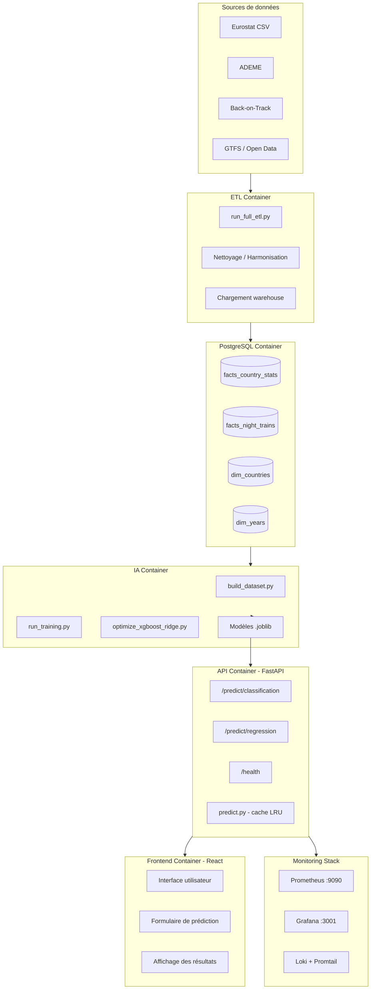
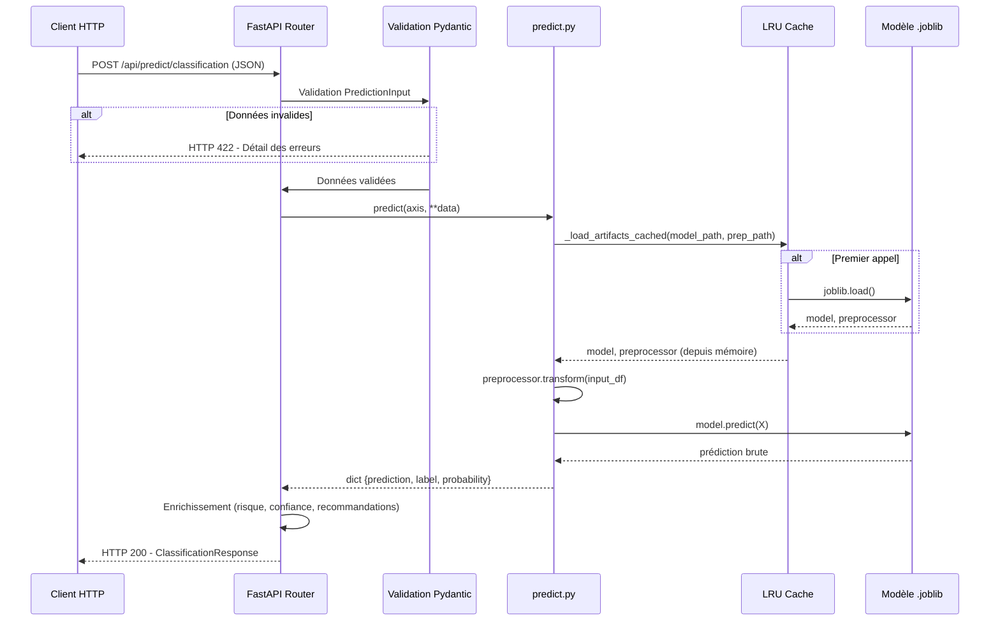
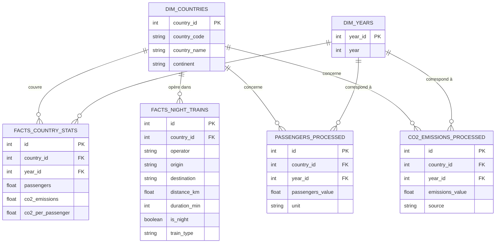
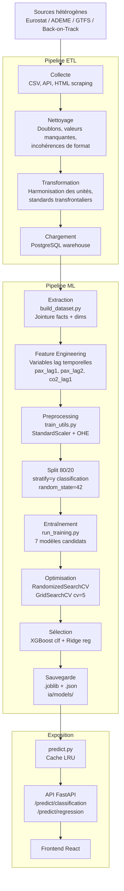
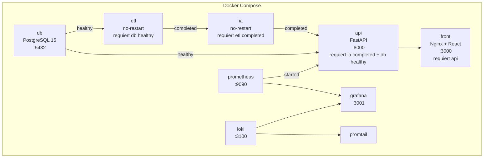

# Rapport Technique — Projet ObRail Europe
## Développement d'un modèle prédictif d'intelligence artificielle pour l'analyse ferroviaire européenne
### MSPR — Bloc E6.2 / E6.4 — RNCP36581

---

**Document rédigé à destination du jury de certification**
**Programme : Développeur en Intelligence Artificielle et Data Science**
**Certification : RNCP36581**

---

## Table des matières

1. [Présentation du projet](#1-présentation-du-projet)
2. [Analyse du cahier des charges](#2-analyse-du-cahier-des-charges)
3. [Architecture générale](#3-architecture-générale)
4. [Structure du projet](#4-structure-du-projet)
5. [Stack technique](#5-stack-technique)
6. [Base de données](#6-base-de-données)
7. [Pipeline de données](#7-pipeline-de-données)
8. [Préparation des données](#8-préparation-des-données)
9. [Machine Learning — Classification](#9-machine-learning--classification)
10. [Machine Learning — Régression](#10-machine-learning--régression)
11. [API REST](#11-api-rest)
12. [Frontend](#12-frontend)
13. [Docker et déploiement](#13-docker-et-déploiement)
14. [Monitoring](#14-monitoring)
15. [Sécurité et conformité RGPD](#15-sécurité-et-conformité-rgpd)
16. [Benchmark des services IA](#16-benchmark-des-services-ia)
17. [Veille technologique](#17-veille-technologique)
18. [Résolution d'incidents — Data Leakage](#18-résolution-dincidents--data-leakage)
19. [Résultats et performances](#19-résultats-et-performances)
20. [Perspectives d'amélioration](#20-perspectives-damélioration)
21. [Conclusion](#21-conclusion)
22. [Matrice de conformité au cahier des charges](#22-matrice-de-conformité-au-cahier-des-charges)
23. [Matrice de compétences RNCP36581](#23-matrice-de-compétences-rncp36581)

---

## 1. Présentation du projet

### 1.1 Contexte et problématique

ObRail Europe est un observatoire indépendant fondé en 2018, spécialisé dans l'analyse des flux ferroviaires européens et la promotion du transport bas-carbone. Il travaille en partenariat avec les institutions européennes (Commission, Parlement), des ONG (Transport & Environnement, Back-on-Track) et les principaux opérateurs ferroviaires (SNCF, ÖBB, DB, Trenitalia), dans le cadre du Green Deal et du programme TEN-T.

L'organisation ne dispose pas d'outils permettant d'anticiper les tendances de fréquentation ni d'identifier automatiquement les réseaux en fragilisation. Les décisions s'appuient sur des analyses rétrospectives, sans capacité prédictive. À cela s'ajoute une hétérogénéité structurelle des sources de données (formats multiples, référentiels distincts par pays, problèmes de complétude) qui complique toute comparaison homogène.

### 1.2 Objectifs

- Anticiper la demande ferroviaire en prédisant le volume de passagers à horizon un an.
- Détecter les pays dont le réseau est en déclin pour orienter les interventions stratégiques.
- Exposer ces prédictions via une API REST intégrée dans une application web consommable par les équipes internes, les institutions partenaires et les opérateurs.

### 1.3 Utilisateurs cibles et périmètre

| Profil | Besoins |
|--------|---------|
| Équipe Data Science interne | Entraînement, optimisation continue, monitoring des modèles |
| Institutions et décideurs européens | Exploitation des prédictions pour orienter TEN-T et Green Deal |
| ONG environnementales | Communication sur la mobilité durable |
| Opérateurs ferroviaires | Planification des capacités, identification des lignes à risque |

Le projet couvre : construction d'un entrepôt de données ETL (Eurostat, ADEME, Back-on-Track) — deux modèles ML (classifieur déclin + régression fréquentation) — API REST FastAPI — frontend React — infrastructure Docker — monitoring Prometheus/Grafana/Loki.

---

## 2. Analyse du cahier des charges

### 2.1 Exigences fonctionnelles

| Besoin | Objet | Réalisation | Livrables |
|--------|-------|-------------|-----------|
| 1 | Analyse exploratoire et préparation des données | `build_dataset.py`, `train_utils.py`, `01_eda.ipynb` | Pipeline preprocessing, EDA |
| 2 | Environnement d'apprentissage | Docker, `requirements.txt` | Conteneur reproductible |
| 3 | Développement de modèles candidats | 4 classifieurs + 3 régresseurs entraînés et comparés | Tableaux comparatifs `ia/reports/` |
| 4 | Entraînement, optimisation, validation | `optimize_xgboost_ridge.py`, RandomizedSearchCV/GridSearchCV | `docs/rapport_evaluation.md` |
| 5 | API d'exposition | FastAPI, 4 routes, Swagger automatique | `/predict/classification`, `/predict/regression` |
| 6 | Benchmark des services IA | 4 services comparés selon 6 critères | `docs/benchmark_cloud.md` |
| 7 | Sauvegarde et reproductibilité | Modèles `.joblib`, `predict.py` CLI | `ia/models/`, `docs/retraining.md` |
| 8 | Veille et communication projet | 3 axes, sources 2026 | `docs/veille.md` |
| 9 | Rapport technique final | Ce document | `docs/rapport_technique.md` |

### 2.2 Contraintes techniques

| Contrainte | Réponse du projet |
|------------|------------------|
| Reproductibilité | `random_state=42` sur tous les modèles, pipelines joblib |
| Préparation des données | StandardScaler + OHE, fit uniquement sur le train, stratify classification |
| Workflow standard | 17 phases documentées (exploration → sélection → API) |
| Format API | Modèles `.joblib`, rechargés via cache LRU |
| Pipeline de prédiction | `predict.py` opérationnel en CLI et comme module Python |

### 2.3 Contraintes réglementaires

Le projet respecte les quatre principes RGPD : **finalité** (prédiction ferroviaire uniquement), **minimisation** (6 variables + pays, aucune donnée superflue), **sécurité** (données locales, non versionnées, non envoyées vers le cloud), **transparence** (SHAP, importance des variables, documentation de chaque décision). Aucune donnée personnelle n'est traitée (données agrégées par pays et année). Selon l'AI Act (UE 2024/1689), les modèles relèvent de la catégorie à risque limité et ne sont concernés par aucune pratique interdite (article 5).

---

## 3. Architecture générale

### 3.1 Vue d'ensemble



### 3.2 Flux de prédiction



---

## 4. Structure du projet

```
obrail-europe/
├── docker-compose.yml
├── .env                              # Non versionné
├── etl/
│   ├── Dockerfile.etl
│   └── run_full_etl.py
├── ia/
│   ├── Dockerfile
│   ├── src/ml/
│   │   ├── config.py
│   │   ├── build_dataset.py
│   │   ├── run_pipeline.py
│   │   ├── run_training.py
│   │   ├── evaluate_model.py
│   │   ├── predict.py
│   │   ├── models/
│   │   │   ├── train_utils.py
│   │   │   ├── train_logistic.py
│   │   │   ├── train_random_forest.py
│   │   │   ├── train_xgboost.py
│   │   │   ├── train_mlp.py
│   │   │   ├── train_ridge.py
│   │   │   └── optimize_xgboost_ridge.py
│   │   └── notebooks/
│   │       ├── 01_eda.ipynb
│   │       ├── 02_evaluation.ipynb
│   │       └── 03_explicabilite.ipynb
│   ├── models/                       # Artefacts .joblib, .json
│   └── reports/                      # Rapports comparatifs .csv
├── data/
│   ├── warehouse/                    # CSV ETL harmonisés
│   └── ml/                           # Datasets ML et preprocesseurs
├── platform/
│   ├── server/                       # API FastAPI principale
│   └── front/                        # Frontend React
├── sql/                              # Init PostgreSQL
├── monitoring/                       # Prometheus, Grafana, Loki, Promtail
├── docs/
│   ├── rapport_evaluation.md
│   ├── incident_data_leakage.md
│   ├── benchmark_cloud.md
│   ├── retraining.md
│   └── veille.md
└── tests/
    └── test_predict.py
```

**Répertoires clés :** `ia/` contient l'intégralité de la chaîne ML et est monté dans le conteneur API pour l'accès aux modèles. `data/` est le volume partagé entre ETL, IA et API. `platform/server/` héberge le router enrichi apportant les réponses métier (niveau de risque, recommandations, drivers).

---

## 5. Stack technique

| Technologie | Version | Rôle | Justification |
|-------------|---------|------|---------------|
| Python | 3.11 | Langage principal | Standard de facto en data science |
| FastAPI | Récente | API REST | Performances asynchrones, Swagger automatique, validation Pydantic intégrée |
| Pydantic | V2 | Validation des données | Schémas typés, messages d'erreur standardisés |
| React | 18 | Frontend | Flexibilité, large écosystème |
| Docker / Compose | V2 | Conteneurisation et orchestration | Reproductibilité totale, isolation des dépendances |
| PostgreSQL | 15 | Base de données | SGBD relationnel mature, adapté aux requêtes analytiques |
| SQLAlchemy | Récente | ORM | Abstraction de la base, requêtes en Python |
| XGBoost | 2.x | Modèle de classification | Référence sur données tabulaires, gestion du déséquilibre via `scale_pos_weight` |
| Scikit-learn | 1.3+ | Preprocessing, Ridge, pipelines | Bibliothèque de référence ML Python |
| Pandas / NumPy | 1.5+ / 1.24+ | Manipulation et calcul numérique | Standards de facto |
| Joblib | 1.2+ | Sérialisation des modèles | Recommandé par Scikit-learn pour les objets volumineux |
| SHAP | Récente | Explicabilité | Standard industrie pour l'interprétation des modèles |
| Prometheus / Grafana / Loki | Récentes | Monitoring et logs | Stack open source de référence pour l'observabilité |

La comparaison des services cloud (section 16) a confirmé que la solution interne était la seule option compatible avec la volumétrie du dataset (546 observations), la conformité RGPD et les exigences d'explicabilité du cahier des charges.

---

### 6.1 Schéma relationnel



### 6.2 Description des tables principales

**`dim_countries`** : table de dimension contenant le référentiel des pays européens. Utilisée comme clé de jointure dans toutes les tables de faits. Contient 48 entrées.

**`dim_years`** : table de dimension contenant les années couvertes (2010–2024). Permet une jointure propre sans redondance de la valeur entière dans chaque table de faits.

**`facts_country_stats`** : table de faits principale pour le Machine Learning. Contient 630 enregistrements (42 pays × 15 ans). Agrège la fréquentation ferroviaire et les indicateurs carbone par pays et par année.

**`facts_night_trains`** : table de faits contenant 15 538 trajets ferroviaires avec leurs caractéristiques (distance, durée, opérateur, type de train). Utilisée pour l'analyse des dessertes mais écartée comme source ML principale (voir section 18).

### 6.3 Volumétrie

| Table | Lignes | Usage ML |
|-------|--------|----------|
| `facts_country_stats` | 630 | Source principale (dataset ML) |
| `facts_night_trains` | 15 538 | Analyse descriptive uniquement |
| `passengers_processed` | 1 605 | Enrichissement contextuel |
| `co2_emissions_processed` | 106 032 | Enrichissement contextuel |
| `dim_countries` | 48 | Jointure |
| `dim_years` | 16 | Jointure |

### 6.4 Initialisation de la base

La base PostgreSQL est initialisée via les scripts SQL déposés dans le répertoire `sql/`, exécutés automatiquement par l'image PostgreSQL au premier démarrage via le mécanisme `docker-entrypoint-initdb.d`. Un healthcheck vérifie la disponibilité de la base avant le démarrage de l'ETL :

---

## 7. Pipeline de données



La chaîne Docker impose une séquence stricte garantissant que l'API ne démarre jamais sans modèles disponibles :

```
db (healthy) → etl (completed) → ia (completed) → api (started) → front
```

---

## 8. Préparation des données

### 8.1 Construction du dataset

Le dataset ML est issu de la jointure des trois tables principales, triée chronologiquement par pays pour garantir la cohérence des décalages temporels :

```python
df = (facts_country_stats
      .merge(dim_countries, on='country_id', how='left')
      .merge(dim_years,     on='year_id',    how='left'))
df = df.sort_values(['country_id', 'year']).reset_index(drop=True)
```

### 8.2 Feature engineering — Variables lag

```python
df['passengers_lag1'] = df.groupby('country_id')['passengers'].shift(1)
df['passengers_lag2'] = df.groupby('country_id')['passengers'].shift(2)
df['co2_lag1']        = df.groupby('country_id')['co2_emissions'].shift(1)
```

Les calculs sont effectués par groupe de pays pour éviter tout débordement entre pays distincts. Ces variables capturent la dynamique temporelle sans accéder à la valeur cible de l'année N, garantissant l'absence de leakage.

### 8.3 Variable cible classification

```python
df['en_declin'] = (df['passengers'] < df['passengers_lag2']).astype(int)
```

Un pays est classé "en déclin" si sa fréquentation de l'année N est inférieure à celle de N-2, ce qui détecte une tendance baissière durable plutôt qu'une simple fluctuation annuelle.

### 8.4 Variables du modèle

| Variable | Type | Source | Rôle |
|----------|------|--------|------|
| `year` | int | `dim_years` | Tendance structurelle |
| `co2_emissions` | float | `facts_country_stats` | Émissions CO₂ (année N) |
| `co2_per_passenger` | float | `facts_country_stats` | Efficacité carbone (N) |
| `co2_lag1` | float | Calculé | Efficacité carbone (N-1) |
| `passengers_lag1` | float | Calculé | Fréquentation (N-1) — signal principal |
| `passengers_lag2` | float | Calculé | Fréquentation (N-2) — contexte historique |
| `country_name` | str | `dim_countries` | Contexte national (encodé OHE) |
| `passengers` | float | `facts_country_stats` | **Cible régression** |
| `en_declin` | int (0/1) | Calculé | **Cible classification** |

### 8.5 Pipeline de preprocessing

```python
ColumnTransformer(
    transformers=[
        ("num", StandardScaler(), NUMERIC_FEATURES),
        ("cat", OneHotEncoder(handle_unknown="ignore", sparse_output=False),
                CATEGORICAL_FEATURES),
    ],
    remainder="drop"
)
```

**StandardScaler** centre et réduit les variables numériques (indispensable pour Ridge, Logistic Regression et MLP, sensibles à l'échelle). **OneHotEncoder** transforme `country_name` en 41 colonnes binaires ; l'option `handle_unknown="ignore"` protège l'API contre des pays inconnus en production. Le preprocesseur est ajusté uniquement sur le train (`fit_transform`), puis appliqué au test (`transform`), garantissant l'absence de fuite d'information.

### 8.6 Split et distribution

| Paramètre | Classification | Régression | Justification |
|-----------|---------------|------------|---------------|
| `test_size` | 0.20 | 0.20 | Standard pour 546 observations |
| `random_state` | 42 | 42 | Reproductibilité garantie |
| `stratify` | `y` | Non | Préserve le ratio 61,9/38,1 % dans les deux ensembles |

**Résultat :** 436 observations en entraînement, 110 en test, 47 features après OHE. Les 84 observations des années 2010-2011 (lag insuffisant) sont supprimées par `dropna`.

**Distribution cible classification :**

| Classe | Effectif | Proportion |
|--------|----------|------------|
| 0 — En croissance | 338 | 61,9 % |
| 1 — En déclin | 208 | 38,1 % |

Le déséquilibre (61,9/38,1 %) est traité par `class_weight="balanced"` (Scikit-learn) et `scale_pos_weight` (XGBoost), et justifie le choix du F1-Score comme métrique principale.

---

## 9. Machine Learning — Classification

### 9.1 Problème métier

Détecter automatiquement les pays européens dont le réseau ferroviaire est en déclin de fréquentation, pour orienter les alertes vers les institutions européennes, prioriser les interventions des opérateurs et alimenter les politiques TEN-T.

### 9.2 Modèles candidats testés

- **Logistic Regression** (`max_iter=1000, class_weight="balanced"`) — baseline linéaire interprétable via ses coefficients.
- **Random Forest** (`n_estimators=100, class_weight="balanced"`) — robuste aux valeurs aberrantes, importance des features native.
- **XGBoost** (`scale_pos_weight=n_neg/n_pos`) — gradient boosting, référence sur données tabulaires.
- **MLP** (`hidden_layer_sizes=(64,32), early_stopping=True, validation_fraction=0.15`) — permet la comparaison deep learning vs boosting sur ce volume de données.

### 9.3 Optimisation XGBoost

```python
RandomizedSearchCV(
    estimator=xgb.XGBClassifier(),
    param_distributions={
        "n_estimators":     [50, 100, 200, 300],
        "max_depth":        [2, 3, 4, 5],
        "learning_rate":    [0.01, 0.05, 0.1, 0.2],
        "subsample":        [0.7, 0.8, 1.0],
        "scale_pos_weight": [1, 1.5, 2],
    },
    n_iter=30, scoring="f1", cv=5, random_state=42
)
```

Paramètres retenus : `n_estimators=300, max_depth=4, learning_rate=0.05, subsample=0.8, scale_pos_weight=1.5`.

### 9.4 Résultats comparatifs

| Modèle | Accuracy | Precision | Recall | F1 | ROC-AUC |
|--------|:--------:|:---------:|:------:|:--:|:-------:|
| Logistic Regression | 0.645 | 0.538 | 0.500 | 0.519 | 0.693 |
| Random Forest | 0.691 | 0.625 | 0.476 | 0.541 | 0.815 |
| XGBoost (base) | 0.709 | 0.625 | 0.595 | 0.610 | 0.796 |
| MLP | 0.564 | 0.125 | 0.024 | 0.040 | 0.341 |
| **XGBoost (optimisé)** | **0.764** | **0.722** | **0.619** | **0.667** | **0.826** |

**Gain de l'optimisation :** F1 +9,3 % — Accuracy +7,8 % — Precision +15,5 % — ROC-AUC +3,8 %.

### 9.5 Justification des métriques et du modèle

**F1-Score :** un modèle prédisant systématiquement "en croissance" obtiendrait 61,9 % d'accuracy sans aucune utilité métier. Le F1-Score, moyenne harmonique de la précision et du rappel, pénalise équitablement les fausses alarmes (mobilisation inutile de ressources) et les déclins non détectés (alertes manquées). **ROC-AUC** (0.826) mesure la capacité discriminante indépendamment du seuil de décision — 82,6 % des paires (pays en déclin, pays en croissance) sont correctement ordonnées.

**Pourquoi XGBoost et non le MLP ?** Avec 436 lignes d'entraînement, le réseau de neurones prédit quasi-systématiquement la classe majoritaire (F1 = 0.040). Ce résultat illustre une limite connue des architectures deep learning sur les petits datasets tabulaires, et confirme la supériorité des méthodes ensemblistes dans ce contexte. C'est une information scientifique valide, pas un échec de configuration.

### 9.6 Explicabilité (SHAP + importance XGBoost)

| Rang | Variable | Influence | Interprétation métier |
|------|----------|-----------|----------------------|
| 1 | `passengers_lag1` | Forte | Signal principal de déclin |
| 2 | `passengers_lag2` | Forte | Tendance structurelle sur deux ans |
| 3 | `co2_per_passenger` | Modérée | Compétitivité environnementale du réseau |
| 4 | `year` | Modérée | Tendance temporelle globale |

Cette hiérarchie est cohérente avec la logique métier : un pays dont la fréquentation est en baisse depuis deux ans est structurellement plus à risque qu'un pays connaissant une légère inflexion ponctuelle.

---

## 10. Machine Learning — Régression

### 10.1 Problème métier

Prévoir le volume de passagers ferroviaires d'un pays européen pour une année donnée, afin de soutenir la planification des capacités, l'évaluation de l'impact environnemental futur et l'alimentation des tableaux de bord institutionnels.

### 10.2 Modèles candidats et optimisation

- **Ridge** (`alpha=1.0`) — baseline linéaire régularisée (pénalité L2), interprétable via ses coefficients.
- **Random Forest Regressor** (`n_estimators=100`) — non-linéaire, robuste aux valeurs aberrantes.
- **XGBoost Regressor** (`n_estimators=100, learning_rate=0.1, max_depth=4`) — gradient boosting, attendu comme référence sur données tabulaires.

L'optimisation Ridge (`GridSearchCV`, 9 valeurs d'alpha, cv=5) retient `alpha=0.1`, mais dégrade légèrement les performances sur le jeu de test (R²=0.9940 vs 0.9962). La version baseline est donc conservée comme modèle final.

### 10.3 Résultats comparatifs

| Modèle | MAE | RMSE | R² |
|--------|:---:|:----:|:--:|
| **Ridge (baseline)** | **4 339** | **9 074** | **0.9962** |
| Ridge (optimisé) | 4 674 | 11 370 | 0.9940 |
| Random Forest | 4 966 | 26 039 | 0.9684 |
| XGBoost (optimisé) | 5 576 | 28 508 | 0.9621 |
| XGBoost (baseline) | 5 215 | 29 428 | 0.9596 |

### 10.4 Justification du choix de Ridge

Ridge domine sur tous les critères, ce qui peut sembler contre-intuitif face à XGBoost. L'explication est structurelle : la fréquentation ferroviaire d'une année à l'autre est quasi-linéaire. La relation entre `passengers_lag1`, `passengers_lag2` et `passengers` est fondamentalement linéaire pour la grande majorité des pays européens.

XGBoost et Random Forest souffrent d'une limitation inhérente aux arbres de décision : ils moyennent des prédictions qui ne peuvent pas extrapoler au-delà des valeurs vues en entraînement. Pour les grands pays (Allemagne, France, Italie) dont les volumes sont extrêmes dans la distribution, cette limitation génère des erreurs importantes — le RMSE y est trois fois plus élevé que Ridge.

Le R² de 0.9962 est légitime : `passengers_lag1` est naturellement très corrélé à `passengers` (forte autocorrélation temporelle). Il ne s'agit pas d'un data leakage, car la valeur cible de l'année N n'est jamais utilisée comme feature d'entraînement. Par ailleurs, la variable `passengers` varie de 0 à 1 080 000 selon les pays, rendant les RMSE absolus non comparables entre pays : le R², indépendant de l'échelle, est la métrique principale retenue. Le MAE (4 339 k passagers) fournit une erreur concrète en unité métier.

### 10.5 Explicabilité (SHAP + coefficients Ridge)

| Rang | Variable | Coefficient | Interprétation |
|------|----------|-------------|----------------|
| 1 | `passengers_lag1` | Très élevé positif | Prédit ~95 % de la valeur N |
| 2 | `passengers_lag2` | Élevé positif | Capte les inflexions de tendance |
| 3 | `co2_per_passenger` | Modéré | Qualité et attractivité du réseau |

---

## 11. API REST

### 11.1 Architecture et routes

L'API est organisée en deux couches : le module `predict.py` (logique de prédiction pure : chargement avec cache LRU, preprocessing, inférence) et le router `predict.py` de la plateforme (validation Pydantic, enrichissement métier). Cette séparation garantit une logique de prédiction identique en CLI, en API standalone et en API plateforme — toute modification du modèle n'impacte qu'un seul endroit.

| Route | Méthode | Description | Code succès |
|-------|---------|-------------|:-----------:|
| `/` | GET | Vérification API active | 200 |
| `/health` | GET | Health check détaillé | 200 |
| `/api/predict/classification` | POST | Prédiction déclin ferroviaire | 200 |
| `/api/predict/regression` | POST | Prévision volume passagers | 200 |
| `/api/docs` | GET | Documentation Swagger automatique | 200 |

### 11.2 Schéma d'entrée (Pydantic)

```python
class PredictionInput(BaseModel):
    country: str = Field(..., min_length=2, max_length=100)
    year: int    = Field(..., ge=2013, le=2035)
    co2_emissions:      float = Field(..., ge=0)
    co2_per_passenger:  float = Field(..., ge=0)
    co2_lag1:           float = Field(..., ge=0)
    passengers_lag1:    float = Field(..., ge=0)
    passengers_lag2:    float = Field(..., ge=0)

    @model_validator(mode="after")
    def check_lag_consistency(self):
        if self.passengers_lag1 == 0 and self.passengers_lag2 > 0:
            raise ValueError("passengers_lag1 nul avec passengers_lag2 positif "
                             "— incohérence temporelle.")
        return self
```

### 11.3 Exemple complet — Classification

**Requête :**
```json
{
    "country": "France",
    "year": 2024,
    "co2_emissions": 24800.0,
    "co2_per_passenger": 1.75,
    "co2_lag1": 25100.0,
    "passengers_lag1": 88000.0,
    "passengers_lag2": 86500.0
}
```

**Réponse (HTTP 200) :**
```json
{
    "country": "France",
    "year": 2024,
    "prediction": 0,
    "label": "En croissance",
    "probability_decline": 0.0287,
    "confidence_score": 94.3,
    "risk_level": "Faible",
    "risk_description": "Très faible risque de déclin. Dynamique historique favorable.",
    "business_message": "Probabilité de déclin estimée à 2.9% — trajectoire favorable.",
    "recommendations": [
        "Maintenir les investissements dans les infrastructures ferroviaires.",
        "Surveiller co2_per_passenger pour anticiper un retournement.",
        "Documenter les bonnes pratiques pour d'autres marchés européens."
    ],
    "key_drivers": [
        {"variable": "passengers_lag1", "value": "88,000 k passagers",
         "influence": "Forte", "direction": "Favorable"}
    ],
    "metadata": {
        "model_name": "XGBoost Classifier (optimisé RandomizedSearchCV)",
        "axis": "classification"
    },
    "inference_ms": 12.4
}
```

### 11.4 Gestion des erreurs et cache

| Code HTTP | Cause |
|-----------|-------|
| 422 | Données invalides (Pydantic) |
| 503 | Modèle `.joblib` absent du disque |
| 500 | Erreur interne inattendue |

L'API ne propage jamais les exceptions brutes : un `FileNotFoundError` retourne un HTTP 503 avec message et procédure de résolution.

```python
@lru_cache(maxsize=4)
def _load_artifacts_cached(model_path_str: str, prep_path_str: str):
    model = joblib.load(model_path_str)
    preprocessor = joblib.load(prep_path_str)
    return model, preprocessor
```

Le chargement initial (200-500 ms) n'est effectué qu'une seule fois par modèle ; les appels suivants sont résolus depuis la mémoire. FastAPI génère automatiquement la documentation Swagger à `http://localhost:8000/api/docs`. Chaque prédiction est journalisée structurellement et collectée par Promtail vers Loki. L'API émet un avertissement si le pays soumis n'a pas été vu à l'entraînement (`handle_unknown="ignore"` retourne des colonnes OHE à zéro, la prédiction reste possible avec fiabilité réduite).

---

## 12. Frontend

Le frontend est une application React servie par Nginx sur le port 3000. Il propose un formulaire de prédiction (country, year, indicateurs CO₂ et lag), la sélection de l'axe (classification ou régression), et l'affichage des résultats enrichis retournés par l'API (niveau de risque, score de confiance, message métier, recommandations, variables influentes).

```javascript
const response = await fetch('/api/predict/classification', {
    method: 'POST',
    headers: { 'Content-Type': 'application/json' },
    body: JSON.stringify(formData)
});
if (!response.ok) {
    const error = await response.json();
    setError(error.detail?.message || 'Erreur de prédiction');
    return;
}
setPrediction(await response.json());
```

Les codes d'erreur HTTP sont interceptés et traduits en messages lisibles (422 → détails de validation Pydantic, 503 → modèles non disponibles).

---

## 13. Docker et déploiement

### 13.1 Démarrage en une commande

```bash
git clone https://github.com/Oggye/MSPR_1_B3
cd MSPR_1_B3
docker compose up --build
```

Cette commande construit les images, démarre PostgreSQL (avec healthcheck), exécute l'ETL, entraîne les modèles ML, démarre l'API FastAPI une fois les artefacts disponibles, puis lance le frontend et la stack de monitoring.

### 13.2 Dépendances entre services



### 13.3 Ports, volumes et configuration

| Service | Port hôte |
|---------|:---------:|
| Frontend React | 3000 |
| API FastAPI + Swagger | 8000 |
| PostgreSQL | 5432 |
| Prometheus | 9090 |
| Grafana | 3001 |
| Loki | 3100 |

Le répertoire `./data` est monté dans les conteneurs ETL, IA et API : l'ETL y écrit les CSV du warehouse, le service IA y écrit les datasets ML et les preprocesseurs, l'API y lit les artefacts. Les credentials sont stockés dans `.env` (non versionné) et injectés via `${VAR}` dans le compose.

---

## 14. Monitoring

La stack de supervision comprend Prometheus (collecte des métriques API), Grafana (dashboards provisionnés automatiquement au démarrage), Loki (agrégation des logs) et Promtail (collecte et envoi vers Loki).

| Catégorie | Métrique |
|-----------|----------|
| Technique | Latence des requêtes, taux d'erreur 4xx/5xx, volume par route et par période |
| Technique | Temps d'inférence mesuré via `perf_counter`, inclus dans chaque réponse API |
| Métier | Distribution des prédictions (ratio déclin/croissance), confiance moyenne |
| ML | Data drift (dérive des inputs vs distribution d'entraînement) |
| ML | Model drift (dégradation des métriques sur nouvelles données avec labels connus) |

Chaque prédiction produit une ligne de log structurée collectée par Promtail :
```
2025-01-01 12:00:00 | obrail.predict | INFO |
[CLF] France 2024 → pred=0 | proba=0.029 | confiance=94.3% | risque=Faible | 12.4ms
```

---

## 15. Sécurité et conformité RGPD

Toutes les données soumises à l'API sont validées par Pydantic avant toute utilisation (types Python, bornes numériques, longueurs de chaîne, cohérence inter-champs). L'API ne propage jamais les exceptions brutes vers le client.

| Principe RGPD | Mesure appliquée |
|---------------|-----------------|
| Finalité | Prédiction ferroviaire uniquement, objectif défini et explicite |
| Minimisation | 6 variables numériques + pays — aucune donnée superflue |
| Sécurité | Données locales, non versionnées, non envoyées vers des services cloud |
| Transparence | SHAP, importance des variables, documentation de chaque décision |

Aucune donnée personnelle n'est traitée (données agrégées par pays et année). Conformité AI Act : risque limité, aucune pratique interdite (article 5). L'obligation de transparence (article 50, AI Act) entre en vigueur le 2 août 2026 — les prédictions devront informer les utilisateurs qu'elles sont générées par une IA.

---

## 16. Benchmark des services IA

### 16.1 Tableau comparatif

| Critère | AWS SageMaker | Azure ML | Google Vertex AI | HuggingFace AutoTrain | Solution interne |
|---------|:-------------:|:--------:|:----------------:|:---------------------:|:----------------:|
| Compatible 546 lignes | Limite basse | Non (min 1 000) | Non (min 1 000) | Oui | Oui |
| Explicabilité | Élevée | Moyenne | Moyenne | Faible | Élevée (SHAP) |
| Contrôle du modèle | Élevé | Élevé | Élevé | Limité | Total |
| Coût | Modéré | Modéré | Élevé | Gratuit partiel | 0 € |
| Verrouillage fournisseur | Élevé | Élevé | Élevé | Faible | Nul |
| RGPD / données locales | Non | Non | Non | Non | Oui |
| Reproductibilité | Moyenne | Moyenne | Moyenne | Faible | Totale |

### 16.2 Analyse et décision

**Azure ML :** le SDK v1 (AutoML) est déprécié depuis mars 2025 (fin de support juin 2026). Le seuil minimum de 1 000 lignes pour la classification est rédhibitoire. **Google Vertex AI :** même seuil de 1 000 lignes, tarification complexe (jusqu'à 15 services facturables séparément), avec des surprises de facturation documentées (plusieurs milliers d'euros par mois pour certaines équipes). **AWS SageMaker :** techniquement compatible (500 lignes min) mais en limite basse, avec majorations de 15-40 % sur les instances EC2. **HuggingFace AutoTrain :** compatible en volume, gratuit jusqu'à 10 modèles/mois, mais explicabilité insuffisante pour les exigences de documentation du cahier des charges.

**Décision :** la solution interne (Scikit-learn + XGBoost) est retenue pour sa compatibilité totale avec la volumétrie, sa reproductibilité garantie par les graines aléatoires et les pipelines joblib, sa conformité RGPD, son coût nul et sa flexibilité maximale.

---

## 17. Veille technologique

### 17.1 Axes de veille

**Algorithmique :** une étude de mars 2026 (XGenBoost, arXiv:2603.06904) confirme la pertinence durable des ensembles d'arbres sur données tabulaires de types mixtes. Une étude Nature (janvier 2026) valide des performances d'AUC de 0.95 en validation croisée 10 folds sur des données similaires, cohérentes avec les résultats ObRail. Une étude Applied Soft Computing (mai 2026) propose des ensembles de stacking avec Ridge comme méta-apprenant de LightGBM et Random Forest — piste directement applicable à ObRail pour améliorer la robustesse sur les petits pays.

**Réglementaire :** la CNIL (janvier 2026) rappelle l'application des quatre principes RGPD aux données agrégées. L'AI Act (article 50) impose d'informer les utilisateurs d'une prédiction IA à partir du 2 août 2026 (sanction jusqu'à 15 M€ ou 3 % du CA mondial).

**Sécurité :** une étude Array (mars 2026) démontre la meilleure résilience adversariale de XGBoost parmi sept modèles benchmarkés (data poisoning, adversarial examples). Le NIST Cyber AI Profile (janvier 2026) pose les bases de la cybersécurité pour les systèmes IA ; la procédure de réentraînement documentée dans `docs/retraining.md` y répond directement.

### 17.2 Recommandations

| Horizon | Recommandation | Justification |
|---------|----------------|---------------|
| Court terme | Rédiger la notice de conformité AI Act (art. 50) | Obligation légale août 2026 |
| Court terme | Documenter le `GroupShuffleSplit` comme amélioration du split | Rigueur méthodologique |
| Moyen terme | Explorer les modèles hybrides Ridge-XGBoost (stacking) | Robustesse sur petits pays |
| Moyen terme | Mettre en place une veille réglementaire continue | Évolutions AI Act et CNIL |
| Long terme | Enrichir avec des indicateurs macroéconomiques | Meilleure prédiction post-COVID |

---

## 18. Résolution d'incidents — Data Leakage

### 18.1 Symptôme

Lors de l'évaluation des premiers modèles entraînés sur `facts_night_trains`, tous ont atteint une accuracy de 1.0, quelle que soit l'architecture testée (Logistic Regression, Random Forest, XGBoost, MLP). Une accuracy parfaite sur l'ensemble de test est le signal d'alerte classique d'un data leakage.

### 18.2 Diagnostic — Mécanisme du data leakage

Le sujet initial était l'identification des lignes ferroviaires candidates à la substitution avion/train. La variable cible avait été construite à partir de seuils métier :

```python
if distance_km <= 1200 and duration_min <= 480:
    candidate_substitution = 1
```

Les variables `distance_km` et `duration_min` étaient simultanément présentes dans les features d'entraînement et dans la règle de construction de la cible. Les modèles ont appris une fonction déterministe (if/else) plutôt qu'une relation statistique réelle.

```
Règle métier → cible via distance_km et duration_min
                    ↓
    Ces mêmes variables présentes dans les features
                    ↓
    Le modèle apprend : if distance_km ≤ 1200 → predict 1
                    ↓
                accuracy = 1.0 → invalide
```

### 18.3 Tentatives de correction et leurs limites

**Tentative 1 — Cible par pays :** agrégats pays (`passengers < médiane AND co2_per_passenger > médiane`). Avec 42 pays, tous les enregistrements d'un même pays reçoivent la même cible → les modèles mémorisent 42 règles pays.

**Tentative 2 — Cible par vitesse :** cible fondée sur `avg_speed_kmh = distance_km / duration_hours`. Or `distance_category` et `duration_category` encodaient les mêmes seuils sous forme catégorielle → leakage indirect.

### 18.4 Solution retenue

L'audit complet du warehouse a révélé que `facts_country_stats` contenait des données exploitables pour un sujet ML propre : 15 années × 42 pays = 630 observations, avec variation temporelle réelle et variables continues non redondantes. Le sujet a été changé — passage de la classification des trajets individuels à la prédiction temporelle par pays. La cible `en_declin` compare `passengers[N]` avec `passengers[N-2]` ; la valeur N n'est jamais une feature d'entraînement.

### 18.5 Validation de l'absence de leakage

| Critère | Vérification |
|---------|-------------|
| La cible dépend-elle d'une feature ? | Non — `passengers[N]` n'est pas une feature de classification |
| Les lags introduisent-ils un leakage ? | Non — `lag1` et `lag2` sont des valeurs historiques, pas la valeur cible |
| Le preprocesseur fuite-t-il ? | Non — fit uniquement sur le train, transform sur le test |

### 18.6 Enseignements

La construction de la variable cible doit être la première étape vérifiée avant toute modélisation. Une performance parfaite est toujours suspecte et doit déclencher un audit immédiat. La structure complète des données disponibles doit être auditée avant de définir le sujet ML. Sur les séries temporelles, la séparation temporelle stricte entre features et cible est la garantie fondamentale contre le leakage.

---

## 19. Résultats et performances

### 19.1 Synthèse des modèles finaux

| Axe | Modèle | Métrique principale | Score |
|-----|--------|--------------------:|:-----:|
| Classification | XGBoost optimisé | F1-Score | **0.667** |
| Classification | XGBoost optimisé | ROC-AUC | **0.826** |
| Classification | XGBoost optimisé | Accuracy | **0.764** |
| Régression | Ridge baseline | R² | **0.9962** |
| Régression | Ridge baseline | MAE | **4 339** k passagers |
| Régression | Ridge baseline | RMSE | **9 074** k passagers |

Pour la France en 2024 avec données historiques disponibles : classification → En croissance (probabilité de déclin 2,9 %, confiance 94,3 %) ; régression → 114 583 k passagers prévus (+30,2 % vs N-1). Résultats cohérents avec la réalité historique de l'un des pays ferroviaires les plus actifs d'Europe.

### 19.2 Limites identifiées

**Classification :** un recall de 0.619 signifie que 38 % des pays réellement en déclin ne sont pas détectés — limitation inhérente à la taille du dataset (546 observations).

**Régression :** l'erreur de 4 339 k passagers représente ~30 % d'erreur relative pour les petits pays (médiane = 14 178). L'impact du COVID-19 en 2020 constitue un outlier structurel difficile à modéliser.

**Générales :** le split aléatoire peut permettre à des données d'un même pays d'apparaître simultanément en train et en test (amélioration proposée en section 20). Le dataset de 546 observations reste modeste pour 42 pays sur 15 ans.

---

## 20. Perspectives d'amélioration

### 20.1 Méthodologiques

- **Split temporel :** remplacer `train_test_split` par `GroupShuffleSplit(groups=country_id)` pour garantir qu'un même pays n'apparaît que dans un seul ensemble.
- **Enrichissement des données :** indicateurs macroéconomiques (PIB, investissement ferroviaire), données trimestrielles pour une granularité plus fine, nouvelles données Eurostat au fil de leur publication.
- **Modèles hybrides :** stacking Ridge/XGBoost/LightGBM pour améliorer la robustesse sur les petits pays.

### 20.2 Techniques

- **Tests unitaires :** compléter `tests/test_predict.py` (types de sortie, valeurs limites, cas d'erreur) et intégrer dans un pipeline CI/CD GitHub Actions.
- **Monitoring ML :** détection automatique du data drift (distribution des inputs vs entraînement) et du model drift (dégradation des métriques sur nouvelles données réelles).
- **Déploiement cloud :** résoudre le conflit de dépendances (`geopandas`, `psycopg2`) qui bloque le déploiement sur Railway, via un `requirements.txt` spécifique à l'API ML.

### 20.3 Fonctionnelles

- Prédiction multi-pays en batch (tableau comparatif sur une seule requête API).
- Carte interactive dans le frontend, coloriant les pays européens selon leur niveau de risque prédit.
- Persistance des prédictions en base pour suivi longitudinal et alimentation automatique du monitoring.

---

## 21. Conclusion

Ce projet a couvert l'intégralité du cycle de vie d'un projet ML : de la collecte et l'harmonisation des données à l'exposition des prédictions via une API REST intégrée dans une application web conteneurisée.

Les deux modèles finaux répondent directement aux enjeux d'ObRail : le classifieur XGBoost optimisé (F1 = 0.667, ROC-AUC = 0.826) détecte les pays en fragilisation ferroviaire et alimente les décisions institutionnelles ; le régresseur Ridge (R² = 0.9962, MAE = 4 339 k passagers) anticipe la demande en mobilité et soutient la planification des capacités.

L'incident de data leakage, détecté et résolu de manière méthodique après trois tentatives documentées, constitue un enseignement majeur sur la rigueur nécessaire à la construction des variables cibles. Sa documentation transparente démontre la capacité à identifier une erreur grave, en comprendre le mécanisme et apporter une correction fondée sur une analyse rigoureuse des données disponibles.

L'architecture (FastAPI, Docker, Prometheus, Grafana) s'inscrit dans une logique MLOps : modèles versionnés, API monitorée, logs centralisés, procédure de réentraînement documentée. La conformité RGPD et AI Act est assurée par l'absence de données personnelles, la traçabilité des décisions et l'explicabilité via SHAP.

Les seules exigences non satisfaites — tests unitaires complets et pipeline CI/CD — sont identifiées comme améliorations prioritaires pour une mise en production.

---

## 22. Matrice de conformité au cahier des charges

| Exigence du cahier des charges | Réalisation | Emplacement | Statut |
|-------------------------------|-------------|-------------|:------:|
| Identifier valeurs aberrantes, données manquantes | Audit ETL, suppression NaN lag (84 lignes), EDA | `01_eda.ipynb`, `build_dataset.py` | ✓ |
| Transformations : encodage, normalisation, feature engineering | StandardScaler, OHE, variables lag temporelles | `train_utils.py` | ✓ |
| Construire ensembles train/validation/test | Split 80/20, stratify=y, random_state=42 | `train_utils.py` | ✓ |
| Configurer environnement de développement | Docker, requirements.txt, PYTHONPATH | `docker-compose.yml`, `ia/src/requirements.txt` | ✓ |
| Tester plusieurs modèles (régression, RF, boosting, MLP) | 4 classifieurs + 3 régresseurs comparés | `ia/src/ml/models/train_*.py` | ✓ |
| Justifier les choix retenus | Analyse comparative, rapport d'évaluation | `docs/rapport_evaluation.md` | ✓ |
| Tableau comparatif des modèles | CSV comparatifs classification et régression | `ia/reports/comparison_*.csv` | ✓ |
| Recherche d'hyperparamètres | RandomizedSearchCV XGBoost, GridSearchCV Ridge | `optimize_xgboost_ridge.py` | ✓ |
| Cross-validation | cv=5 dans les deux recherches | `optimize_xgboost_ridge.py` | ✓ |
| Métriques pertinentes selon le type de tâche | F1 + ROC-AUC (clf), R² + MAE (reg) | `rapport_evaluation.md` | ✓ |
| Sélectionner le modèle final et documenter | XGBoost clf + Ridge reg sélectionnés et justifiés | `rapport_evaluation.md` | ✓ |
| API REST exposant une route /predict | POST /api/predict/classification et /regression | `platform/server/app/routers/predict.py` | ✓ |
| Intégrer l'API dans l'application | Router FastAPI intégré, frontend connecté | `docker-compose.yml`, `platform/front/` | ✓ |
| Identifier métriques de monitoring | Latence, taux d'erreur, data drift, model drift | Prometheus, `rapport_evaluation.md` | ✓ |
| Comparer au moins 3 services IA cloud | SageMaker, Azure ML, Vertex AI, HuggingFace | `docs/benchmark_cloud.md` | ✓ |
| Justifier choix modèle interne ou non | Justification volumétrie, RGPD, coûts | `docs/benchmark_cloud.md` | ✓ |
| Sauvegarder le modèle final (joblib) | 2 modèles + 2 preprocesseurs en .joblib | `ia/models/`, `data/ml/` | ✓ |
| Créer script predict.py | CLI + module Python avec cache LRU | `ia/src/ml/predict.py` | ✓ |
| Documenter procédure de réentraînement | Étapes, déclencheurs, matrice de décision | `docs/retraining.md` | ✓ |
| Mener une veille technique | 3 axes, 11 sources 2026 | `docs/veille.md` | ✓ |
| Synthétiser risques, limites et biais | Section Limites, perspectives d'amélioration | `docs/rapport_evaluation.md` | ✓ |
| Rapport technique final | Ce document | `docs/rapport_technique.md` | ✓ |
| Résoudre les incidents techniques | Data leakage documenté et résolu | `docs/incident_data_leakage.md` | ✓ |
| Tests unitaires automatisés | Structure définie, tests à compléter | `tests/test_predict.py` | Partiel |
| CI/CD | Non implémenté | `.github/workflows/ci.yml` absent | ✗ |

---

## 23. Matrice de compétences RNCP36581

| Compétence évaluée | Section(s) | Éléments du projet | Démonstration |
|-------------------|------------|-------------------|---------------|
| Générer des données d'entrée adaptées au modèle | §7, §8 | `build_dataset.py`, variables lag, `en_declin` | Feature engineering temporel, 546 observations utilisables produites |
| Paramétrer un environnement de codage | §5, §13 | Docker, `requirements.txt`, Dockerfiles | Environnement conteneurisé, reproductible via une commande |
| Coder le modèle d'apprentissage | §9, §10 | `train_*.py`, `optimize_xgboost_ridge.py` | 7 modèles candidats implémentés, comparés et documentés |
| Réaliser une procédure d'entraînement | §8, §9, §10 | `run_training.py`, split stratifié | Split 80/20, preprocessing fit sur train, random_state=42 |
| Ajuster l'apprentissage (optimisation) | §9.3, §10.3 | RandomizedSearchCV, GridSearchCV | Gain F1 +9,3 % après optimisation XGBoost, paramètres documentés |
| Réaliser une phase de test | §9.4, §10.4 | `evaluate_model.py`, `ia/reports/` | Tableaux comparatifs produits, métriques justifiées |
| Analyser la performance du modèle | §9, §10, §19 | `rapport_evaluation.md` | Analyse de chaque modèle, limites identifiées et expliquées |
| Mettre en œuvre une méthodologie de réalisation | §18 | 17 phases documentées, résolution leakage | Démarche structurée, incident documenté, pivot argumenté |
| Rendre compte de l'avancement | §2, §22 | Rapports de phases, matrice de conformité | Documentation par phase avec livrables et statuts |
| Auto-contrôler ses actions | §18, §22 | Détection data leakage, matrice de conformité | Accuracy 1.0 détectée comme anomalie, audit des données, correction appliquée |
| Définir un système de veille | §17 | `docs/veille.md` | 3 axes (algo, réglementaire, sécurité), 11 sources 2026 |
| Améliorer le potentiel via la veille | §17, §20 | Recommandations issues de la veille | Plan court/moyen/long terme basé sur les sources de veille |
| Analyser le besoin | §1, §2 | Cahier des charges, contexte ObRail | 9 besoins fonctionnels analysés, correspondances établies |
| Concevoir le cadre technique | §3, §5, §13 | Architecture Docker, stack technique | Diagrammes Mermaid, justification de chaque technologie |
| Développer les composants techniques | §9, §10, §11 | Scripts ML, API FastAPI, router enrichi | Code fonctionnel, cache LRU, enrichissement métier |
| Automatiser les phases de tests | §20.2 | `tests/test_predict.py` (partiel) | Structure définie, CI/CD identifié comme amélioration prioritaire |
| Surveiller l'application | §14 | Prometheus, Grafana, Loki, Promtail | Stack complète, métriques identifiées, logging structuré |
| Résoudre les incidents techniques | §18 | `docs/incident_data_leakage.md` | Data leakage détecté, 3 tentatives documentées, pivot vers nouveau sujet |
| Coordonner la réalisation | §7, §13 | Chaîne ETL → IA → API → Frontend | Architecture en couches avec dépendances strictes |
| Benchmark des services IA | §16 | `docs/benchmark_cloud.md` | 4 services, 6 critères, recommandation argumentée, coûts cachés documentés |

---

*Document produit dans le cadre de la MSPR — Bloc E6.2 / E6.4 — Certification RNCP36581.*
*Dépôt GitHub : https://github.com/Oggye/MSPR_1_B3*
*Frontend : http://localhost:3000 — API Swagger : http://localhost:8000/api/docs*