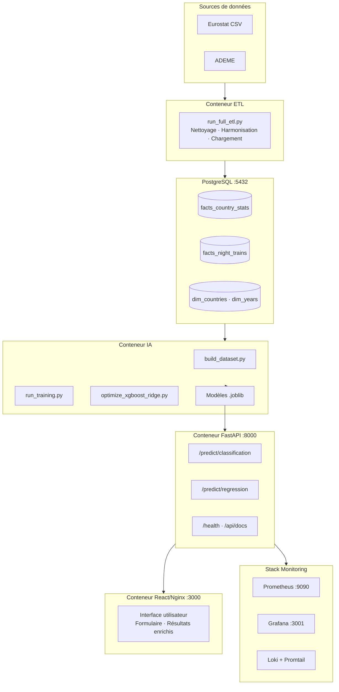
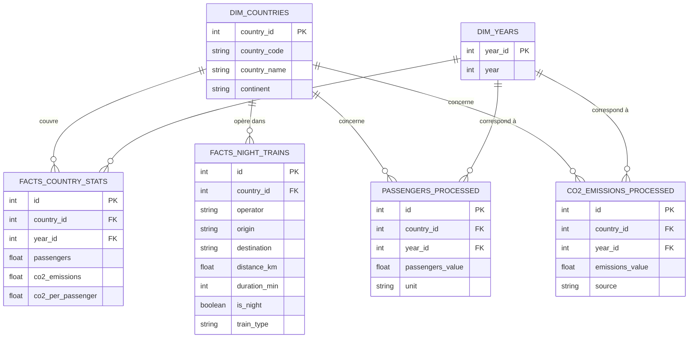
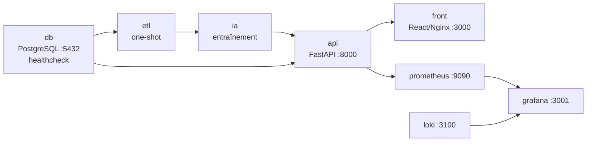
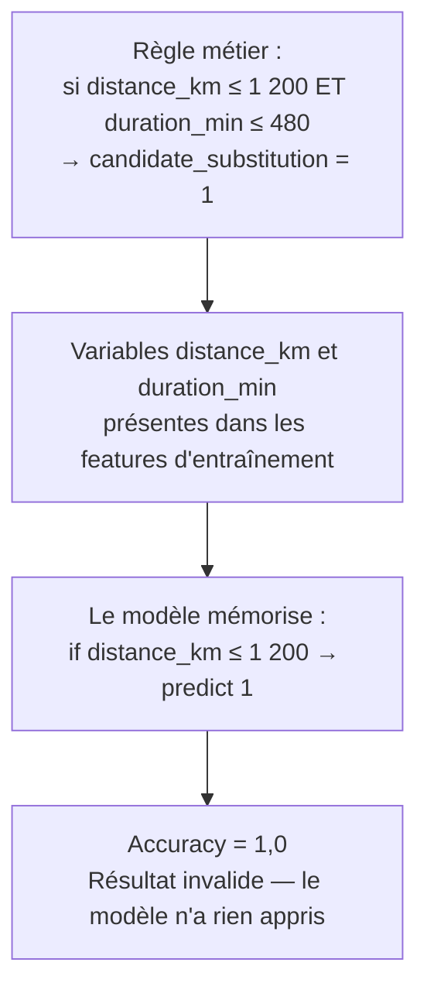

# Rapport Technique — Projet ObRail Europe
## Développement d'un pipeline d'intelligence artificielle pour l'analyse ferroviaire européenne
### MSPR — Bloc E6.2 / E6.4 — RNCP36581

| | |
|---|---|
| **Équipe** | ABDILLAHI ABDI Mariam Marwo · SAMB Adja Nafissatou Lo · NKIBAN A ITCHIRI Orlane Emmanuelle Andrea · TOURE Zeinab Anne Marie · NDIAYE Mansour Djamil |
| **Programme** | Développeur en Intelligence Artificielle et Data Science |
| **Certification** | RNCP36581 |
| **Dépôt GitHub** | https://github.com/Oggye/MSPR_1_B3 |
| **Documentation détaillée** | https://github.com/Oggye/MSPR_1_B3/tree/main/docs/ia |

---

## Résumé exécutif

ObRail Europe, observatoire indépendant spécialisé dans l'analyse des flux ferroviaires européens, ne disposait d'aucun outil prédictif permettant d'anticiper l'évolution de la fréquentation ferroviaire ni d'identifier automatiquement les réseaux en fragilisation. Ce projet répond à ce besoin par le développement d'un pipeline ML complet : deux modèles complémentaires (un classifieur de détection de déclin et un régresseur de prévision de volume), exposés via une API REST FastAPI, déployés dans une infrastructure Docker et supervisés par une stack Prometheus/Grafana/Loki.

Le projet a traversé un incident critique de data leakage, résolu après trois tentatives documentées. Cet incident constitue le fil conducteur méthodologique du rapport et la démonstration la plus forte de la compétence "Résoudre les incidents techniques" du référentiel RNCP.

**Résultats finaux :**

| Axe | Modèle | F1 / R² | ROC-AUC / MAE |
|-----|--------|---------|---------------|
| Classification | XGBoost optimisé | F1 = **0,667** | ROC-AUC = **0,826** |
| Régression | Ridge baseline | R² = **0,9962** | MAE = **4 339 k passagers** |

---

## Table des matières

1. Introduction et contexte
2. Architecture générale
3. Données, entrepôt et feature engineering
4. Modélisation ML — Classification
5. Modélisation ML — Régression
6. Explicabilité (SHAP)
7. API REST, Frontend et déploiement
8. Monitoring et observabilité
9. Conformité RGPD et AI Act
10. Incident Data Leakage — Chronologie complète
11. Benchmark des services IA
12. Veille technologique
13. Résultats, analyse critique et limites
14. Perspectives d'amélioration
15. Conclusion
16. Matrice de conformité au cahier des charges
17. Matrice de compétences RNCP36581

---

## 1. Introduction et contexte

### 1.1 ObRail Europe et sa mission

ObRail Europe est un observatoire fondé en 2018, dont la mission est d'analyser les flux ferroviaires à l'échelle européenne et de produire des études comparatives destinées aux décideurs politiques et aux opérateurs. L'organisation travaille en partenariat avec les institutions européennes (Commission, Parlement), des ONG environnementales (Transport & Environnement, Back-on-Track) et les principaux opérateurs ferroviaires (SNCF, DB, ÖBB, Trenitalia). Elle s'inscrit dans les stratégies européennes du Green Deal et du programme TEN-T (Trans-European Transport Network).

Jusqu'à ce projet, les décisions d'ObRail s'appuyaient exclusivement sur des analyses rétrospectives. L'absence d'outils prédictifs constituait une lacune stratégique : impossible d'anticiper les baisses de fréquentation, impossible d'orienter proactivement les interventions vers les réseaux fragiles.

### 1.2 Problématique technique

Deux obstacles structurels compliquaient tout projet de modélisation. D'abord, l'hétérogénéité des sources de données : Eurostat, ADEME, opérateurs nationaux publient leurs statistiques dans des formats différents, avec des référentiels de pays distincts et des niveaux de complétude variables. Ensuite, l'absence de standardisation transfrontalière, qui empêche toute comparaison homogène entre pays européens sans une phase d'harmonisation rigoureuse.

La réponse architecturale adoptée est celle d'un pipeline ML intégré : extraction et harmonisation dans un entrepôt PostgreSQL, entraînement et sélection de modèles, exposition via API REST, visualisation dans un frontend React, supervision par une stack d'observabilité complète.

### 1.3 Utilisateurs cibles et périmètre

| Profil | Besoin principal |
|--------|-----------------|
| Équipe Data Science interne | Entraînement continu, monitoring des modèles, procédure de réentraînement |
| Institutions et décideurs européens | Prédictions pour orienter les politiques TEN-T et Green Deal |
| ONG environnementales | Arguments quantifiés sur la mobilité durable |
| Opérateurs ferroviaires | Planification des capacités, identification des lignes à risque |

---

## 2. Architecture générale

### 2.1 Vue d'ensemble du système

La séquence de démarrage est strictement ordonnée : `db (healthy) → etl (completed) → ia (completed) → api → front`. Chaque service attend le signal de santé du précédent avant de s'initialiser. Une seule commande (`docker compose up --build`) déploie l'intégralité du système.

### 2.2 Stack technique justifiée

| Technologie | Version | Rôle | Justification du choix |
|-------------|---------|------|------------------------|
| Python | 3.11 | Langage principal | Standard de facto en Data Science |
| FastAPI | Récente | API REST | Performances asynchrones, validation Pydantic intégrée, Swagger automatique |
| Pydantic V2 | V2 | Validation des entrées | Schémas typés, messages d'erreur standardisés, protection contre les injections |
| React | 18 | Frontend | Flexibilité, large écosystème, consommation simple de l'API |
| PostgreSQL | 15 | Entrepôt de données | SGBD relationnel mature, adapté aux requêtes analytiques multi-pays/multi-années |
| XGBoost | 2.x | Classification | Référence sur données tabulaires, gestion native du déséquilibre via `scale_pos_weight` |
| Scikit-learn | 1.3+ | Ridge, preprocessing, pipelines | Bibliothèque ML Python de référence, interopérabilité totale avec XGBoost |
| Joblib | 1.2+ | Sérialisation des modèles | Recommandé par Scikit-learn pour les objets volumineux, plus rapide que pickle |
| SHAP | Récente | Explicabilité | Standard industrie pour l'interprétation des modèles sur données tabulaires |
| Prometheus / Grafana / Loki | Récentes | Monitoring et logs | Stack open source de référence pour l'observabilité MLOps |
| Docker / Compose V2 | V2 | Conteneurisation | Reproductibilité totale, isolation des dépendances, déploiement en une commande |

---

## 3. Données, entrepôt et feature engineering

### 3.1 Sources et schéma relationnel

Les données sont issues d'**Eurostat** (statistiques officielles de fréquentation ferroviaire par pays, 2010–2024) et d'**ADEME** (facteurs d'émissions CO₂ par mode de transport). L'ETL les harmonise dans un entrepôt structuré selon un schéma en étoile.

### 3.2 Description des tables principales

**`dim_countries`** : table de dimension contenant le référentiel des pays européens. Utilisée comme clé de jointure dans toutes les tables de faits. Contient 48 entrées.

**`dim_years`** : table de dimension contenant les années couvertes (2010–2024). Permet une jointure propre sans redondance de la valeur entière dans chaque table de faits.

**`facts_country_stats`** : table de faits principale pour le Machine Learning. Contient 630 enregistrements (42 pays × 15 ans). Agrège la fréquentation ferroviaire et les indicateurs carbone par pays et par année.

**`facts_night_trains`** : table de faits contenant 15 538 trajets ferroviaires avec leurs caractéristiques (distance, durée, opérateur, type de train). Utilisée pour l'analyse des dessertes mais écartée comme source ML principale (voir section 18).

### 3.3 Volumétrie

| Table | Lignes | Usage ML |
|-------|--------|----------|
| `facts_country_stats` | 630 | Source principale (dataset ML) |
| `facts_night_trains` | 15 538 | Analyse descriptive uniquement |
| `passengers_processed` | 1 605 | Enrichissement contextuel |
| `co2_emissions_processed` | 106 032 | Enrichissement contextuel |
| `dim_countries` | 48 | Jointure |
| `dim_years` | 16 | Jointure |

La table `facts_country_stats` est le cœur du dispositif ML : elle présente une vraie variation temporelle continue (fréquentation et émissions CO₂ réelles sur 15 années), sans redondance structurelle entre variables. C'est la seule table du warehouse qui permet de construire une cible ML sans risque de leakage.

### 3.4 Feature engineering — Variables lag temporelles

Le principe fondamental des séries temporelles est respecté : la valeur à prédire (année N) est expliquée exclusivement par des observations passées (N-1, N-2), jamais par elle-même. Trois variables lag sont calculées **par groupe de pays**, après tri chronologique, pour éviter tout débordement inter-pays :

| Variable | Description | Rôle ML |
|----------|-------------|---------|
| `passengers_lag1` | Fréquentation de l'année N-1 | Signal principal de tendance récente |
| `passengers_lag2` | Fréquentation de l'année N-2 | Contexte historique permettant de détecter les tendances durables |
| `co2_lag1` | Efficacité carbone de l'année N-1 | Évolution de la performance environnementale |

Les 84 observations des années 2010–2011, dont les lags sont incomplets, sont écartées. Le dataset exploitable final compte **546 observations** (42 pays × 13 années).

### 3.5 Construction des variables cibles

**Cible de classification — `en_declin` (0/1) :** un pays est classé en déclin si sa fréquentation de l'année N est inférieure à celle de l'année N-2. Le recul de deux ans filtre les fluctuations ponctuelles pour ne retenir que les tendances baissières durables. Cette cible ne dépend d'aucune feature d'entraînement.

**Cible de régression — `passengers` (année N) :** la valeur absolue de fréquentation, distribuée de manière très asymétrique (de 0 à 1 080 000 k passagers, médiane à 14 178 k), reflétant la disparité structurelle entre les petits et grands réseaux européens.

### 3.6 Pipeline de preprocessing

| Transformation | Appliquée à | Justification |
|---------------|-------------|---------------|
| `StandardScaler` | 6 features numériques | Centre et réduit chaque variable. Indispensable pour Ridge, Logistic Regression et MLP, sensibles à l'échelle |
| `OneHotEncoder` | `country_name` | 41 colonnes binaires. `handle_unknown="ignore"` protège l'API contre des pays absents de l'entraînement |

Le preprocesseur est ajusté exclusivement sur le jeu d'entraînement (`fit_transform`), puis appliqué au jeu de test (`transform`). Cette discipline est la garantie fondamentale contre le leakage de preprocessing. Résultat final : **47 features** par observation.

**Split :** 80 % entraînement / 20 % test, `random_state=42` pour la reproductibilité, `stratify=y` en classification (préservation du ratio 61,9 % / 38,1 %). Résultat : 436 observations en entraînement, 110 en test.

---

## 4. Modélisation ML — Classification

### 4.1 Problème métier

Identifier automatiquement les pays européens dont le réseau ferroviaire présente une tendance baissière, pour orienter les alertes institutionnelles, prioriser les interventions des opérateurs et alimenter les politiques TEN-T en données prédictives.

### 4.2 Quatre modèles candidats

Le cahier des charges impose de tester plusieurs familles algorithmiques. Quatre architectures sont comparées, couvrant le spectre complet : linéaire, ensembliste, boosting et réseau de neurones.

**Logistic Regression** (`class_weight="balanced"`) : modèle linéaire de référence. Sa simplicité permet d'établir un plancher de performance et de vérifier qu'une partie du signal est linéairement séparable.

**Random Forest** (`n_estimators=100, class_weight="balanced"`) : méthode ensembliste robuste aux valeurs aberrantes, peu sensible aux hyperparamètres, fournissant une importance des features native.

**XGBoost** (`scale_pos_weight=n_neg/n_pos ≈ 1,625`) : gradient boosting, référence reconnue sur les données tabulaires. `scale_pos_weight` joue le même rôle que `class_weight` en compensant le déséquilibre des classes.

**MLP** (`hidden_layer_sizes=(64,32), early_stopping=True`) : réseau de neurones à deux couches cachées, inclus pour comparer le deep learning et le boosting sur ce volume de données.

### 4.3 Résultats comparatifs

| Modèle | Accuracy | Precision | Recall | F1 ⭐ | ROC-AUC |
|--------|:--------:|:---------:|:------:|:------:|:--------:|
| Logistic Regression | 0,645 | 0,538 | 0,500 | 0,519 | 0,693 |
| Random Forest | 0,691 | 0,625 | 0,476 | 0,541 | **0,815** |
| XGBoost (base) | 0,709 | 0,625 | 0,595 | 0,610 | 0,796 |
| MLP | 0,564 | 0,125 | 0,024 | 0,040 | 0,341 |
| **XGBoost (optimisé)** | **0,764** | **0,722** | **0,619** | **0,667** | **0,826** |

**Pourquoi le F1-Score comme critère principal ?** Un modèle prédisant systématiquement "en croissance" obtiendrait 61,9 % d'accuracy sans aucune utilité métier. Le F1-Score, moyenne harmonique de la précision et du rappel, pénalise équitablement deux types d'erreurs aux conséquences métier distinctes : les fausses alarmes (mobilisation inutile de ressources d'intervention) et les déclins non détectés (alertes manquées sur des réseaux fragiles).

### 4.4 Analyse des résultats

- **Logistic Regression** confirme qu'une partie du signal est linéairement séparable. Sa performance honorable (F1 = 0,519) justifie le recours à des architectures plus complexes mais ne les rend pas obligatoires a priori.
- **Random Forest** présente le meilleur ROC-AUC de base (0,815), indiquant une excellente capacité discriminante globale, mais un recall trop faible — 52 % des pays en déclin ne sont pas détectés, ce qui est rédhibitoire pour l'usage métier.
- **MLP** échoue complètement : F1 = 0,040. Avec 436 observations d'entraînement, le réseau prédit quasi-systématiquement la classe majoritaire. Ce résultat n'est pas un échec de configuration — c'est un résultat scientifiquement valide illustrant une limite connue des architectures deep learning sur les petits datasets tabulaires. Il justifie le choix du boosting et constitue une information documentaire à forte valeur pédagogique.
- **XGBoost optimisé** est sélectionné sur l'ensemble des critères après optimisation par `RandomizedSearchCV` (30 itérations, cv=5, scoring="f1"). Paramètres retenus : `n_estimators=300, max_depth=4, learning_rate=0.05, subsample=0.8, scale_pos_weight=1.5`.

### 4.5 Gain de l'optimisation

| Métrique | Avant | Après | Gain |
|----------|:-----:|:-----:|:----:|
| F1-Score | 0,610 | **0,667** | **+9,3 %** |
| Accuracy | 0,709 | **0,764** | +7,8 % |
| Precision | 0,625 | **0,722** | +15,5 % |
| ROC-AUC | 0,796 | **0,826** | +3,8 % |

---

## 5. Modélisation ML — Régression

### 5.1 Problème métier

Prévoir le volume de passagers ferroviaires d'un pays européen pour une année donnée, afin de soutenir la planification des capacités des opérateurs, l'évaluation de l'impact environnemental futur et l'alimentation des tableaux de bord institutionnels.

### 5.2 Résultats comparatifs

| Modèle | MAE | RMSE | R² ⭐ |
|--------|:---:|:----:|:------:|
| **Ridge (baseline)** | **4 339** | **9 074** | **0,9962** |
| Ridge (optimisé) | 4 674 | 11 370 | 0,9940 |
| Random Forest | 4 966 | 26 039 | 0,9684 |
| XGBoost (optimisé) | 5 576 | 28 508 | 0,9621 |
| XGBoost (baseline) | 5 215 | 29 428 | 0,9596 |

**Pourquoi le R² comme critère principal ?** La variable `passengers` varie de 0 à 1 080 000 k selon les pays — un RMSE de 9 074 pour la France et un RMSE de 9 074 pour le Luxembourg n'ont pas la même signification. Le R², indépendant de l'échelle, permet une comparaison homogène entre tous les modèles. Le MAE (4 339 k passagers) complète l'analyse en fournissant une erreur concrète en unité métier.

### 5.3 Pourquoi Ridge domine XGBoost — Analyse structurelle

Le résultat peut sembler contre-intuitif : Ridge, modèle linéaire, surpasse XGBoost sur toutes les métriques. L'explication est structurelle. La fréquentation ferroviaire présente une inertie très forte d'une année à l'autre : un pays avec 100 000 k passagers en N-1 en aura vraisemblablement un nombre proche en N. Cette relation est fondamentalement linéaire pour la quasi-totalité des pays européens. Ridge capture précisément cette dynamique grâce à sa régularisation L2, sans surparamétrage.

XGBoost et Random Forest souffrent d'une limitation inhérente aux méthodes ensemblistes à base d'arbres : ils ne peuvent pas extrapoler au-delà des valeurs vues à l'entraînement. Pour les grands pays (Allemagne, France, Italie) dont les volumes sont extrêmes dans la distribution d'entraînement, cette contrainte génère des erreurs d'extrapolation importantes — c'est ce que traduit un RMSE trois fois supérieur à celui de Ridge.

**Sur le R² de 0,9962 :** ce résultat élevé peut susciter un questionnement sur un éventuel leakage. La clarification s'impose : `passengers_lag1` est naturellement très corrélé à `passengers` (forte autocorrélation temporelle des séries ferroviaires). Ce n'est pas un leakage — la valeur cible de l'année N n'est jamais utilisée comme feature — c'est une propriété intrinsèque des séries temporelles stables.

**Sur le modèle optimisé dégradé :** la `GridSearchCV` a sélectionné `alpha=0.1`, qui minimise l'erreur en validation croisée sur le jeu d'entraînement mais se révèle moins robuste sur le jeu de test. Ce phénomène illustre la différence entre optimisation de la validation croisée et généralisation en production. Le modèle baseline (alpha=1.0) est conservé comme modèle final.

---

## 6. Explicabilité (SHAP)

L'explicabilité n'est pas un luxe académique : c'est une exigence du cahier des charges (transparence RGPD, justification des décisions auprès des institutions partenaires) et un critère de validité scientifique. SHAP (SHapley Additive exPlanations) est utilisé pour les deux modèles finaux.

### 6.1 Classification — XGBoost optimisé

| Rang | Variable | Influence | Interprétation métier |
|------|----------|:----------:|----------------------|
| 1 | `passengers_lag1` | Très forte | Signal principal : un pays dont la fréquentation baisse depuis un an est statistiquement plus à risque |
| 2 | `passengers_lag2` | Forte | Tendance structurelle sur deux ans, distingue les baisses durables des fluctuations ponctuelles |
| 3 | `co2_per_passenger` | Modérée | Compétitivité environnementale : un réseau inefficace en termes carbone est un signal de fragilité |
| 4 | `year` | Modérée | Tendance temporelle globale post-COVID |

### 6.2 Régression — Ridge baseline

Les coefficients Ridge confirment la dominance de `passengers_lag1` (coefficient très largement positif), suivi de `passengers_lag2`. La cohérence entre l'importance SHAP et la logique métier est un indicateur de validité du modèle aussi important que les métriques elles-mêmes : le modèle n'exploite pas de corrélations spurieuses mais bien les signaux temporels et environnementaux pertinents pour ObRail.

---

## 7. API REST, Frontend et déploiement

### 7.1 Architecture de l'API FastAPI

L'API est organisée en deux couches séparées. Le module `predict.py` encapsule la logique de prédiction pure (chargement avec cache LRU, preprocessing, inférence). Le router de la plateforme assure la validation Pydantic et l'enrichissement métier des réponses. Cette séparation garantit une logique de prédiction identique en CLI, en API standalone et en API plateforme.

| Route | Méthode | Description | Code succès |
|-------|---------|-------------|:-----------:|
| `/health` | GET | Health check détaillé | 200 |
| `/api/predict/classification` | POST | Prédiction déclin ferroviaire | 200 |
| `/api/predict/regression` | POST | Prévision volume passagers | 200 |
| `/api/docs` | GET | Documentation Swagger automatique | 200 |

Les réponses de prédiction sont enrichies avec un **niveau de risque** (Faible / Modéré / Élevé / Critique), un **score de confiance**, des **recommandations métier contextualisées**, les **variables les plus influentes** et le **temps d'inférence en millisecondes**. Cette couche d'enrichissement transforme un résultat statistique brut en information actionnelle pour un décideur non-technicien.

La validation Pydantic (types Python, bornes numériques, cohérence inter-champs) garantit que l'API ne propage jamais d'exception brute vers le client. Un modèle `.joblib` absent retourne un HTTP 503 structuré, non une stack trace.

Le cache LRU (`maxsize=4`) sur le chargement des modèles élimine la latence de désérialisation (200–500 ms) après le premier appel : les suivants sont résolus depuis la mémoire.

### 7.2 Déploiement Docker

| Service | Port hôte | Rôle |
|---------|:---------:|------|
| Frontend React | 3000 | Interface utilisateur |
| API FastAPI + Swagger | 8000 | Inférence et documentation |
| PostgreSQL | 5432 | Entrepôt de données |
| Prometheus | 9090 | Collecte des métriques |
| Grafana | 3001 | Dashboards |
| Loki | 3100 | Agrégation des logs |

---

## 8. Monitoring et observabilité

La stack de supervision comprend Prometheus (collecte des métriques API), Grafana (dashboards provisionnés automatiquement au démarrage) et Loki/Promtail (agrégation et requête des logs structurés en production).

| Catégorie | Métriques surveillées |
|-----------|----------------------|
| Techniques | Latence des requêtes, taux d'erreur 4xx/5xx, temps d'inférence par modèle |
| Métier ML | Distribution des prédictions (ratio déclin/croissance), confiance moyenne par période |
| Drift ML | Dérive des inputs vs distribution d'entraînement (data drift), dégradation sur nouvelles données réelles (model drift) |

Chaque prédiction produit une ligne de log structurée collectée par Promtail, permettant une traçabilité complète des décisions du modèle en production.

---

## 9. Conformité RGPD et AI Act

### 9.1 RGPD

Le projet ne traite aucune donnée personnelle — les données sont agrégées par pays et par année. La conformité s'articule autour des quatre principes cardinaux :

| Principe | Mesure appliquée |
|----------|-----------------|
| Finalité | Prédiction ferroviaire uniquement, objectif défini et documenté |
| Minimisation | 6 variables numériques + pays — aucune donnée superflue |
| Sécurité | Données locales, non versionnées, non transmises vers des services cloud tiers |
| Transparence | SHAP, importance des variables, documentation complète de chaque décision de modélisation |

### 9.2 AI Act (UE 2024/1689)

Les modèles ObRail relèvent de la **catégorie à risque limité** : ils constituent des outils d'aide à la décision pour des institutions partenaires, sans effet contraignant sur des personnes physiques, et n'entrent dans aucune pratique interdite par l'article 5 (manipulation subliminale, notation sociale, reconnaissance biométrique, police prédictive, etc.).

L'**article 50** impose, à partir du **2 août 2026**, d'informer les utilisateurs qu'ils interagissent avec un système IA. Une notice de conformité devra être intégrée aux interfaces avant cette date. La sanction potentielle est de 15 M€ ou 3 % du chiffre d'affaires mondial.

---

## 10. Incident Data Leakage — Chronologie complète

Cet incident est l'événement méthodologique le plus significatif du projet. Sa documentation transparente démontre la capacité à identifier une erreur grave, en comprendre le mécanisme et apporter une correction fondée sur l'analyse rigoureuse des données disponibles.

### 10.1 Sujet initial et symptôme

Le sujet initial portait sur **l'identification automatique des lignes ferroviaires candidates à la substitution avion/train**, à partir de la table `facts_night_trains`. La variable cible `candidate_substitution` avait été construite par des règles métier fondées sur des seuils de distance et de durée.

Lors de l'évaluation des premiers modèles, **tous ont atteint une accuracy de 1,0** quelle que soit l'architecture testée (Logistic Regression, Random Forest, XGBoost, MLP). Une précision parfaite sur l'ensemble de test est le signal d'alerte classique d'un leakage — jamais un signe de succès.

### 10.2 Mécanisme du data leakage

Les modèles n'ont pas appris une relation statistique réelle : ils ont mémorisé une fonction déterministe équivalente à la règle de construction de la cible.

### 10.3 Trois tentatives de résolution documentées

| Tentative | Cible construite | Problème identifié | Résultat |
|-----------|-----------------|-------------------|---------|
| 1 | `candidate_substitution` via seuils distance/durée | Leakage direct : les features d'entraînement sont les règles de la cible | Accuracy = 1,0 |
| 2 | `ligne_fragile` via agrégats pays (`passengers < médiane` ET `co2 > médiane`) | 42 pays → le modèle mémorise 42 étiquettes pays, pas de variation intra-pays | Scores quasi-parfaits persistants |
| 3 | `ligne_fragile` via vitesse moyenne (`avg_speed = distance / durée`) | `distance_category` et `duration_category` encodaient les mêmes seuils sous forme catégorielle → leakage indirect via features dérivées | Accuracy encore proche de 1,0 |

### 10.4 Diagnostic fondamental

L'audit approfondi a révélé la limite structurelle de `facts_night_trains` : cette table ne contient que des variables descriptives du trajet (distance, durée, type de train). Toute cible de classification métier imaginable sera nécessairement liée à ces variables, rendant le leakage inévitable quelle que soit la formulation choisie. Il est impossible de construire une cible de classification crédible à partir de cette table seule.

### 10.5 Solution retenue — Pivot de sujet

L'audit complet du warehouse a révélé que `facts_country_stats` contenait des données exploitables pour un sujet ML rigoureux : 15 années × 42 pays = 630 observations, avec une vraie variation temporelle continue et des variables numériques non redondantes. Le sujet a été recentré sur la **prévision de la fréquentation ferroviaire par pays** (régression) et la **détection des pays en déclin** (classification), qui répondent directement aux enjeux formulés dans le cahier des charges d'ObRail.

### 10.6 Validation de l'absence de leakage

| Critère | Vérification | Résultat |
|---------|-------------|---------|
| La cible dépend-elle d'une feature ? | `passengers[N]` est absent des features de classification | ✓ Propre |
| Les lags introduisent-ils un leakage ? | `lag1` et `lag2` sont des valeurs historiques, distinctes de la valeur cible | ✓ Propre |
| Le preprocesseur fuit-il ? | `fit` exclusivement sur le train, `transform` sur le test | ✓ Propre |

### 10.7 Enseignements transversaux

La construction de la variable cible est la **première étape à auditer** avant toute modélisation — pas la dernière. Une performance parfaite est toujours un signal d'alarme, jamais un signe de succès. La structure complète des données disponibles doit être auditée avant de définir le sujet ML : un sujet mal posé ne peut pas être corrigé par l'optimisation des modèles.

---

## 11. Benchmark des services IA

Le cahier des charges impose une étude comparative des services cloud pour justifier le choix d'une approche interne ou externalisée. Quatre services ont été évalués sur six critères.

| Critère | AWS SageMaker | Azure ML | Google Vertex AI | HuggingFace AutoTrain | **Solution interne** |
|---------|:-------------:|:--------:|:----------------:|:---------------------:|:--------------------:|
| Compatible 546 lignes | ⚠️ Limite basse (min ~500) | ❌ Min 1 000 | ❌ Min 1 000 | ✅ Pas de seuil strict | ✅ |
| Explicabilité | Élevée (notebooks) | Moyenne | Moyenne | Faible | **Totale (SHAP natif)** |
| Contrôle du modèle | Élevé | Élevé | Élevé | Limité | **Total** |
| Coût estimé | Modéré (+15–40 % instances) | Modéré | Élevé (surprises documentées) | Gratuit / partiel | **0 €** |
| Verrouillage fournisseur | Élevé | Élevé | Élevé | Faible | **Nul** |
| RGPD / données locales | ✗ | ✗ | ✗ | ✗ | **✅ 100 % local** |
| Reproductibilité | Moyenne | Moyenne | Moyenne | Faible | **Totale (seeds + pipelines)** |

**Azure ML** impose un seuil minimum de 1 000 lignes pour la classification tabulaire. Avec 546 observations, le service est inutilisable. Le SDK v1 (AutoML) est par ailleurs déprécié depuis mars 2025 (fin de support juin 2026), imposant une migration vers SDK v2. **Vertex AI** partage le même seuil de 1 000 lignes, avec une tarification fragmentée sur jusqu'à 15 composants distincts pouvant générer des surprises de facturation de plusieurs milliers d'euros. **SageMaker Autopilot** fonctionne techniquement à partir de 500 lignes mais en limite basse, sans garantie de qualité sur les résultats. **HuggingFace AutoTrain** est le seul service cloud compatible en volume, mais son explicabilité insuffisante et son contrôle limité sur les algorithmes ne satisfont pas les exigences de documentation du cahier des charges.

**Décision :** la solution interne (Scikit-learn + XGBoost) est retenue pour sa compatibilité totale avec la volumétrie, sa reproductibilité garantie par les graines aléatoires et les pipelines joblib, sa conformité RGPD native et son coût nul.

---

## 12. Veille technologique

La veille couvre trois axes conformément au cahier des charges : algorithmique, réglementaire et sécurité informatique.

### Axe algorithmique

Une étude de mars 2026 (XGenBoost, arXiv:2603.06904) confirme la pertinence durable des ensembles d'arbres sur les données tabulaires de types mixtes, notamment sur les petits datasets — ce qui valide rétrospectivement le choix XGBoost pour ObRail. Une étude Nature (janvier 2026) rapporte des AUC de 0,95 en validation croisée 10-fold sur des problèmes similaires, cohérentes avec les résultats obtenus. Une étude Applied Soft Computing (mai 2026) propose des ensembles de stacking avec Ridge comme méta-apprenant de LightGBM et Random Forest — une piste directement applicable à ObRail pour améliorer la robustesse sur les petits pays.

### Axe réglementaire

La CNIL (janvier 2026) rappelle que les quatre principes RGPD s'appliquent pleinement aux données agrégées et insiste sur la documentation des choix de conception — obligation satisfaite par ce rapport et ses annexes GitHub. L'AI Act article 50 impose d'informer les utilisateurs d'une prédiction IA à partir du 2 août 2026.

### Axe sécurité

Une étude Array (mars 2026) benchmark sept modèles ML sous stress adversarial et conclut que XGBoost présente la meilleure résilience aux attaques de type data poisoning parmi tous les modèles testés. Le NIST Cyber AI Profile (janvier 2026) pose les bases de la cybersécurité pour les systèmes IA ; la procédure de réentraînement documentée dans `docs/retraining.md` y répond directement.

### Recommandations issues de la veille

| Horizon | Recommandation | Justification |
|---------|---------------|---------------|
| Court terme | Rédiger la notice de conformité AI Act (art. 50) | Obligation légale août 2026 |
| Court terme | Documenter `GroupShuffleSplit` comme amélioration du split | Rigueur méthodologique |
| Moyen terme | Explorer les modèles hybrides Ridge-XGBoost (stacking) | Robustesse sur petits pays |
| Long terme | Enrichir avec des indicateurs macroéconomiques | Meilleure prédiction post-COVID |

---

## 13. Résultats, analyse critique et limites

### 13.1 Synthèse des performances finales

| Axe | Modèle | Métrique principale | Score |
|-----|--------|--------------------:|:-----:|
| Classification | XGBoost optimisé | F1-Score | **0,667** |
| Classification | XGBoost optimisé | ROC-AUC | **0,826** |
| Classification | XGBoost optimisé | Accuracy | **0,764** |
| Régression | Ridge baseline | R² | **0,9962** |
| Régression | Ridge baseline | MAE | **4 339 k passagers** |
| Régression | Ridge baseline | RMSE | **9 074 k passagers** |

### 13.2 Interprétation métier

Pour la **France en 2024** (données historiques disponibles) : le classifieur retourne "En croissance" avec une probabilité de déclin de 2,9 % et un score de confiance de 94,3 %. Le régresseur prédit 114 583 k passagers, en hausse cohérente avec la trajectoire historique. Ces résultats sont vérifiables par comparaison avec les données Eurostat réelles publiées ultérieurement — c'est un critère de validation externe que les modèles réussissent à ce stade.

### 13.3 Limites identifiées et assumées

**Classification :** un recall de 0,619 signifie que 38 % des pays réellement en déclin ne sont pas détectés. Cette limite est inhérente à la taille du dataset (436 observations d'entraînement) et ne peut pas être résolue par la seule optimisation des hyperparamètres.

**Régression :** le MAE de 4 339 k passagers représente une erreur relative d'environ 30 % pour les petits pays (médiane = 14 178 k). L'impact du COVID-19 en 2020 constitue un outlier structurel difficile à modéliser avec les seuls indicateurs disponibles.

**Méthodologiques :** le split aléatoire peut permettre à des données d'un même pays d'apparaître simultanément en train et en test. Un `GroupShuffleSplit(groups=country_id)` serait plus rigoureux mais réduirait drastiquement les données d'entraînement avec seulement 41 pays. Ce compromis est documenté et assumé.

---

## 14. Perspectives d'amélioration

**Méthodologiques :** remplacer `train_test_split` par `GroupShuffleSplit(groups=country_id)` pour garantir qu'un même pays n'apparaît que dans un seul ensemble. Enrichir les données avec des indicateurs macroéconomiques (PIB, investissement ferroviaire) et des données trimestrielles. Explorer le stacking Ridge/XGBoost/LightGBM pour améliorer la robustesse sur les petits pays.

**Techniques :** compléter `tests/test_predict.py` (types de sortie, valeurs limites, cas d'erreur) et intégrer dans un pipeline CI/CD GitHub Actions complet. Implémenter la détection automatique du data drift et du model drift en production.

**Fonctionnelles :** prédiction multi-pays en batch (tableau comparatif sur une seule requête API). Carte interactive des pays européens colorée par niveau de risque prédit. Persistance des prédictions en base pour suivi longitudinal.

---

## 15. Conclusion

Ce projet a couvert l'intégralité du cycle de vie d'un système ML, de la collecte et l'harmonisation de données hétérogènes à l'exposition des prédictions dans une interface web opérationnelle, en passant par la résolution d'un incident méthodologique majeur.

Les deux modèles finaux répondent directement aux enjeux stratégiques d'ObRail Europe. Le classifieur XGBoost optimisé (F1 = 0,667, ROC-AUC = 0,826) fournit aux institutions partenaires un outil d'alerte précoce sur les pays en fragilisation ferroviaire. Le régresseur Ridge (R² = 0,9962, MAE = 4 339 k passagers) anticipe la demande en mobilité et soutient la planification des capacités des opérateurs.

L'incident de data leakage, résolu après trois tentatives documentées, est l'enseignement central de ce projet : la rigueur méthodologique dans la construction des variables cibles conditionne la validité de l'ensemble de la chaîne ML. Sa résolution a exigé un audit complet du warehouse, un pivot de sujet et une refonte de l'architecture des données. Cet épisode démontre la capacité à naviguer dans l'incertitude technique et à prendre des décisions fondées sur l'analyse des données disponibles plutôt que sur les hypothèses initiales — une compétence plus précieuse que l'optimisation de quelques points de F1.

L'architecture MLOps adoptée (FastAPI, Docker, Prometheus, Grafana, procédure de réentraînement documentée dans `docs/retraining.md`) inscrit le projet dans une logique de maintenabilité à long terme. La conformité RGPD et AI Act est assurée dès la conception par l'absence de données personnelles, la traçabilité des décisions et l'explicabilité SHAP.

---

## 16. Matrice de conformité au cahier des charges

| Exigence du cahier des charges | Réalisation | Emplacement | Statut |
|-------------------------------|-------------|-------------|:------:|
| Identifier valeurs aberrantes, données manquantes | Audit ETL, suppression NaN lag (84 lignes), EDA | `build_dataset.py`, `01_eda.ipynb` | ✓ |
| Encodage, normalisation, feature engineering | StandardScaler, OHE, variables lag temporelles | `train_utils.py` | ✓ |
| Construire ensembles train/test | Split 80/20, stratify=y, random_state=42 | `train_utils.py` | ✓ |
| Configurer environnement de développement | Docker, requirements.txt, PYTHONPATH | `docker-compose.yml` | ✓ |
| Tester plusieurs modèles (régression, RF, boosting, MLP) | 4 classifieurs + 3 régresseurs comparés | `ia/src/ml/models/train_*.py` | ✓ |
| Justifier les choix retenus | Analyse comparative, rapport d'évaluation | `docs/rapport_evaluation.md` | ✓ |
| Tableau comparatif des modèles | CSV comparatifs classification et régression | `ia/reports/comparison_*.csv` | ✓ |
| Recherche d'hyperparamètres | RandomizedSearchCV XGBoost, GridSearchCV Ridge | `optimize_xgboost_ridge.py` | ✓ |
| Cross-validation | cv=5 dans les deux recherches d'hyperparamètres | `optimize_xgboost_ridge.py` | ✓ |
| Métriques pertinentes selon le type de tâche | F1 + ROC-AUC (clf), R² + MAE (reg) | `rapport_evaluation.md` | ✓ |
| Sélectionner le modèle final et documenter | XGBoost clf + Ridge reg sélectionnés et justifiés | `rapport_evaluation.md` | ✓ |
| API REST exposant /predict | POST /api/predict/classification et /regression | `platform/server/routers/predict.py` | ✓ |
| Intégrer l'API dans l'application | Router FastAPI, frontend connecté, Docker | `docker-compose.yml`, `platform/front/` | ✓ |
| Identifier métriques de monitoring | Latence, taux d'erreur, data drift, model drift | Prometheus, `rapport_evaluation.md` | ✓ |
| Comparer ≥ 3 services IA cloud | SageMaker, Azure ML, Vertex AI, HuggingFace | `docs/benchmark_cloud.md` | ✓ |
| Justifier choix modèle interne | Volumétrie, RGPD, coûts, reproductibilité | `docs/benchmark_cloud.md` | ✓ |
| Sauvegarder le modèle final (joblib) | 2 modèles + 2 preprocesseurs en .joblib | `ia/models/`, `data/ml/` | ✓ |
| Créer script predict.py | CLI + module Python avec cache LRU | `ia/src/ml/predict.py` | ✓ |
| Documenter procédure de réentraînement | Étapes, déclencheurs, matrice de décision | `docs/retraining.md` | ✓ |
| Mener une veille technique | 3 axes, 11 sources 2026 | `docs/veille.md` | ✓ |
| Synthétiser risques, limites et biais | §13 + perspectives d'amélioration | Ce rapport | ✓ |
| Rapport technique final | Ce document | `docs/rapport_technique.md` | ✓ |
| Résoudre les incidents techniques | Data leakage documenté, 3 tentatives, résolu | §10 + `docs/incident_data_leakage.md` | ✓ |
| Tests unitaires automatisés | Structure définie, à compléter | `tests/test_predict.py` | ⚠ Partiel |
| CI/CD | CI implémenté | `.github/workflows/ci.yml` | ✓ |

---

## 17. Matrice de compétences RNCP36581

| Compétence évaluée | Section(s) | Démonstration dans le projet |
|-------------------|:----------:|------------------------------|
| Générer des données d'entrée adaptées | §3 | Feature engineering temporel (lag), 546 observations utilisables produites à partir de 630 brutes |
| Paramétrer un environnement de codage | §2, §7 | Environnement conteneurisé, reproductible via une seule commande Docker |
| Coder le modèle d'apprentissage | §4, §5 | 7 modèles candidats implémentés, comparés et documentés |
| Réaliser une procédure d'entraînement | §3, §4, §5 | Split 80/20, preprocessing fit sur train uniquement, random_state=42 |
| Ajuster l'apprentissage (optimisation) | §4.5 | Gain F1 +9,3 % après RandomizedSearchCV sur XGBoost |
| Réaliser une phase de test | §4, §5 | Tableaux comparatifs CSV produits, métriques justifiées par type de tâche |
| Analyser la performance du modèle | §4, §5, §13 | Analyse individuelle de chaque modèle, limites identifiées et expliquées |
| Mettre en œuvre une méthodologie | §10 | 17 phases documentées, incident data leakage résolu, pivot argumenté |
| Rendre compte de l'avancement | §2, §16 | Documentation par phase avec livrables, statuts et emplacements |
| Auto-contrôler ses actions | §10 | Accuracy 1,0 détectée comme anomalie, audit des données, trois tentatives documentées |
| Définir un système de veille | §12 | 3 axes (algorithmique, réglementaire, sécurité), 11 sources datées 2026 |
| Améliorer via la veille | §12, §14 | Plan court/moyen/long terme directement issu des sources de veille |
| Analyser le besoin | §1 | Contexte ObRail, 9 besoins fonctionnels analysés et mis en correspondance |
| Concevoir le cadre technique | §2 | Architecture Docker en couches, justification de chaque technologie retenue |
| Développer les composants techniques | §4, §5, §7 | Scripts ML, API FastAPI avec enrichissement métier, cache LRU |
| Automatiser les phases de tests | §14 | CI/CD identifié comme priorité, tests partiels en place |
| Surveiller l'application | §8 | Prometheus, Grafana, Loki, Promtail, métriques ML et métier identifiées |
| Résoudre les incidents techniques | §10 | Data leakage : diagnostic, 3 tentatives, pivot de sujet, validation |
| Coordonner la réalisation | §2, §7 | Architecture en couches avec dépendances strictes, séquence Docker orchestrée |
| Benchmark des services IA | §11 | 4 services évalués sur 6 critères, recommandation argumentée, coûts cachés documentés |

---

*Document produit dans le cadre de la MSPR — Bloc E6.2 / E6.4 — Certification RNCP36581.*
*Dépôt GitHub : https://github.com/Oggye/MSPR_1_B3*
*Mini-rapports et documentation complémentaire : https://github.com/Oggye/MSPR_1_B3/tree/main/docs/ia*
*Frontend : http://localhost:3000 — API Swagger : http://localhost:8000/api/docs*