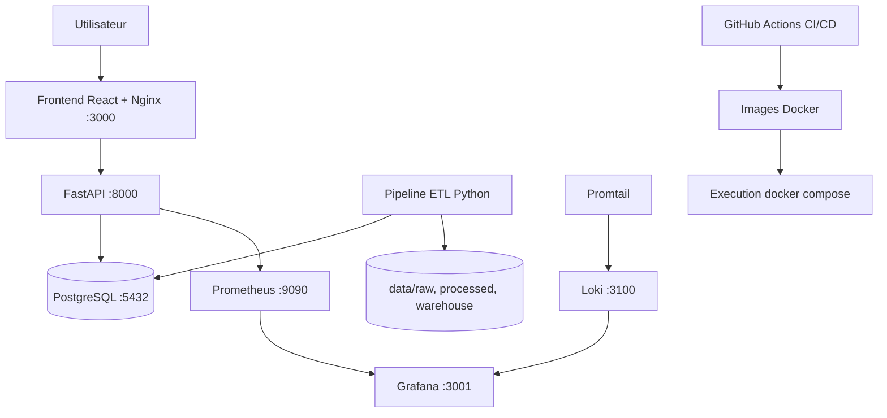
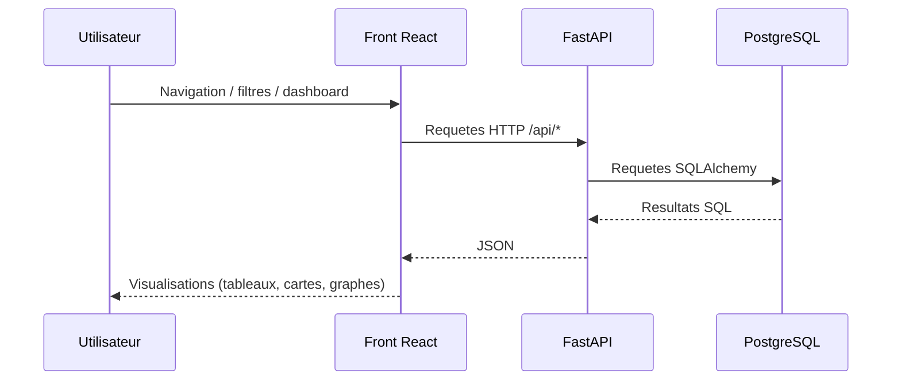
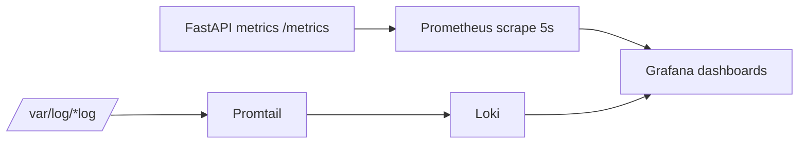
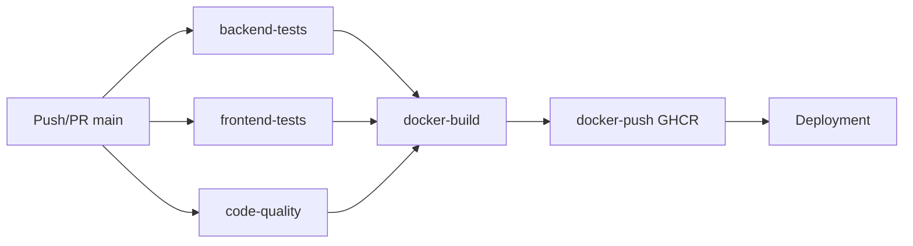

# Rapport Technique MSPR - ObRail Europe

## 1. Page de garde

- Projet: ObRail Europe - Industrialisation et mise en production d'une plateforme ferroviaire europeenne
- MSPR: TPRE532
- Promotion: B3
- Date: 18 mai 2026
- Document: Rapport technique de reference
- Version du document: v1.0
- Annee scolaire: 2025-2026
- Statut: Version finale
- Encadrant pedagogique: *Dora Sabino*
- Membres du groupe:
  - ABDILLAHI ABDI Mariam Marwo
  - SAMB Adja Nafissatou Lo
  - NKIBAN A ITCHIRI Orlane Emmanuelle Andrea
  - TOURE Zeinab Anne Marie
  - NDIAYE Mansour Djamil
- Suivi des taches: Trello (lien fourni): https://trello.com/invite/b/69e74e583f650936f382ba17/ATTIaa05d72d0f16e3a2a3827bc407c678ffA9A7D7CE/mspr-b3

---

## 2. Sommaire

1. Page de garde  
2. Sommaire  
3. Contexte et objectifs  
4. Architecture globale de la solution (schemas)  
5. Backend (FastAPI)  
6. Frontend (React)  
7. Base de donnees et modele de donnees  
8. ETL et data warehouse  
9. Docker et orchestration  
10. CI/CD  
11. Strategie de tests et resultats  
12. Supervision, monitoring et logs  
13. Securite  
14. RGPD et accessibilite  
15. Installation, execution et exploitation  
16. Maintenance, mises a jour et rollback  
17. Organisation equipe, difficultes et resolutions  
18. Axes d'amelioration et evolutions futures  
19. Conclusion  
20. Annexes

---

## 3. Contexte et objectifs

ObRail Europe est un observatoire de la mobilite ferroviaire europeenne. Le projet MSPR vise a transformer un socle existant (MSPR precedent) en plateforme industrialisee, testee, monitorable et exploitable en conditions quasi production.

### 3.1 Objectifs fonctionnels

- Centraliser des donnees multi-sources (Eurostat, GTFS, Back-on-Track, emissions CO2).
- Exposer des donnees metier via API REST documentee (`/api/docs`).
- Fournir deux interfaces React:
  - Interface externe (consultation publique et analyse).
  - Interface interne/admin (supervision, tests, operations).
- Fournir analyses: timeline, classement CO2, comparaison jour/nuit, recommandations.

### 3.2 Objectifs non fonctionnels

- Reproductibilite via Docker Compose.
- Qualite logicielle via CI/CD GitHub Actions.
- Observabilite via Prometheus + Grafana + Loki + Promtail.
- Maintenabilite via separation claire des couches (ETL/API/Front/Monitoring).
- Conformite RGPD (pas de donnees personnelles, tracabilite, minimisation).
- Accessibilite (efforts RGAA/WCAG sur UI, navigation et lisibilite).

### 3.3 Conformite aux exigences MSPR

| Exigence du sujet | Implementation realisee |
|---|---|
| Architecture globale documentee | ✔ Schemas Mermaid et description complete |
| Pipeline CI/CD | ✔ GitHub Actions |
| Strategie de tests | ✔ Tests unitaires, integration, E2E |
| Supervision et monitoring | ✔ Grafana, Prometheus, Loki, Promtail |
| Installation et execution | ✔ Docker Compose documente |
| Securite | ✔ Validation, isolation conteneurs, variables d'environnement |
| RGPD | ✔ Minimisation des donnees et tracabilite |
| Accessibilite | ✔ Efforts RGAA/WCAG |
| Maintenance et rollback | ✔ Procedures documentees |

---

## 4. Architecture globale de la solution (schemas)

### 4.1 Schema d'architecture global



### 4.1.1 Arborescence generale du projet

```text
project/
├── platform/
│   ├── server/
│   └── front/
├── etl/
├── monitoring/
│   ├── grafana/
│   ├── prometheus/
│   ├── loki/
│   └── promtail/
├── sql/
├── docs/
├── .github/workflows/
└── docker-compose.yml
```


### 4.2 Flux applicatifs



### 4.3 Architecture monitoring



### 4.4 Principaux choix techniques (argumentes)

| Technologie | Alternatives possibles | Justification du choix |
|---|---|---|
| FastAPI | Flask, Django | Documentation OpenAPI automatique, performances async, integration simple avec tests et monitoring |
| React | Vue.js, Angular | Ecosysteme mature, modularite forte, integration simple avec bibliotheques graphiques |
| PostgreSQL | MySQL, MariaDB | Robustesse relationnelle, vues SQL avancees, compatibilite analytique |
| Docker Compose | Kubernetes | Solution adaptee a la taille du projet MSPR et plus simple a maintenir |
| GitHub Actions | GitLab CI, Jenkins | Integration native GitHub et configuration rapide |
| Grafana | Kibana | Simplicite de configuration et visualisation temps reel |
| Playwright | Cypress | Compatibilite multi-navigateurs et automatisation moderne |

---

## 5. Backend (FastAPI)

### 5.1 Structure backend

- Dossier principal: `platform/server/app`
- Fichiers centraux:
  - `main.py`: creation app, CORS, routeurs, healthcheck, docs `/api/docs`.
  - `database.py`: connexion SQLAlchemy via variables d'environnement.
  - `models.py`: dimensions, faits, vues.
  - `routers/*.py`: logique API par domaine metier.

### 5.2 Endpoints exposes

Principaux endpoints valides et utilises:

- Pays et stats:
  - `GET /api/countries`
  - `GET /api/countries/stats`
- Trains:
  - `GET /api/night-trains`
  - `GET /api/night-trains/night`
  - `GET /api/night-trains/day`
  - `GET /api/night-trains/summary`
  - `GET /api/night-trains/by-operator/{operator_id}`
- Dashboard:
  - `GET /api/dashboard/metrics`
  - `GET /api/dashboard/kpis`
- Analyses:
  - `GET /api/statistics/timeline`
  - `GET /api/statistics/co2-ranking`
  - `GET /api/analysis/train-types-comparison`
  - `GET /api/analysis/policy-recommendations`
- Operateurs:
  - `GET /api/operators`
  - `GET /api/operators/{operator_id}/stats`
- Geographie:
  - `GET /api/geographic/coverage`
- Metadonnees:
  - `GET /api/metadata/quality`
  - `GET /api/metadata/sources`
- Interne/admin:
  - `GET /api/internal/overview`
  - `POST /api/internal/diagnostic/run`
  - `POST /api/internal/tests/run`
- Sante:
  - `GET /health`

### 5.3 Points techniques importants

- Suppression de la limite fixe 500 sur certains flux de trains: la pagination supporte `limit=None` (retour non borne si necessaire).
- CORS configure pour `http://localhost:3000`.
- Instrumentation Prometheus active via `prometheus-fastapi-instrumentator`.
- Logique de supervision interne: API appelle Prometheus/Grafana, lit rapports JSON ETL, execute diagnostic/tests.

### 5.4 Performance et optimisation

Plusieurs mecanismes d'optimisation ont ete mis en place afin de garantir des performances acceptables sur des volumes importants de donnees:

- Suppression de la limitation fixe de 500 trains afin de permettre une exploitation complete des donnees.
- Mise en place de plafonds de rendu front (`MAX_TRAINS_TOTAL`, `MAX_TRAINS_PER_TYPE`) afin de limiter la surcharge navigateur.
- Utilisation du clustering Leaflet (`leaflet.markercluster`) pour reduire la densite visuelle et le cout de rendu.
- Utilisation de vues SQL (`dashboard_metrics`, `operator_dashboard`) afin d'eviter des calculs lourds repetes cote API.
- Separation ETL/API afin d'eviter les traitements intensifs en temps reel.

---

## 6. Frontend (React)

### 6.1 Architecture front

- Dossier: `platform/front/app/src`
- Routing principal:
  - Externe: `/externe/HomePage`, `/externe/Trajets`, `/externe/Map`, `/externe/Statistique`, `/externe/Operateur`
  - Interne: `/interne/HomePage`
- Services API via Axios dans `src/services/api.js`.

### 6.2 Interface externe

- Consultation des trains (jour/nuit), stats, operateurs.
- Carte Leaflet avec clustering pour lisibilite sur forte densite.
- Graphiques Chart.js (barres, comparatifs, KPIs).

### 6.3 Interface interne (admin)

- Onglets Dashboard / Monitoring / Logs / Tests & Qualite / CI-CD.
- Rafraichissement periodique configurable (10s, 30s, 60s).
- Lancement depuis UI de:
  - Diagnostic ETL
  - Tests backend
- Affichage de l'etat des services docker detectes localement.

### 6.4 Point cle de conception map (probleme densite)

Probleme rencontre: surcharge visuelle de la carte due au volume de trains.  
Solution appliquee: usage de `leaflet.markercluster` + plafonds de rendu (`MAX_TRAINS_TOTAL`, `MAX_TRAINS_PER_TYPE`) afin d'ameliorer UX et performances.

---

## 7. Base de donnees et modele de donnees

### 7.1 Schema relationnel (SQL)

Script de reference: `sql/01_init.sql`

- Dimensions:
  - `dim_countries`
  - `dim_years`
  - `dim_operators`
  - `dim_stops`
- Faits:
  - `facts_night_trains` (jour+nuit, distance, duree)
  - `facts_country_stats` (passagers, emissions, CO2/passager)
- Vues:
  - `dashboard_metrics`
  - `operator_dashboard`

### 7.2 Contraintes et integrite

- Cles primaires sur toutes dimensions/faits.
- Cles etrangeres des faits vers dimensions.
- Vues d'agregation pour simplifier front et API.

### 7.3 MCD/MPD

Les schemas de modelisation de l'iteration precedente sont conserves dans:

- `archivre/mspr n1/docs/mcd.png`
- `archivre/mspr n1/docs/mpd.png`

Ils servent de base conceptuelle a l'evolution MSPR actuelle.

---

## 8. ETL et data warehouse

### 8.1 Pipeline ETL

- Point d'entree: `etl/main_etl.py` et `etl/run_full_etl.py`
- Phases:
  1. Extraction (`etl/extract/*`)
  2. Transformation (`etl/transform/*`)
  3. Chargement (`etl/load/*`)

### 8.2 Sources traitees

- GTFS France
- GTFS Suisse
- GTFS Allemagne
- Eurostat trafic/passagers
- Eurostat emissions CO2
- Back-on-Track (trains de nuit)

### 8.3 Audit qualite ETL

- Diagnostic: `etl/audit/diagnostic.py`
- Rapport qualite API: `platform/server/app/reports/quality_reports.json`
- Endpoint expose: `GET /api/metadata/quality`

### 8.4 Pourquoi ce design ETL

- Modularite par source et par etape (extract/transform/load).
- Reexecution partielle possible (debug plus rapide).
- Traite des sources heterogenes sans couplage fort au backend.

---

## 9. Docker et orchestration

### 9.1 Services docker-compose

Fichier: `docker-compose.yml`

Services principaux:

- `front` (React build + Nginx)
- `api` (FastAPI)
- `db` (PostgreSQL)
- `etl` (pipeline complet)
- `prometheus`
- `grafana`
- `loki`
- `promtail`

### 9.2 Volumes et persistance

- Persistance BDD: volume `db_data`.
- Provisioning grafana versionne dans `monitoring/grafana/provisioning`.
- Dashboards exportes en JSON (`monitoring/grafana/dashboards/obrail-dashboard.json`) pour eviter leur perte au redemarrage.

### 9.3 Ports

- Front: `http://localhost:3000`
- API: `http://localhost:8000`
- Swagger: `http://localhost:8000/api/docs`
- Prometheus: `http://localhost:9090`
- Grafana: `http://localhost:3001`
- Loki: `http://localhost:3100`
- PostgreSQL: `localhost:5432`

---

## 10. CI/CD

### 10.1 Workflow GitHub Actions

Fichier: `.github/workflows/ci-cd.yml`

Jobs identifies:

- `backend-tests`
  - Pytest unitaires
  - Pytest integration
  - Pytest E2E API
- `frontend-tests`
  - Installation Node + Playwright
  - Demarrage docker local dans job
  - E2E Playwright
- `code-quality`
  - Flake8
  - ESLint
  - Prettier
- `docker-build` (si tests passent)
- `docker-push` vers GHCR (sur push `main`)

### 10.2 Pipeline simplifie



### 10.3 Point bloquant CI/CD sur interface admin

Le front interne affiche un etat CI/CD local (etat conteneurs) via `PipelinesTab`.  
Limite actuelle: absence d'integration API GitHub Actions (historique de runs non expose en natif dans l'UI).  
Decision projet: fonctionnalite potentielle, abandon possible si indisponible dans les delais.

---

## 11. Strategie de tests et resultats

### 11.1 Typologie

- Backend unitaires: `platform/server/test/unit/*`
- Backend integration: `platform/server/test/integration/api_db/*`
- Backend E2E API: `platform/server/test/E2E/*`
- ETL unitaires: `etl/test/test_transformations.py`
- Front E2E Playwright: `platform/front/app/tests/e2e/*`

### 11.1.1 Volume des tests

| Type de test | Description |
|---|---|
| Tests unitaires backend | Validation logique metier et fonctions isolees |
| Tests integration | Validation interactions API/Base de donnees |
| Tests E2E API | Validation comportement complet endpoints |
| Tests ETL | Verification transformations et qualite donnees |
| Tests E2E front | Validation parcours utilisateur React |

Les tests sont executes automatiquement dans le pipeline CI/CD GitHub Actions.

### 11.2 Exemples verifies

- Validations endpoint pays/stats/train/operators.
- Verifications geographiques, metadata, dashboard.
- Parcours utilisateur front externe et interne.
- Endpoints internes `/api/internal/*` testes en E2E front.

### 11.3 Resultat global

- Le pipeline CI est concu pour bloquer build/push si les tests principaux echouent.
- Les tests de qualite (lint/format) sont informatifs (`continue-on-error`) et peuvent etre renforces plus tard.

---

## 12. Supervision, monitoring et logs

### 12.1 Stack mise en place

- Prometheus: scrape toutes les 5 secondes (`monitoring/prometheus/prometheus.yml`).
- Grafana: datasource provisionnee automatiquement + dashboard charge depuis fichier JSON.
- Loki + Promtail: centralisation des logs systeme.

Le monitoring applicatif repose sur une architecture d'observabilite centralisee:

- Prometheus collecte les metriques exposees par FastAPI via `/metrics`.
- Grafana permet la visualisation temps reel des indicateurs critiques.
- Loki centralise les logs applicatifs et systeme.
- Promtail collecte automatiquement les logs des conteneurs Docker.

Cette architecture permet:
- le suivi des performances,
- la detection d'erreurs,
- l'analyse des logs,
- et le diagnostic rapide des incidents.

### 12.2 Probleme rencontre et resolution

Probleme: dashboards Grafana perdus apres redemarrage des conteneurs.  
Solution: creation/configuration UI puis export JSON versionne (`monitoring/grafana/dashboards/obrail-dashboard.json`) + provisioning automatique.

### 12.3 Donnees observables

- Sante API (`up`)
- Debit requetes
- Erreurs 5xx
- Latence moyenne et p95
- Etats des services docker (via endpoint interne)
- Logs centralises via Loki

---

## 13. Securite

### 13.1 Mesures en place

- Validation des params via FastAPI/Pydantic (types, bornes `Query`).
- CORS explicite vers front local.
- Variables d'environnement pour configuration DB/services.
- Separation des roles de services par conteneur.
- Tests automatiques regulierement executes.

### 13.2 Limites identifiees

- Valeurs sensibles en dur dans `docker-compose.yml` (mot de passe DB, JWT secret) a corriger via `.env` prive + secrets CI/CD.
- Pas d'authentification forte exposee cote API publique dans l'etat actuel.

### 13.3 Recommandations

- Introduire gestion de secrets centralisee.
- Ajouter authentification/autorisation (JWT + roles admin/public).
- Introduire rate limiting et audit securite OWASP API.

### 13.4 Bonnes pratiques appliquees

Le projet suit plusieurs recommandations inspirees des bonnes pratiques OWASP:

- Validation stricte des entrees utilisateur.
- Isolation des services par conteneur Docker.
- Limitation de l'exposition des services internes.
- Separation claire des couches applicatives.
- Limitation des donnees sensibles exposees.

---

## 14. RGPD et accessibilite

### 14.1 RGPD

Mesures appliquees:

- Donnees manipulees majoritairement non personnelles (transport/statistiques agregees).
- Principe de minimisation: pas de collecte d'identifiants utilisateur nominatif.
- Transparence: endpoints metadata (`/api/metadata/sources`, `/api/metadata/quality`).
- Tracabilite ETL via rapports d'audit.

Points de vigilance:

- Si futur ajout d'authentification/utilisateurs: registre de traitements, durees de conservation, droits d'acces/suppression a formaliser.

### 14.2 Accessibilite (RGAA/WCAG)

Travail declare et implemente sur le front:

- Navigation structuree interne/externe.
- Labels et structuration des blocs critiques.
- Lisibilite des pages et adaptation responsive.
- Effort specifique map dense via clustering pour limiter surcharge cognitive/visuelle.

Ameliorations conseillees:

- Audit outille (axe-core, Lighthouse, RGAA checklist) avec score versionne.
- Revue contraste/couleurs et parcours clavier complet documente.

---

## 15. Installation, execution et exploitation

### 15.1 Prerequis

- Docker
- Docker Compose
- (optionnel dev front) Node.js 20+
- (optionnel dev API) Python 3.11+

### 15.2 Lancement standard

```bash
docker compose up --build
```

### 15.3 Arret

```bash
docker compose down
```

### 15.4 Logs

```bash
docker compose logs -f
```

### 15.5 Lancement E2E front

```bash
cd platform/front/app
npm ci
npm run e2e:install
npm run e2e
```

---

## 16. Maintenance, mises a jour et rollback

### 16.1 Maintenance courante

- Mise a jour dependances backend/front avec validation CI complete.
- Regeneration ETL planifiee et verification des rapports qualite.
- Monitoring continu des erreurs/latences via Grafana.

### 16.2 Correctifs

- Branches de correction ciblees, PR, execution pipeline, merge main.
- Verification post-correctif: endpoints critiques + smoke tests UI.

### 16.3 Strategie rollback

- Rollback code: retour commit Git stable precedent.
- Rollback images: redeploiement tag GHCR stable precedent.
- Rollback data: restauration volume DB depuis sauvegarde SQL si necessaire.

Procedure type:

1. Identifier version stable (commit/tag image).  
2. Redeployer image stable (`docker compose pull` puis `up -d`).  
3. Verifier `health`, endpoints critiques, dashboard monitoring.  
4. Documenter incident et RCA (Root Cause Analysis).

---

## 17. Organisation equipe, difficultes et resolutions

### 17.1 Repartition des rôles 

- NDIAYE Mansour Djamil:
  - Reprise Docker/conteneurs et architecture du code.
  - Ajout de donnees warehouse (trajets).
  - Mise en place monitoring (Grafana, Prometheus, Loki, Promtail).
  - Support Andrea sur finalisation tests E2E backend (contrainte de temps).
- NKIBAN A ITCHIRI Orlane Emmanuelle Andrea:
  - Evolution API (nouveaux endpoints).
  - Corrections backend (dont limite de recuperation trains retiree).
  - Partie principale des tests E2E.
- SAMB Adja Nafissatou Lo:
  - Tests unitaires, integration et pipeline CI/CD.
  - Gestion de l'implémentation et de l'orchestration des tests en pipeline.
- ABDILLAHI ABDI Mariam Marwo:
  - Front externe client, liaison API, respect RGAA.
  - Interface interne orientee graphes/visualisation.
  - Resolution problème de densite de la carte via clustering Leaflet.
- TOURE Zeinab Anne Marie:
  - Interface admin/interne (avec appui Djamil sur certaines liaisons).
  - Intégration de composants de supervision et flux internes.

### 17.2 Difficultes majeures et solutions

- Densite carte trop forte:
  - Solution: marker clustering + limites de rendu.
- Dashboards Grafana perdus au restart:
  - Solution: export JSON + provisioning versionne.
- Decouverte Playwright et couverture multi-front:
  - Solution: progressive setup + documentation `docs/E2E_TESTS.md` + integration CI.
- Affichage CI/CD dans front admin:
  - Solution transitoire: etat local Docker; evolution prevue via API GitHub.

#### Difficultes rencontrees par SAMB Adja Nafissatou Lo

La principale difficulte concernait l'integration des tests dans le pipeline CI/CD, notamment les tests E2E.  
Le lancement automatique des services Docker et l'orchestration des dependances necessaires aux tests ont demande plusieurs ajustements du workflow GitHub Actions.

Solution apportee:
- Ajout d'etapes de demarrage automatique Docker Compose dans les jobs CI.
- Stabilisation des temps d'attente et de disponibilite des services.
- Separation des tests unitaires et E2E afin de simplifier le debug.

#### Difficultes rencontrees par ABDILLAHI ABDI Mariam Marwo

Le principal probleme concernait l'affichage de la carte interactive due au volume tres important de trains affiches simultanement.

Solution apportee:
- Integration de `leaflet.markercluster`.
- Mise en place de plafonds de rendu afin d'ameliorer les performances et la lisibilite.
- Travail complementaire sur les regles RGAA/WCAG et la lisibilite des interfaces.

#### Difficultes rencontrees par TOURE Zeinab Anne Marie

La principale difficulte concernait l'integration de la supervision et de certaines donnees CI/CD dans l'interface admin React.

Solution apportee:
- Mise en place d'une supervision locale des services Docker.
- Liaison entre endpoints internes FastAPI et composants React admin.
- Etude d'une future integration GitHub Actions API.

#### Difficultes rencontrees par NKIBAN A ITCHIRI Orlane Emmanuelle Andrea

Les principales difficultes ont concerne:
- la suppression des limitations historiques de certains endpoints,
- et l'apprentissage de Playwright pour les tests E2E.

Solution apportee:
- Refactorisation des endpoints critiques.
- Mise en place progressive des tests automatises.
- Documentation technique dans `docs/E2E_TESTS.md`.

#### Difficultes rencontrees par NDIAYE Mansour Djamil

Les principales difficultes ont concerne:
- la restructuration Docker,
- l'industrialisation du monitoring,
- et la persistance des dashboards Grafana.

Solution apportee:
- Reorganisation des conteneurs et volumes Docker.
- Mise en place du provisioning Grafana.
- Export JSON versionne des dashboards afin d'eviter leur perte apres redemarrage.

### 17.3 Approche collective

L'equipe a fait circuler les connaissances entre membres pour que chacun comprenne les sujets transverses (API, front, tests, infra), ce qui a renforce l'autonomie globale.

---

## 18. Axes d'amelioration et evolutions futures

### 18.1 Priorites court terme

- Externaliser toutes les valeurs sensibles dans `.env`/secrets.
- Ajouter mesure de coverage automatisee avec seuil bloquant.
- Connecter veritable statut GitHub Actions dans l'interface admin.

### 18.2 Evolutions techniques

- Authentification JWT + roles (public/admin).
- Caching API pour endpoints lourds.
- Alerting Grafana/Prometheus plus fin (seuils, notifications).
- Sauvegarde/restauration DB automatisee.

### 18.3 Evolution metier majeure proposee

Ajout d'un systeme de prediction:

- Prediction de demande passagers par pays/periode.
- Estimation des emissions futures selon scenarios de trafic.
- Priorisation de politiques ferroviaires (recommandations data-driven).

Piste technique: modele de prevision temporelle (Prophet/XGBoost/LSTM selon maturite), expose via endpoints API dedies.

### 18.4 Limites actuelles du projet

Malgre l'industrialisation realisee, certaines limites techniques restent identifiees:

- Absence d'authentification forte sur l'API publique.
- Absence d'orchestration Kubernetes.
- Couverture de tests non encore imposee par seuil bloquant.
- Monitoring principalement local et non distribue.
- Absence actuelle de systeme d'alerting automatise (mail, webhook).
- Integration GitHub Actions incomplete dans l'interface admin.


### 18.5 Perspectives MLOps et intelligence artificielle

Le projet pourra evoluer vers une architecture orientee MLOps afin d'integrer des fonctionnalites predictives avancees.

Pistes envisagees:
- entrainement automatise de modeles de prediction,
- monitoring des performances des modeles IA,
- versionning des modeles,
- pipeline de traitement automatise des donnees d'apprentissage,
- endpoints FastAPI dedies aux predictions.

Des modeles de series temporelles (Prophet, XGBoost, LSTM) pourront etre testes afin d'anticiper:
- la demande passagers,
- les emissions CO2,
- les besoins d'infrastructures ferroviaires.
---

## 19. Conclusion

Le projet MSPR ObRail Europe a permis de mettre en oeuvre une demarche d'industrialisation complete autour d'une plateforme de traitement et d'analyse de donnees ferroviaires europeennes.

Au-dela des fonctionnalites metier, le projet a integre des dimensions essentielles de l'ingenierie logicielle moderne:
- conteneurisation,
- CI/CD,
- supervision,
- tests automatises,
- securite,
- observabilite,
- maintenabilite,
- et preparation a l'evolution future vers des usages IA et predictifs.

Le socle realise constitue une base technique robuste, evolutive et exploitable dans un contexte proche des contraintes professionnelles reelles.

---

## 20. Annexes

### 20.1 Fichiers de reference

- API docs: `http://localhost:8000/api/docs`
- CI/CD: `.github/workflows/ci-cd.yml`
- Compose: `docker-compose.yml`
- SQL init: `sql/01_init.sql`
- ETL: `etl/main_etl.py`, `etl/run_full_etl.py`
- Monitoring:
  - `monitoring/prometheus/prometheus.yml`
  - `monitoring/grafana/provisioning/*`
  - `monitoring/grafana/dashboards/obrail-dashboard.json`
  - `monitoring/loki/local-config.yaml`
  - `monitoring/promtail/config.yml`
- Tests:
  - Backend: `platform/server/test/*`
  - ETL: `etl/test/test_transformations.py`
  - Front E2E: `platform/front/app/tests/e2e/*`
- Historique MSPR N1:
  - `archivre/mspr n1/docs/rapport_technique.md`

### 20.2 Commandes utiles

```bash
# Demarrer
docker compose up --build

# Voir l'etat
docker compose ps

# Logs
docker compose logs -f

# Arreter
docker compose down

# Tests backend locaux (exemple)
python -m pytest -v platform/server/test/unit

# Tests front E2E
cd platform/front/app
npm run e2e
```
